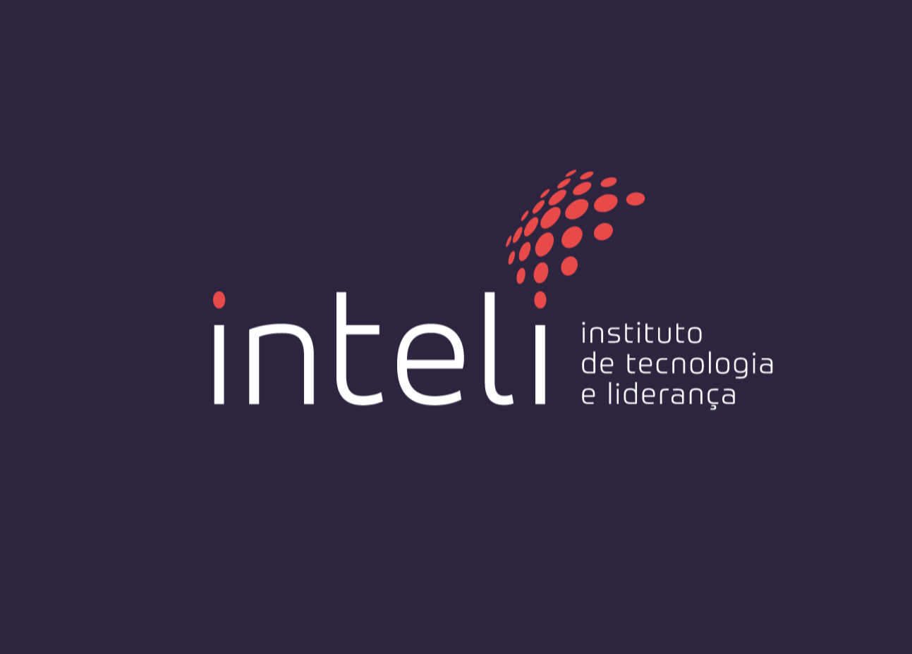
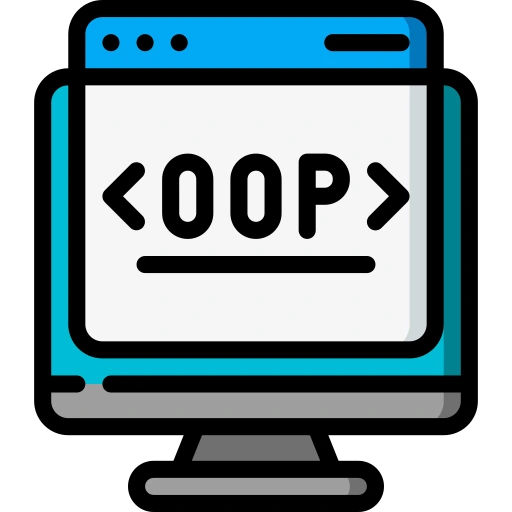

# Inteli - Institute of Technology and Leadership 

<p align="center">
<a href="https://www.inteli.edu.br/" target="_blank"></a>
</p>

As students at <a href="https://www.inteli.edu.br/" target="_blank">**Inteli - Institute of Technology and Leadership**</a>, we had the opportunity to develop an incredible project: the "Unilever City". Inteli is more than an educational institution, it's a place where we are encouraged to apply our skills in real contexts and face complex challenges.

Here at Inteli, we are trained to be effective leaders in the world of technology. We learn to work in teams, think critically and solve complex problems. And "Unilever City" is a perfect example of this.

Developed in response to a real need at Unilever, this game transcends entertainment. It represents a valuable educational and informational tool for new Unilever employees, providing a solid and comprehensive preparation for a successful journey within the company.

We are proud of what we have achieved with this project and are excited to share it with you. We invite you to explore "Unilever City" and see for yourself what we are able to accomplish when we apply our knowledge and skills in a real context.

# What is a README?

A README is a crucial component in software projects, serving as an essential guide for users and collaborators. It contains vital information about the project, including a detailed description, installation and usage instructions, as well as other relevant data to facilitate understanding and engagement with the software.

Welcome to the README of this project developed by the GreenTech group at Inteli - Institute of Technology and Leadership. This document serves as an essential guide to understanding the project, its purpose, its structure and how to interact with it.

## Purpose of this README

This README has been created to provide an overview of the Unilever City project. Here you will find details about the project, information about the members of the group, instructions on how to run the code and the license that governs the use of the project.

We hope that this README will be useful for you to better understand our project and how you can interact with it. If you have any questions or need more information, don't hesitate to contact us.

Enjoy the project! 😊

# 👅 README versions in other languages

Welcome to the README in other languages section! Recognizing the linguistic diversity of our users and seeking to make our content accessible to a wider audience, we offer different versions of this README in various languages.

We know that effective communication is essential to ensure that all our users fully understand the content and information presented. Therefore, we offer localized versions of this README in Portuguese, English and Spanish, to meet the needs of a global audience.

Each version of the README has been carefully translated to ensure accuracy and clarity, while maintaining the integrity of the original content. Regardless of which language you prefer to read, we want to ensure that you have access to the information you need to understand our project, its objectives and its implementation.

Below you will find links to each version of the README in different languages. Feel free to select the language of your choice and explore the full content of the README in your native language.

Choose the language you prefer to read the README in and enjoy!

- <a id="portugues" href="README.md">README.md</a> (Português)
- <a id="english" href="README.en.md">README.en.md</a> (English)
- <a id="espanol" href="README.es.md">README.es.md</a> (Español)

By offering localized versions in Portuguese, English and Spanish, we aim to ensure that all users can fully understand the content and information presented. By maintaining accuracy and clarity in all translations, our aim is to provide a consistent and informative experience, regardless of the language chosen by the user. We hope that this approach will facilitate understanding of our project, its objectives and implementation, allowing all users to become fully involved in the process.

# Content

The content section of this README serves as a comprehensive guide to the Unilever City project. By clicking on a specific section listed below, you will be taken directly to it, making it easier to navigate and search for specific information.

If you're eager to explore the details of the game, its unique proposition and how to immerse yourself in the gameplay, this section is the ideal starting point. Here, we've gathered all the essential information you need to fully enjoy the experience Unilever City offers.

Here are the sections that you can click on to go directly to them, give them a try!

## Contents

1. [What is a README?](#what-is-a-readme)
   - [Purpose of this README](#purpose-of-this-readme)
  
2. [👅 README Versions in Other Languages](-readme-versions-in-other-languages)
   - [Português](#portugues)
   - [English](#english)
   - [Español](#espanol)

4. [Content](#content)
   - [Index](#index)

5. [Presentation](#presentation)
   - [🔍 The problem](#-the-problem)
   - [🎯 The objective](#-the-objective)
   - [🧩 The target audience](#-the-target-audience)

6. [GreenTech](#greentech)
   - [👨‍🎓 Members](#-members)
   - [👩‍🏫 Teachers](#-teachers)
      - [Course Coordinator](#course-coordinator)
      - [Guiding Teacher](#guiding-teacher) 
      - [Teacher Instructors](#teacher-instructors)

7. [📜 Description](#-description)
   - [🔍 Game Objective](#-game-objective)
   - [🌟 Adventure and Emotion](#-adventure-and-emotion)
   - [🌱 Commitment to Sustainability](#-commitment-to-sustainability)
   - [👩‍💼 Corporate Game](#-corporate-game) 
   - [✊ Concern for Social, Racial and Gender Issues](#-concern-for-social-racial-and-gender-issues) 
   - [🎮 Play now](#-play-now) 

8. [🛠️ Techniques and Technologies Used](#%EF%B8%8F-techniques-and-technologies-used)
   - [Artificial Intelligence Technologies](#inteligencia_artificial)
   - [Frameworks](#frameworks)
   - [Text Editors](#text_editors)
   - [Markup Languages](#markdown_languages)
   - [Version Control](#controle_versao)
   - [Graphic Design Tools](#design_grafico)
   - [Communication](#communication)
   - [File Storage](#file_storage)
   - [Compression/Decompression Tool](#compressao_descompressao)
   - [Sound Library](#biblioteca_sons)
   - [Programming Techniques](#tecnicas_programacao)
   - [Other Technologies and Techniques](#outros_tecnologias_tecnicas)

9. [📁 Folder structure](#-folder-structure)
   - [assets](#assets)
   - [document](#document)
   - [src](#src)
   - [README.md](#readme.md)

10. [🔧 How to run the code](#-how-to-run-the-code)
    - [Prerequisites](#prerequisites)
    - [Play directly from browser](#play-directly-from-browser)
    - [Download and run locally](#download-and-run-locally)
 
11. [💻 Configuration for Development](#-configuration-for-development)

12. [🗃 Release history](#-release-history)
    - [Sprint 5 - 2024-04-11](#sprint-5---2024-04-11)
    - [Sprint 4 - 2024-03-29](#sprint-4---2024-03-29)
    - [Sprint 3 - 2024-03-15](#sprint-3---2024-03-15)
    - [Sprint 2 - 2024-03-01](#sprint-2---2024-03-01)
    - [Sprint 1 - 2024-02-16](#sprint-1---2024-02-16)

12. [📋 License](#-license)
 
---

So, whether you're a student in search of knowledge, a professional interested in exploring new technologies or simply someone curious about the Unilever City project, this content section is here to guide you on your journey. 

There, now you're ready to explore the README and understand everything about Unilever City.

# Presentation 


[](https://git.io/typing-svg)


Welcome to Unilever City, an initiative conceived in response to a real need at Unilever, with the participation of talented students from class 2024.1 at Inteli - Institute of Technology and Leadership. This project was developed with the aim of instructing and guiding new employees in Unilever's IT area, providing them with comprehensive preparation to successfully integrate into the company, while offering an immersive, hands-on experience that not only entertains, but also educates and informs.
<br>
### **🔍 The problem:** 
Training new employees at Unilever can be challenging, especially for those in IT, due to the complexity of operations and the company's vast range of products and brands.
<br>
<br>
### **🎯 The goal:** 
To offer players a unique opportunity to immerse themselves in the vibrant and dynamic world of Unilever, learning about the company and its main brands, as well as taking part in training sessions, all while embarking on a challenging mission: to recover the lost parts of the company's emblematic "U". In addition, the game seeks to familiarize players with Unilever's core values and commitments, such as sustainability, inclusion and innovation.
<br>
<br>
### **🧩 The target audience:** 
New employees in Unilever's IT department, as well as anyone interested in learning more about the company and its values.
<br>
<br>

Developed as part of the Inteli curriculum, this project is more than just a game. It is proof of the students' potential to apply their skills in a real context and face complex challenges. At the same time, it serves as a valuable tool to prepare future Unilever employees, giving them an authentic insight into the company's culture and values.

We therefore invite you to explore Unilever City, where adventure, learning and fun meet. Get ready for an exciting journey as you discover what it means to be part of one of the world's largest companies and how you can contribute to a better future.
 
# GreenTech

We are GreenTech, a group made up of seven people from different regions of Brazil, each with their own unique experiences, skills and talents. Our team was formed according to the criteria established by our mentor at the beginning of the module, and throughout this journey, we have faced a series of challenges that have allowed us to learn how to collaborate effectively. We are extremely proud and pleased to present the Unilever City project, the result of a lot of hard work, dedication and study.

We are grateful for the opportunity to work together as a team and proud of the end result we have achieved. This project not only allowed us to apply our knowledge and skills, but also taught us the importance of collaboration, effective communication and perseverance in the face of challenges. We look forward to applying these experiences to future projects and continuing to grow together as a team.

# 👨‍🎓 Members

To find out more about each member, try clicking on their names or photos and visiting their LinkedIn profiles.
 
<div align="center">
 <table>
 <tr>
 <td align="center"><a href="https://www.linkedin.com/in/andre-dleizer-cintra-do-prado-7203702b4/"><br>André Prado</a></td>
 <td align="center"><a href="https://www.linkedin.com/in/andre-lobo-dev/"><br>André Lobo</a></td>
 <td align="center"><a href="https://www.linkedin.com/in/gabriel-nascimento-563382243"><br>Gabriel N.</a></td>
 <td align="center"><a href="https://www.linkedin.com/in/laura-rodrigues-277927217/"><br>Laura R.</a></td>
 <td align="center"><a href="https://www.linkedin.com/in/lucca-henrique-pereira-119254258/"><br>Lucca Pereira</a></td>
 <td align="center"><a href="https://www.linkedin.com/in/milena-castro-39a2152b3/"><br>Milena Castro</a></td>
 <td align="center"><a href="http://www.linkedin.com/in/ryan-gartlan-82331b2b3"><br>Ryan Gartlan</a></td>
 </tr>
 </table>
</div>

# 👩‍🏫 Teachers

To find out more about each teacher, try clicking on their names or photos and visit their LinkedIn profiles.

## Course Coordinator
<div align="center">
 <table>
 <tr>
 <td align="center"><a href="https://www.linkedin.com/in/sergio-venancio-a509b342/"><br>Sérgio Venâncio</a></td>
 </tr>
 </table>
</div>

## Guidance teacher

<div align="center">
 <table>
 <tr>
 <td align="center"><a href="https://www.linkedin.com/in/fabiana-martins-de-oliveira-8993b0b2/"><br>Fabiana Martins</a></td>
 </tr>
 </table>
</div>

## Teacher Trainers

<div align="center">
 <table>
 <tr>
 <td align="center"><a href="https://www.linkedin.com/in/ccalminana/"><br>Cesar Almiñana</a><br>Business</td>
 <td align="center"><a href="https://www.linkedin.com/in/cristiano-benites-687647a8/"><br>Cristiano Benites</a><br>Programming</td>
 <td align="center"><a href="https://www.linkedin.com/in/fillipe-resina-b2211a22/"><br>Filipe Resina</a><br>Programming</td>
 </tr>
 </table>
</div>

<br> <!-- Adds vertical space between tables -->

<div align="center">
 <table>
 <tr>
 <td align="center"><a href="https://www.linkedin.com/in/francisco-escobar/"><br>Francisco Escobar</a><br>Design and UX</td>
 <td align="center"><a href="https://www.linkedin.com/in/fernando-pizzo-208b526a/"><br>Fernando Pizzo</a><br>Mathematics and physics</td>
 <td align="center"><a href="https://www.linkedin.com/in/filipe-gon%C3%A7alves-08a55015b/"><br>Filipe Gonçalves</a><br>Leadership</td>
 </tr>
 </table>
</div>
<br>

# 📜 Description

Here you will find a comprehensive overview of the essence and objectives of our work. This section serves as a detailed guide to understanding the purpose, functionality and impact of the project. Let's dive into the adventure and explore all the details that make our project unique and meaningful.

### 🔍 **Game Objective:** 
As a new hire at Unilever, you have a crucial mission: to recover the parts of the iconic "U" that have been stolen and scattered around the city. Explore the various locations in Unilever City, such as the Omo laundromat, the Clear hair salon and the Kibon ice cream parlor, interacting with NPCs, collecting clues and facing unique challenges in each location.

### 🌟 **Adventure and Emotion:** 

Feel the thrill of a gripping plot as you uncover the secrets behind the theft of the "U". Your journey is full of exciting twists and turns, encounters with fascinating characters and surprising discoveries about the company and its culture.

### 🌱 **Commitment to Sustainability:** 
Embark on a journey that goes beyond entertainment. Learn about Unilever's values and commitments, such as sustainability, diversity and innovation, as you move forward in the search for the missing "U".

### 👩‍💼 **Corporate Game:** 
Developed based on a real demand from Unilever in module 1 of the 2024.1 class at Inteli - Institute of Technology and Leadership, by the greentech group, the "Unilever City" Game is not only a fun experience, but also an educational and informative tool for new employees, preparing them for a successful journey in the company.

### ✊ **Concern for Social, Racial and Gender Issues:** 
Committed to inclusion and equality, the game reflects the diversity present in Brazilian society. From the characters to the settings, we are committed to promoting an inclusive and welcoming experience for all players.

### 🎮 **Play now:**
To access the game directly from your browser, go to the following link: [Unilever City](https://inteli-college.github.io/2024-T0012-IN01-G03/src/)

With an exciting plot, clear objectives and an innovative approach, the "Unilever City" game provides an engaging and memorable integration experience, while reinforcing the company's values and identity. Come and be part of this unique journey and prepare for a bright future at Unilever!


# 🛠️ Techniques and Technologies Used

In this section, we present a comprehensive list of the techniques and technologies that were used during the development of our project. From programming languages to collaboration tools and frameworks, each element plays a crucial role in the construction and success of our project.

Explore the table below to find out more about each of the technologies and techniques used. Clicking on the image or the name of the technology will take you to the official website, where you can find out more and explore the subject further.

Don't hesitate to dive in and explore the fascinating world of tools that have propelled our project to success!

| **Technology/Methodology** | **Description** |
|:-------------------------:|-----------|
| | |
| <span id="inteligencia_artificial"></span> **Artificial Intelligence Technologies** | |
| <a href="https://chat.openai.com/" target="_blank"> | <a href="https://chat.openai.com/" target="_blank" >**ChatGPT**</a> is a language model developed by OpenAI, used for various natural language processing tasks, such as text generation, translation, automatic summarization, among others. In the project, we use ChatGPT to help with content generation, corrections and suggestions.
| <a href="https://www.bing.com/search?q=Bing%20AI&showconv=1&form=MA13LX" target="_blank"> | <a href="https://www.bing.com/search?q=Bing%20AI&showconv=1&form=MA13LX" target="_blank">**BingAI**</a> is a set of artificial intelligence tools and APIs provided by Microsoft. In the project, we used BingAI for research, market analysis and image generation. |
| <a href="https://github.com/features/copilot" target="_blank"> | <a href="https://github.com/features/copilot" target="_blank">**GitHub Copilot**</a> is an extension for Visual Studio Code that provides AI-assisted code suggestions during development. In the project, we used GitHub Copilot to speed up the development process by offering intelligent, personalized code suggestions. |
| | |
| <span id="frameworks"></span> **Frameworks** | |
| <a href="https://phaser.io/" target="_blank"> | <a href="https://phaser.io/" target="_blank">**Phaser**</a> is an open source framework for developing HTML5 games. In the project, we used Phaser to create the game's logic, manage assets, handle user input and render elements on the screen. |
| <a href="https://www.scrum.org/" target="_blank"> | <a href="https://www.scrum.org/" target="_blank">**Scrum**</a> is an agile framework for managing and developing complex products. In the project, we used Scrum to organize and execute development in an iterative and incremental manner, promoting collaboration, transparency and adaptation to change.
| | |
| <span id="text_editors"></span> **Text Editors** |
| <a href="https://www.microsoft.com/pt-br/microsoft-365/word" target="_blank"> | <a href="https://www.microsoft.com/pt-br/microsoft-365/word" target="_blank">**Word**</a> is word processing software developed by Microsoft. In the project, we used Word to create and edit documents, reports and documentation related to the development of the game. |
| <a href="https://code.visualstudio.com/" target="_blank"> | <a href="https://code.visualstudio.com/" target="_blank">**Visual Studio Code**</a> is an integrated development environment (IDE) developed by Microsoft. In the project, we used Visual Studio Code as our main software development tool, offering support for various programming languages, debugging, version control and extensions. |
| | |
| <span id="markdown_languages"></span> **Marking Languages** | |
| <a href="https://www.markdownguide.org/" target="_blank"> | <a href="https://www.markdownguide.org/" target="_blank">**Markdown**</a> is a lightweight markup language with plain text formatting, often used to write documentation, including this README file. It was used to write the project documentation in a clear and organized way.
| <a href="https://developer.mozilla.org/pt-BR/docs/Web/HTML" target="_blank"> | <a href="https://developer.mozilla.org/pt-BR/docs/Web/HTML" target="_blank">**HTML (HyperText Markup Language)**</a> is the standard language for structuring and presenting content on the web. In the context of developing games with Phaser, HTML was used to structure the web page on which the game runs.
| <a href="https://developer.mozilla.org/pt-BR/docs/Web/CSS" target="_blank"> | <a href="https://developer.mozilla.org/pt-BR/docs/Web/CSS" target="_blank">**CSS (Cascading Style Sheets)**</a> is used to style the HTML elements of the game, covering layout, colors and animations. In this project, CSS was used to style the screen or canvas of the game.
| | |
| <span id="controle_versao"></span> **Version Control** | |
| <a href="https://git-scm.com/" target="_blank"> | <a href="https://git-scm.com/" target="_blank">**Git**</a> is a distributed version control system used to manage project source code and facilitate collaboration between developers. We use Git to version code, enable collaboration and track changes made to the project. It is essential for precise revision control and for guaranteeing the integrity of the code throughout development.
| <a href="https://github.com/" target="_blank"> | <a href="https://github.com/" target="_blank">**GitHub**</a> is a Git-based source code hosting platform that facilitates the management of project source code and collaboration between developers. We use GitHub to version code, enable collaboration and track changes made to the project. It offers features such as access control, issue tracking, pull requests and continuous integration, making it fundamental for collaborative development and efficient project management.
| | |
| <span id="design_grafico"></span> **Graphic Design Tools** | | 
| <a href="https://www.canva.com/" target="_blank"> | <a href="https://www.canva.com/" target="_blank">**Canva**</a> is an online graphic design platform that provides a range of tools for creating images, graphics and other visual elements. As part of the project, we used Canva to create and edit graphic elements such as logos, icons and other visual resources that are essential for the game.
| <a href="https://www.figma.com/" target="_blank"></a> | <a href="https://www.figma.com/" target="_blank">Figma</a> is a web-based collaborative design platform that allows users to create, test and share user interfaces and interactive designs. In the project, we used Figma for team collaboration, prototyping interfaces and creating wireframes. |
| | |
| <span id="communication"></span> **Communication** | | 
| <a href="https://slack.com/" target="_blank"> | <a href="https://slack.com/" target="_blank">**Slack**</a> is a business communication platform that offers real-time chat, file sharing and integration with various other tools. In the project, we used Slack for internal team communication, file sharing and integration with external services.
| | |
| <span id="file_storage"></span> **File Storage** | | 
| <a href="https://drive.google.com/" target="_blank"> | <a href="https://drive.google.com/" target="_blank">**Google Drive**</a> is a cloud-based file storage platform developed by Google. In the project, we used Google Drive to store and share documents, resources and files related to the development of the game. |
| | |
| <span id="compressao_descompressao"></span> **Compression/Decompression Tool** | |
| <a href="https://www.win-rar.com/" target="_blank"> | <a href="https://www.win-rar.com/" target="_blank">**WinRAR**</a> is a widely used file compression and decompression tool. In the context of this project, we used WinRAR to extract the project files.
| <span id="biblioteca_sons"></span> **Sound Library** | |
| <a href="https://freesound.org/" target="_blank"> | <a href="https://freesound.org/" target="_blank">**FreeSound**</a> is an online library of sounds and sound effects in the public domain. In the project, we used FreeSound to find and download sounds and sound effects to be incorporated into the game, adding auditory elements to the user experience.
| <span id="tecnicas_programacao"></span> **Programming Techniques** | |
| <a href="https://en.wikipedia.org/wiki/Modular_programming" target="_blank"> | <a href="https://en.wikipedia.org/wiki/Modular_programming" target="_blank">**Code Modularization**</a> is a programming practice that involves dividing code into smaller, independent parts, called modules, with well-defined responsibilities. This technique makes the code easier to maintain, reuse and understand, making it more readable and organized. In the project, we applied modularization to divide the code into cohesive and properly coupled modules, promoting a more organized and scalable structure.
| <a href="https://en.wikipedia.org/wiki/Object-oriented_programming" target="_blank"> | <a href="https://en.wikipedia.org/wiki/Object-oriented_programming" target="_blank">**Object Orientation (OOP)**</a> is a programming paradigm based on the idea of "objects", which can contain data in the form of fields, also known as attributes, and code, in the form of procedures, also known as methods. In the project, we used object orientation to organize and structure the game's code in a modular and reusable way, making it easier to maintain and extend the project.
<span id="outros_tecnologias_tecnicas"></span> **Other Technologies and Techniques** | |
| <a href="https://en.wikipedia.org/wiki/Kanban_(development)" target="_blank"> | <a href="https://en.wikipedia.org/wiki/Kanban_(development)" target="_blank">**Kanban**</a> is a method for managing and visualizing work, with the aim of maximizing team efficiency. Kanban tools are used to track the progress of tasks during game development. In the project, we used Kanban to organize and visualize the project's tasks at different stages of development.
| <a href="https://pt.wikipedia.org/wiki/Desenvolvimento_%C3%A1gil_de_software" target="_blank"> | <a href="https://pt.wikipedia.org/wiki/Desenvolvimento_%C3%A1gil_de_software" target="_blank">**Agile**</a> is an approach to software development that emphasizes iterative and incremental delivery, promoting collaboration, adaptation and rapid response to change. It was adopted to plan and execute game development efficiently, prioritizing the continuous delivery of value to the client.
| <a href="https://libresprite.github.io/#!/" target="_blank"> | <a href="https://libresprite.github.io/#!/" target="_blank">**Libra Sprite**</a> is a program used for creating and editing sprites. It offers tools for creating and manipulating graphic images that can be used as visual elements within the game. In the project, we used Libra Sprite to create and edit sprites of characters, objects and other graphic elements in the game. |
| <a href="https://www.mapeditor.org/" target="_blank"> | <a href="https://www.mapeditor.org/" target="_blank">**Tiled**</a> is a map editor for 2D games. It allows you to create and edit maps visually, making it easier to create levels and scenarios for your game. In this project, we used Tiled to design and create the game's levels and scenarios, defining the layout of elements such as platforms, obstacles and items.

Throughout this section, we explored a variety of techniques and technologies that played a key role in the development of our project. From programming languages to collaboration tools and frameworks, each element contributed to creating a unique and immersive experience.

The use of these technologies not only enabled us to build our project, but also demonstrated our commitment to innovation, efficiency and quality. Through the integration of advanced tools and modern methodologies, we were able to overcome challenges, achieve our objectives and deliver an exceptional end product.

In addition, the continuous learning and exploration of new technologies during the development of this project demonstrates our dedication to professional growth and the pursuit of excellence. Each technology used represents not only a tool, but also an opportunity to expand our knowledge and skills.

As we move on to new projects and challenges, we take with us the learning and experience gained from working with these technologies. We are prepared to face the future with confidence and enthusiasm, knowing that we have the skills and knowledge needed to thrive in an increasingly dynamic and demanding environment.

We thank all the technologies and techniques that have accompanied us on this journey and we look forward to continuing to explore, learn and create with them in the future!


# 📁 Folder structure

The efficient organization of files and folders is fundamental to the successful management and development of any project. In this section, we present the folder structure adopted for the Unilever City project, offering a comprehensive overview of the arrangement of files and their function within the context of the game's development.

Each directory and subdirectory plays a specific role in organizing and storing the different types of resources, from source code to visual and audio assets. By understanding the folder structure, team members and external collaborators can easily navigate through the files, facilitating development, maintenance and collaboration on the project.

```bash
├── .vscode           # VS Code settings
├── assets            # General project resources
│ ├── assetsREADME    # General README resources
│ ├── npcs            # Resources related to NPCs (non-playable characters)
│ ├── 4.1             # Resources for section 4.1 of the GDD
├── assetsREADME      # README resources
├── document          # Project documentation
│ └── other           # Other related documents
└── src               # Project source code
 ├── assets           # Specific game assets
 ├── configs          # Project settings
 │ └── celular        # Mobile-specific settings within the game
 ├── inicio           # Code related to the start of the game
 ├── mapas            # Code related to the game maps
 ├── minigames        # Code for minigames
 │ ├── Hack           # 'Hack' minigame code
 │ └── memoria        # Code for the 'Memory' minigame
 ├── plugin           # Code for game plugins
 └── scenes           # Game scenes code
```
The files and folders at the root of the project include:

<span id="assets"></span> <b>assets:</b> This folder contains all the unstructured resources related to the project, such as images, audio and other visual elements used in the game.

<span id="document"></span> <b>document:</b> This folder contains all the project documents, including the Game Design Document (GDD), as well as complementary documents. In addition, there is an "other" subfolder for additional documents.

<span id="src"></span> <b>src:</b> Here is all the source code developed for the creation of the game project. All the classes, scripts and files related to the game's logic and functionality are contained in this folder.

<span id="readme.md"></span> <b>README.md:</b> This file serves as a guide and general explanation of the project, its characteristics, purpose and important information for collaborators and users of the game.

The folder structure is the skeleton that supports the entire development of the Unilever City project. From the organization of source code to the storage of visual and audio assets, each folder plays a crucial role in maintaining order and facilitating the team's workflow.

By following a well-defined and intuitive structure, we ensure that all team members can quickly locate the resources they need and understand the context in which they are working. This promotes effective collaboration, reduces the time spent searching for files and contributes to a more fluid and productive development experience.

In short, the folder structure is more than just a physical organization of files - it's the backbone of our development process, providing a solid foundation for creating an exceptional game and a memorable experience for players.

# 🔧 How to run the code

In this section, we provide two ways to access and play the Unilever City project. Firstly, you can simply click on the link provided to play directly from your browser. If you prefer an offline option or want to explore the game's source code, we've also provided instructions on how to download and run the game locally on your computer.

These options ensure that you can enjoy the game experience conveniently, whether online or offline. Follow the instructions provided and embark on an exciting journey through Unilever City, exploring its challenges, mysteries and surprises. Have fun!

## Prerequisites

Before you begin, it's important to be aware of the prerequisites needed to fully enjoy our project. Although it is possible to access the game via the link provided, it is essential to note that the game has been developed exclusively for computers. Therefore, devices such as cell phones and tablets will not be compatible with the gaming experience.

In addition, our game features an immersive soundtrack and various sound effects that contribute significantly to the player's immersion. For this reason, we recommend that you have a working sound system on your device. This can be achieved through external speakers or quality headphones, ensuring that you can enjoy every sonic aspect of the game.

In addition to the hardware requirements, it's important to mention that the game is played using the keys on the keyboard to interact with the elements on the screen. So make sure you have access to a functional keyboard for a smooth gaming experience.

To fully appreciate the incredible designs and graphics of our game, we highly recommend having a color screen. The visual elements have been carefully developed to provide an immersive and engaging visual experience. Therefore, a color screen will allow you to enjoy all the details and nuances of the settings, characters and visual effects, contributing to a richer and more vibrant gaming experience.

Finally, as the game can be accessed via the internet, a stable internet connection is also recommended to ensure smooth, uninterrupted gameplay.

With these prerequisites met, you'll be ready to dive into the unique experience offered by our project, Unilever City.

### Play directly from your browser:

You can play the game directly from your browser by clicking on the link below:

[Unilever City](https://inteli-college.github.io/2024-T0012-IN01-G03/src/)

### Download and run locally:

If you prefer, you can also download all the game's source code directly from the repository on GitHub. Follow the instructions below to run the game on your computer:

1. **Download the source code:**

 - Click on the "Code" button in the top right-hand corner of the GitHub repository.
 - Select "Download ZIP" to download the compressed source code to your computer.

2. **Extract the files

 - Once the download is complete, you'll need to extract the files from the downloaded ZIP archive.
 - If you don't have a decompression program, we recommend using WinRAR. You can download and install WinRAR from the [official website](https://www.win-rar.com/download.html).
 - After installing WinRAR, right-click on the downloaded ZIP file and select "Extract here" to extract the files.

3. **Open the game

 - After extracting the files, navigate to the folder where the game was extracted.
 - Find the index.html file and open it in your web browser.
 - Make sure you have an up-to-date web browser with JavaScript enabled and compatible with the Phaser framework.

Now you're ready to embark on an exciting journey through Unilever City, exploring its challenges, mysteries and surprises directly from your browser or your own computer. Have fun!

# 💻 Configuration for Development

If you want to explore and modify the Unilever city, feel free to do so. As you'll see later in the section on our [License](#-license), it allows you to adapt and customize the project according to your needs and preferences. By contributing to the project, you will have the freedom to experience and explore different aspects of Unilever at your own pace. Make the most of this opportunity to learn and improve your game development skills. We are excited to see your contributions and how you will enrich this project with your creativity and unique vision.

Remember that when using or modifying this project, you must give the appropriate credits, as stipulated in the project license.

To start contributing to the project, follow these steps:

1. **Download the Source Code**:
 - First, [download or clone the repository](link_to_the_repository) of the project to your local computer. If you choose to download the ZIP file, you will need to extract the files. We recommend using [WinRAR](https://www.win-rar.com/start.html?&L=9) or other decompression software.

2. **GitHub - Version Control and Collaboration:
 - We recommend using [**GitHub**](https://github.com/) as your main platform for source code version control and team collaboration. Make sure you create a GitHub account and fork the main repository before starting contributions.

3. **IDE (Integrated Development Environment)**:
 - Although the project is based on common web technologies such as JavaScript, HTML and CSS, we recommend using an IDE to facilitate development. Visual Studio Code (https://code.visualstudio.com/) is a popular choice due to its wide compatibility and support for useful extensions.

4. **Link to Phaser**:
 - The project uses the **Phaser** framework for developing HTML5 games. You don't need to install Phaser, just include it in your HTML code using a link to the Phaser script hosted on the web.

With the appropriate settings in place, you're ready to dive into project development. Use the recommended tools and follow the best practices to maximize your efficiency and collaboration. Always remember to review the guidelines and documentation provided to ensure a clear understanding of the workflow and expectations. With a solid setup and a collaborative mindset, you're ready to make valuable contributions to the project and expand your game development skills.

As you'll see later in the [License](#-license) section, the project is available under a certain license that stipulates the terms of use, distribution and permitted modifications. Be sure to review these terms before proceeding with the development or use of the project.

# 🗃 Release history

This section provides a detailed record of our project's progress. In Inteli, a module is made up of five sprints, each lasting fifteen days. We chose to list the changes by sprints, rather than listing each individual commit. We believe this provides a clearer and more manageable view of the project's progress.

The dates are in ISO 8601 format (YYYY-MM-DD), which is an internationally recognized standard and commonly used in technical documentation. This format was chosen for its clarity and wide use in technical and international environments.

## Sprint 5 - 2024-04-11
### Added
- We have completed sections 4.5, 6 and 7 of the Game Design Document (GDD).
- We have created the README file.

### Updated
- We have carried out a general revision of the GDD based on the feedback received from the teachers.

## Sprint 4 - 2024-03-29
### Added
- We have completed sections 5.2.1, 5.2.2 and 4.4 of the GDD.
- We have included the analysis of Porter's 5 Forces.
- We have completed the implementation of the game mechanics.
- We carried out tests and deployed them on GitHub Pages.

### Updated
- We updated section 5.1 of the GDD.
- We revised the GDD, focusing on section 1.1.

## Sprint 3 - 2024-03-15
### Added
- We completed sections 3, 3.2.3, 3.6 and 3.7 of the GDD.
- We continued developing the game scenes.
- We have developed the mechanics of the game.
- We integrated the scenes.
- We've updated the list of tests.

### Updated
- We carried out a general revision and correction of the GDD.

## Sprint 2 - 2024-03-01
### Added
- We completed sections 1.2, 1.3, 2, 3, 3.2, 3.3, 3.5, 4.2 and 5.1 of the GDD.
- Delivered two integrated scenes: the character choice scene and the game scene.
- We delivered the game overview, scene diagram, concept art, test cases and target audience.

### Updated
- We carried out a general review and correction of the GDD.

## Sprint 1 - 2024-02-16
### Added
- We have completed sections 1.1.1 to 1.1.5, 1.2 and 4.1 of the GDD.
- Delivered the first scene of the game, including basic character movement.
- We included the Risk Matrix, Value Proposition Canvas and SWOT Analysis.
- We contextualized the industry and described the solution to be developed.

In short, this sprint history serves as a transparent record of our work and progress. It highlights our achievements in each sprint and shows how our project has evolved over time. We will continue to keep this record as we progress through the project, ensuring that all important changes are documented here.

# 📋 License

Licenses are legal instruments that define the terms and conditions under which creative and intellectual work can be used, distributed and modified by third parties. They play a crucial role in the world of creation, promoting collaboration, protecting copyright and encouraging innovation.

This project is licensed under the [Attribution 4.0 International License](https://creativecommons.org/licenses/by/4.0/?ref=chooser-v1).

The Attribution License 4.0 International is a widely used open source license that allows the redistribution, modification and commercial use of the work, as long as credit is properly given to the original author. This means that you are free to:

- Share: copy and redistribute the material in any medium or format.
- Adapt: remix, transform and build on the material for any purpose, even commercially.

As long as you give due credit, you can use this work in creative and innovative ways. This license is a popular choice for open source and collaborative projects, as it promotes collaboration and knowledge sharing.

We chose this license because we believe in the importance of collaboration and knowledge sharing in the academic community and in the development of collaborative projects.

For more details on the terms of the license and what it allows, see the full text of the [Attribution License 4.0 International](https://creativecommons.org/licenses/by/4.0/?ref=chooser-v1).

<p align="center">
  <a property="dct:title" rel="cc:attributionURL" href="https://github.com/Intelihub/Template_M1">MODELO GIT INTELI</a> by 
  <a rel="cc:attributionURL dct:creator" property="cc:attributionName" href="https://www.inteli.edu.br/">Inteli</a>,  
  <a href="https://www.linkedin.com/in/andre-dleizer-cintra-do-prado-7203702b4/">André Prado</a>, 
  <a href="https://www.linkedin.com/in/andre-lobo-dev/">André Lobo</a>, 
  <a href="https://www.linkedin.com/in/gabriel-nascimento-563382243/">Gabriel Nascimento</a>, 
  <a href="https://www.linkedin.com/in/laura-rodrigues-277927217/">Laura Rodrigues</a>, 
  <a href="https://www.linkedin.com/in/lucca-henrique-pereira-119254258/">Lucca Pereira</a>, 
  <a href="https://www.linkedin.com/in/milena-castro-39a2152b3/">Milena Castro</a>, 
  <a href="http://www.linkedin.com/in/ryan-gartlan-82331b2b3">Ryan Gartlan</a> 
  is licensed under <a href="http://creativecommons.org/licenses/by/4.0/?ref=chooser-v1" target="_blank" rel="license noopener noreferrer" style="display:inline-block;">Attribution 4.0 International</a>.
</p>

<p align="center">
 
  
</p>

--- 
<p align="center">
⌨️ with 💜 by GreenTech 👋 
</p>
