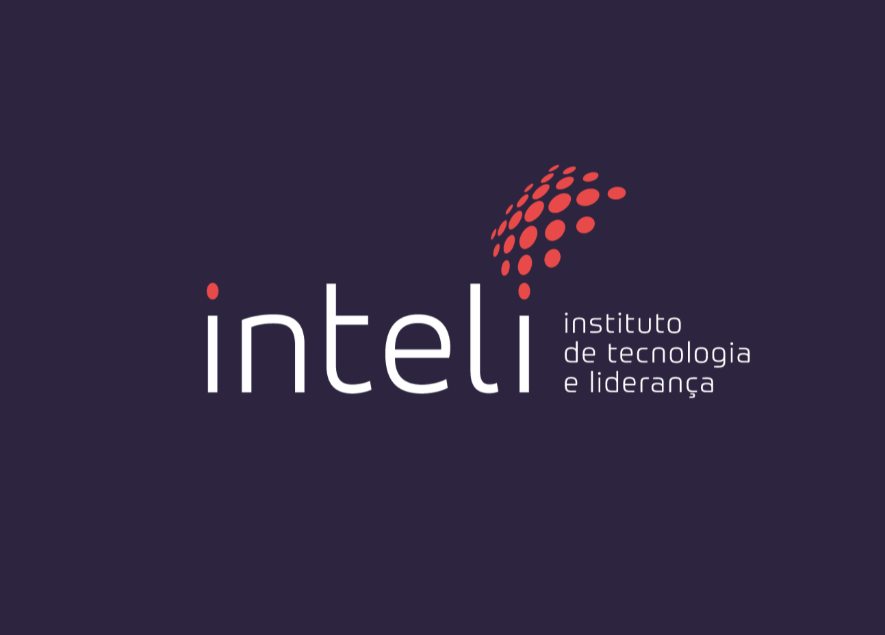
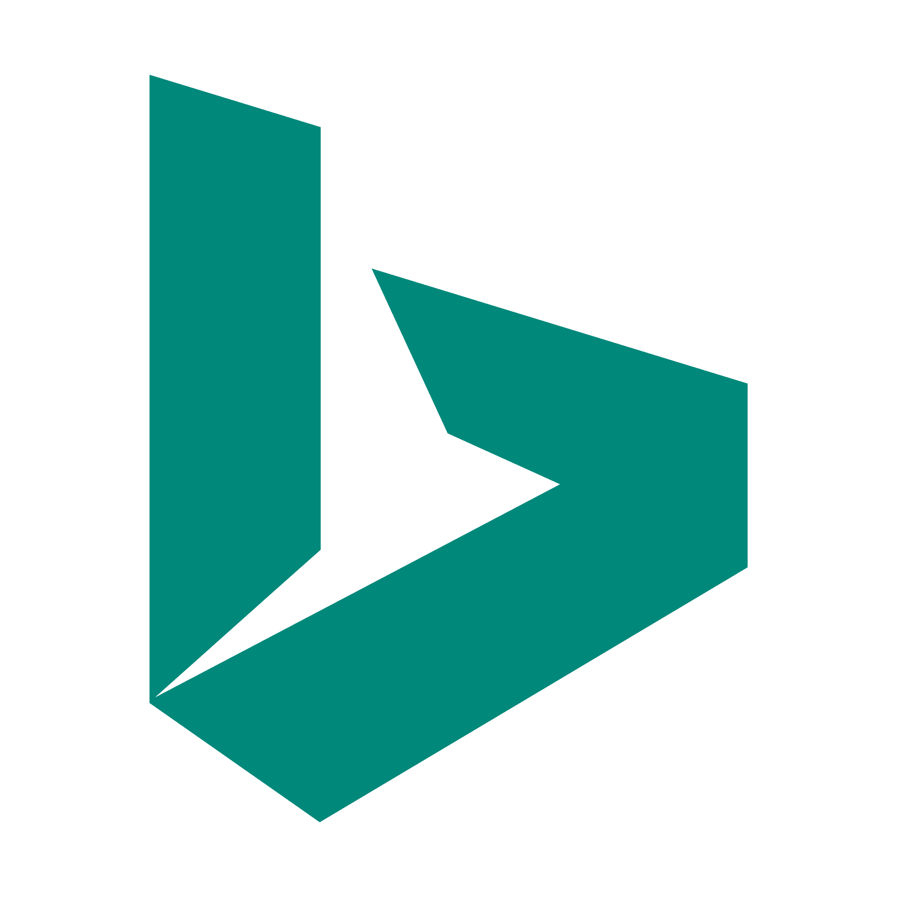
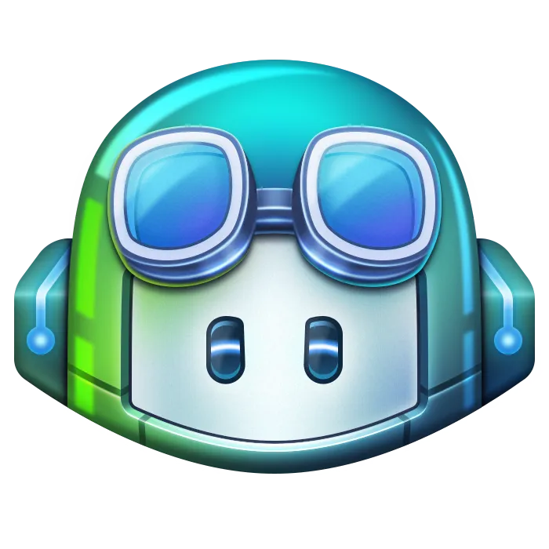
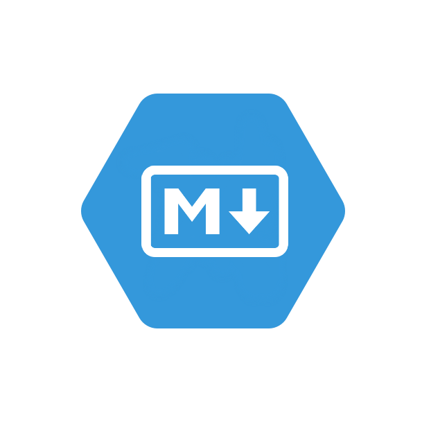
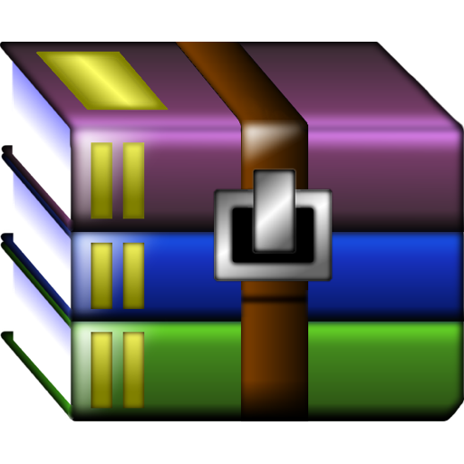
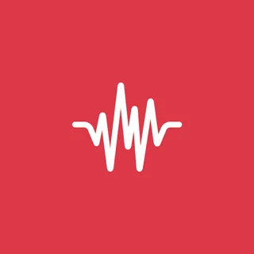
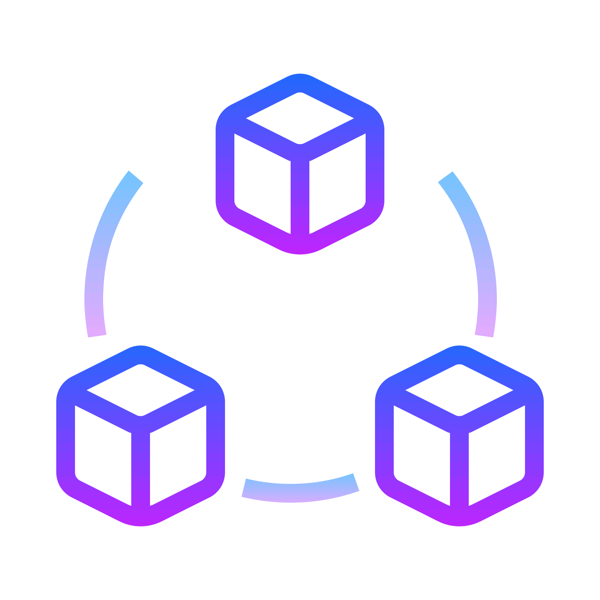
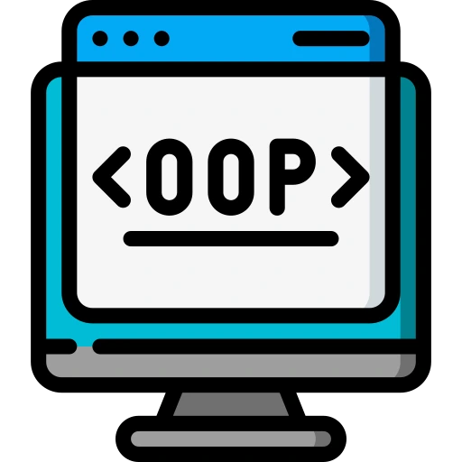
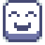
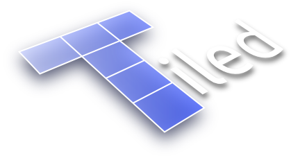

# Inteli - Instituto de Tecnología y Liderazgo 

<p align="center">
<a href="https://www.inteli.edu.br/" target="_blank"></a>
</p>

Como estudiantes de <a href="https://www.inteli.edu.br/" target="_blank">**Inteli - Instituto de Tecnología y Liderazgo**</a>, tuvimos la oportunidad de desarrollar un proyecto increíble: la "Ciudad Unilever". Inteli es más que una institución educativa, es un lugar donde se nos anima a aplicar nuestras habilidades en contextos reales y enfrentarnos a retos complejos.

Aquí, en Inteli, nos formamos para ser líderes eficaces en el mundo de la tecnología. Aprendemos a trabajar en equipo, a pensar de forma crítica y a resolver problemas complejos. Y "Ciudad Unilever" es un ejemplo perfecto de ello.

Desarrollado en respuesta a una necesidad real de Unilever, este juego trasciende el entretenimiento. Representa una valiosa herramienta educativa e informativa para los nuevos empleados de Unilever, proporcionándoles una preparación sólida y completa para una trayectoria de éxito dentro de la empresa.

Estamos orgullosos de lo que hemos conseguido con este proyecto y nos entusiasma compartirlo con ustedes. Te invitamos a que explores "Ciudad Unilever" y compruebes por ti mismo lo que somos capaces de conseguir cuando aplicamos nuestros conocimientos y habilidades en un contexto real.

# ¿Qué es un README?

Un README es un componente crucial en los proyectos de software, ya que sirve de guía esencial para usuarios y colaboradores. Contiene información vital sobre el proyecto, incluyendo una descripción detallada, instrucciones de instalación y uso, así como otros datos relevantes para facilitar la comprensión y el compromiso con el software.

Bienvenido al README de este proyecto desarrollado por el grupo GreenTech de Inteli - Instituto de Tecnología y Liderazgo. Este documento sirve como guía esencial para entender el proyecto, su propósito, su estructura y cómo interactuar con él.

## Propósito de este README

Este README ha sido creado para proporcionar una visión general del proyecto Ciudad Unilever. Aquí encontrarás detalles sobre el proyecto, información sobre los miembros del grupo, instrucciones sobre cómo ejecutar el código y la licencia que rige el uso del proyecto.

Esperamos que este README te resulte útil para comprender mejor nuestro proyecto y cómo puedes interactuar con él. Si tienes alguna pregunta o necesitas más información, no dudes en ponerte en contacto con nosotros.

¡Que disfrutes del proyecto! 😊

# 👅 Versiones del README en otros idiomas

Bienvenido a la sección README en otros idiomas. Conscientes de la diversidad lingüística de nuestros usuarios y con el objetivo de que nuestros contenidos sean accesibles a un público más amplio, ofrecemos distintas versiones de este README en varios idiomas.

Sabemos que una comunicación eficaz es esencial para garantizar que todos nuestros usuarios entienden perfectamente el contenido y la información presentados. Por ello, ofrecemos versiones localizadas de este README en portugués, inglés y español, para satisfacer las necesidades de un público global.

Cada versión del README se ha traducido cuidadosamente para garantizar la precisión y claridad, manteniendo la integridad del contenido original. Independientemente del idioma en que prefiera leerlo, queremos asegurarnos de que tenga acceso a la información necesaria para comprender nuestro proyecto, sus objetivos y su puesta en práctica.

A continuación encontrará enlaces a cada versión del README en diferentes idiomas. Siéntase libre de seleccionar el idioma de su elección y explorar el contenido completo del README en su lengua materna.

Elige el idioma en el que prefieras leer el README y ¡disfrútalo!

- <a id="portugues" href="README.md">README.md</a> (Português)
- <a id="english" href="README.en.md">README.en.md</a> (English)
- <a id="espanol" href="README.es.md">README.es.md</a> (Español)

Al ofrecer versiones localizadas en portugués, inglés y español, pretendemos garantizar que todos los usuarios puedan comprender plenamente el contenido y la información presentados. Al mantener la precisión y claridad en todas las traducciones, nuestro objetivo es ofrecer una experiencia coherente e informativa, independientemente del idioma elegido por el usuario. Esperamos que este enfoque facilite la comprensión de nuestro proyecto, sus objetivos y su aplicación, permitiendo a todos los usuarios participar plenamente en el proceso.

# Contenido

La sección de contenido de este README sirve como guía completa del proyecto Ciudad Unilever. Al hacer clic en una sección específica que aparece a continuación, se le llevará directamente a ella, por lo que es más fácil de navegar y buscar información específica.

Si quieres conocer los detalles del juego, su propuesta única y cómo sumergirte en su jugabilidad, esta sección es el punto de partida ideal. Aquí hemos reunido toda la información esencial que necesitas para disfrutar plenamente de la experiencia que te ofrece Ciudad Unilever.

Aquí tienes las secciones en las que puedes hacer clic para ir directamente a ellas, ¡pruébalas!

## Contenido

1. [¿Qué es un README?](#qué-es-un-readme)
   - [Propósito de este README](#propósito-de-este-readme)

2. [👅 Versiones del README en otros idiomas](-versiones-del-readme-en-otros-idiomas)
   - [Português](#portugues)
   - [English](#english)
   - [Español](#espanol)

4. [Contenido](#contenido)
   - [Índice](#contenido-1)

5. [Presentación](#presentación)
   - [🔍El problema](#-el-problema)
   - [🎯 El objetivo](#-el-objetivo)
   - [🧩 El público objetivo](#-el-público-objetivo)

6. [GreenTech](#greentech)
   - [👨‍🎓 Miembros](#-miembros)
   - [👩‍🏫 Profesores](#-profesores)
     - [Coordinador del curso](#coordinador-del-curso)
     - [Profesor de orientación](#profesor-de-orientación) 
     - [Profesores instructores](#profesor-de-orientación)

7. [📜 Descripción](#-descripción)
   - [🔍 Objetivo del juego](#-objetivo-del-juego)
   - [🌟 Aventura y emoción](#-aventura-y-emoción)
   - [🌱 Compromiso con la sostenibilidad](#-compromiso-con-la-sostenibilidad)
   - [👩‍💼 Juego Corporativo](#-juego-corporativo) 
   - [✊ Preocupación por las cuestiones sociales, raciales y de género](#-preocupación-por-las-cuestiones-sociales-raciales-y-de-género) 
   - [🎮 Jugar ahora](#-juega-ahora) 

8. [🛠️ Técnicas y tecnologías utilizadas](#%EF%B8%8F-técnicas-y-tecnologías-utilizadas)
   - [Tecnologías de inteligencia artificial](#inteligencia_artificial)
   - [Frameworks](#frameworks)
   - [Editores de texto](#editores_texto)
   - [Lenguajes de marcado](#markdown_languages)
   - [Control de versiones](#control_version)
   - [Herramientas de diseño gráfico](#diseño_grafico)
   - [Comunicación](#comunicación)
   - [Almacenamiento de archivos](#file_storage)
   - [Herramienta de compresión/descompresión](#compression_decompression)
   - [Biblioteca de sonidos](#biblioteca_sons)
   - [Técnicas de programación](#tecnicas_programacao)
   - [Otras tecnologías y técnicas](#otras_tecnologias_tecnicas)

9. [📁 Estructura de carpetas](#-estructura-de-carpetas)
   - [assets](#assets)
   - [documento](#document)
   - [src](#src)
   - [README.md](#readme.md)

10. [🔧 Cómo ejecutar el código](#-cómo-ejecutar-el-código)
    - [Requisitos previos](#requisitos-previos)
    - [Reproducir directamente desde el navegador](#juega-directamente-desde-tu-navegador)
    - [Descargar y ejecutar localmente](#descargar-y-ejecutar-localmente)
 
11. [💻 Configuración para el desarrollo](#descargar-y-ejecutar-localmente)

12. [🗃 Historial de versiones](#-historial-de-lanzamientos)
    - [Sprint 5 - 2024-04-11](#sprint-5---2024-04-11)
    - [Sprint 4 - 2024-03-29](#sprint-4---2024-03-29)
    - [Sprint 3 - 2024-03-15](#sprint-3---2024-03-15)
    - [Sprint 2 - 2024-03-01](#sprint-2---2024-03-01)
    - [Sprint 1 - 2024-02-16](#sprint-1---2024-02-16)

13. [📋 Licencia](#-licencia)
 
---

Así que, tanto si eres un estudiante en busca de conocimiento, un profesional interesado en explorar nuevas tecnologías o simplemente alguien curioso sobre el proyecto Ciudad Unilever, esta sección de contenidos está aquí para guiarte en tu viaje. 

Listo, ahora estás preparado para explorar el README y entenderlo todo sobre Ciudad Unilever.

# Presentación 


[](https://git.io/typing-svg)


Bienvenidos a Ciudad Unilever, una iniciativa concebida en respuesta a una necesidad real en Unilever, con la participación de estudiantes talentosos de la clase 2024.1 en Inteli - Instituto de Tecnología y Liderazgo. Este proyecto fue desarrollado con el objetivo de instruir y orientar a los nuevos empleados en el departamento de TI de Unilever, proporcionándoles una preparación completa para integrarse con éxito en la empresa, al tiempo que ofrece una experiencia inmersiva y práctica que no sólo entretiene, sino que también educa e informa.
<br>
### **🔍 El problema:** 
La formación de los nuevos empleados de Unilever puede ser un reto, especialmente para los de TI, debido a la complejidad de las operaciones y a la amplia gama de productos y marcas de la empresa.
<br>
<br>
### **🎯 El objetivo:** 
Ofrecer a los jugadores una oportunidad única de sumergirse en el vibrante y dinámico mundo de Unilever, aprendiendo sobre la empresa y sus principales marcas, así como participando en sesiones de formación, todo ello mientras se embarcan en una desafiante misión: recuperar las partes perdidas de la emblemática "U" de la empresa. Además, el juego pretende familiarizar a los jugadores con los principales valores y compromisos de Unilever, como la sostenibilidad, la inclusión y la innovación.
<br>
<br>
### **🧩 El público objetivo:** 
Nuevos empleados del departamento de TI de Unilever, así como cualquier persona interesada en aprender más sobre la empresa y sus valores.
<br>
<br>

Desarrollado como parte integrante del plan de estudios Inteli, este proyecto es algo más que un juego. Es una prueba del potencial de los estudiantes para aplicar sus habilidades en un contexto real y enfrentarse a retos complejos. Al mismo tiempo, sirve como valiosa herramienta para preparar a los futuros empleados de Unilever, ofreciéndoles una visión auténtica de la cultura y los valores de la empresa.

Así que te invitamos a explorar Ciudad Unilever, donde se dan cita la aventura, el aprendizaje y la diversión. Prepárate para un viaje emocionante mientras descubres lo que significa formar parte de una de las mayores empresas del mundo y cómo puedes contribuir a un futuro mejor.
 
# GreenTech

Somos GreenTech, un grupo formado por siete personas de diferentes regiones de Brasil, cada una con sus propias experiencias, habilidades y talentos únicos. Nuestro equipo se formó de acuerdo con los criterios establecidos por nuestro supervisor al inicio del módulo, y a lo largo de este viaje nos hemos enfrentado a una serie de retos que nos han permitido aprender a colaborar eficazmente. Estamos muy orgullosos y satisfechos de presentar el proyecto Ciudad Unilever, fruto de mucho trabajo, dedicación y estudio.

Estamos agradecidos por la oportunidad de trabajar en equipo y orgullosos del resultado final que hemos conseguido. Este proyecto no sólo nos ha permitido aplicar nuestros conocimientos y habilidades, sino que también nos ha enseñado la importancia de la colaboración, la comunicación eficaz y la perseverancia ante los retos. Esperamos poder aplicar estas experiencias a futuros proyectos y seguir creciendo juntos como equipo.

# 👨‍🎓 Miembros

Para saber más sobre cada miembro, haz clic en sus nombres o fotos y visita sus perfiles de LinkedIn.
 
<div align="center">
 <table>
 <tr>
 <td align="center"><a href="https://www.linkedin.com/in/andre-dleizer-cintra-do-prado-7203702b4/"><br>André Prado</a></td>
 <td align="center"><a href="https://www.linkedin.com/in/andre-lobo-dev/"><br>André Lobo</a></td>
 <td align="center"><a href="https://www.linkedin.com/in/gabriel-nascimento-563382243"><br>Gabriel N.</a></td>
 <td align="center"><a href="https://www.linkedin.com/in/laura-rodrigues-277927217/"><br>Laura R.</a></td>
 <td align="center"><a href="https://www.linkedin.com/in/lucca-henrique-pereira-119254258/"><br>Lucca Pereira</a></td>
 <td align="center"><a href="https://www.linkedin.com/in/milena-castro-39a2152b3/"><br>Milena Castro</a></td>
 <td align="center"><a href="http://www.linkedin.com/in/ryan-gartlan-82331b2b3"><br>Ryan Gartlan</a></td>
 </tr>
 </table>
</div> <div>

# 👩‍🏫 Profesores

Para obtener más información sobre cada profesor, haga clic en sus nombres o fotos y visite sus perfiles de LinkedIn.

## Coordinador del curso
<div align="center">
 <table>
 <tr>
 <td align="center"><a href="https://www.linkedin.com/in/sergio-venancio-a509b342/"><br>Sérgio Venâncio</a></td>
 </tr>
 </table>
</div>

## Profesor de orientación

<div align="center">
 <table>
 <tr>
 <td align="center"><a href="https://www.linkedin.com/in/fabiana-martins-de-oliveira-8993b0b2/"><br>Fabiana Martins</a></td>
 </tr>
 </table>
</div> <div>

## Profesores Instructores

<div align="center">
 <table>
 <tr>
 <td align="center"><a href="https://www.linkedin.com/in/ccalminana/"><br>Cesar Almiñana</a><br>Negocios</td>
 <td align="center"><a href="https://www.linkedin.com/in/cristiano-benites-687647a8/"><br>Cristiano Benites</a><br>Programación</td>
 <td align="center"><a href="https://www.linkedin.com/in/fillipe-resina-b2211a22/"><br>Filipe Resina</a><br>Programación</td>
 </tr>
 </table>
</div>

<br> <!-- Añade un espacio vertical entre tablas -->

<div align="center">
 <table>
 <tr>
 <td align="center"><a href="https://www.linkedin.com/in/francisco-escobar/"><br>Francisco Escobar</a><br>Diseño y UX</td>
 <td align="center"><a href="https://www.linkedin.com/in/fernando-pizzo-208b526a/"><br>Fernando Pizzo</a><br>Matemáticas y física</td>
 <td align="center"><a href="https://www.linkedin.com/in/filipe-gon%C3%A7alves-08a55015b/"><br>Filipe Gonçalves</a><br>Liderazgo</td>
 </tr>
 </table>
</div>
<br>

# 📜 Descripción

Aquí encontrará una descripción exhaustiva de la esencia y los objetivos de nuestro trabajo. Esta sección sirve de guía detallada para comprender el propósito, la funcionalidad y el impacto del proyecto. Sumerjámonos en la aventura y exploremos todos los detalles que hacen que nuestro proyecto sea único y significativo.

### 🔍 **Objetivo del juego:** 
Como nuevo empleado de Unilever, tienes una misión crucial: recuperar las piezas de la emblemática "U" que han sido robadas y esparcidas por la ciudad. Explora los distintos lugares de Ciudad Unilever, como la lavandería Omo, la peluquería Clear y la heladería Kibon, interactuando con los PNJ, recogiendo pistas y enfrentándote a desafíos únicos en cada lugar.

### 🌟 **Aventura y emoción:** 
Sienta la emoción de una trama apasionante mientras desentraña los secretos que se esconden tras el robo de la "U". Tu viaje está lleno de giros emocionantes, encuentros con personajes fascinantes y descubrimientos sorprendentes sobre la empresa y su cultura.

### 🌱 **Compromiso con la sostenibilidad:** 
Embárcate en un viaje que va más allá del entretenimiento. Conoce los valores y compromisos de Unilever, como la sostenibilidad, la diversidad y la innovación, mientras avanzas en la búsqueda de la "U" que falta.

### 👩‍💼 **Juego corporativo:** 
Desarrollado sobre la base de una demanda real de Unilever en el módulo 1 de la clase 2024.1 en Inteli - Instituto de Tecnología y Liderazgo, por el grupo greentech, el Juego "Ciudad Unilever" no es sólo una experiencia divertida, sino también una herramienta educativa e informativa para los nuevos empleados, preparándolos para un viaje exitoso en la empresa.

### ✊ **Preocupación por las cuestiones sociales, raciales y de género:** 
Comprometido con la inclusión y la igualdad, el juego refleja la diversidad presente en la sociedad brasileña. Desde los personajes hasta los escenarios, nos comprometemos a promover una experiencia inclusiva y acogedora para todos los jugadores.

### 🎮 **Juega ahora:**
Para acceder al juego directamente desde tu navegador, entra en el siguiente enlace: [Ciudad Unilever](https://inteli-college.github.io/2024-T0012-IN01-G03/src/)

Con una trama emocionante, objetivos claros y un enfoque innovador, el juego "Ciudad Unilever" proporciona una experiencia de integración atractiva y memorable, al tiempo que refuerza los valores y la identidad de la empresa. ¡Ven a formar parte de este viaje único y prepárate para un futuro brillante en Unilever!


# 🛠️ Técnicas y tecnologías utilizadas

En esta sección, presentamos una lista exhaustiva de las técnicas y tecnologías que se utilizaron durante el desarrollo de nuestro proyecto. Desde lenguajes de programación hasta herramientas y marcos de colaboración, cada elemento desempeña un papel crucial en la construcción y el éxito de nuestro proyecto.

Explore la siguiente tabla para saber más sobre cada una de las tecnologías y técnicas utilizadas. Si hace clic en la imagen o en el nombre de la tecnología, accederá al sitio web oficial, donde podrá obtener más información y profundizar en el tema.

No dude en sumergirse y explorar el fascinante mundo de las herramientas que han impulsado nuestro proyecto hacia el éxito.

| **Tecnología/Metodología** | **Descripción** |
|:-------------------------:|-----------|
| | |
| <span id="inteligencia_artificial"></span> **Tecnologías de Inteligencia Artificial** | |
|  | **ChatGPT** es un modelo de lenguaje desarrollado por OpenAI, utilizado para diversas tareas de procesamiento del lenguaje natural, como generación de textos, traducción, resumen automático, entre otras. En el proyecto, utilizamos ChatGPT para ayudar en la generación de contenidos, correcciones y sugerencias.
|  | **BingAI** es un conjunto de herramientas de inteligencia artificial y APIs proporcionadas por Microsoft. En el proyecto, utilizamos BingAI para la investigación, el análisis de mercado y la generación de imágenes. | GitHub Copiloto.
|  | **GitHub Copilot** es una extensión para Visual Studio Code que proporciona sugerencias de código asistidas por IA durante el desarrollo. En el proyecto, utilizamos GitHub Copilot para acelerar el proceso de desarrollo ofreciendo sugerencias de código inteligentes y personalizadas.
| | |
| <span id="frameworks"></span> **Frameworks** | | |
|  | **Phaser** es un framework de código abierto para desarrollar juegos HTML5. En el proyecto, utilizamos Phaser para crear la lógica del juego, gestionar los activos, manejar las entradas del usuario y renderizar los elementos en la pantalla. | |
|  | **Scrum** es un marco ágil para gestionar y desarrollar productos complejos. En el proyecto, utilizamos Scrum para organizar y ejecutar el desarrollo de forma iterativa e incremental, fomentando la colaboración, la transparencia y la adaptación al cambio.
| | |
| <span id="editores_texto"></span> **Editores de texto** | | |
|  | **Word** es un software de tratamiento de textos desarrollado por Microsoft. En el proyecto, utilizamos Word para crear y editar documentos, informes y documentación relacionados con el desarrollo del juego.
|  | **Visual Studio Code** es un entorno de desarrollo integrado (IDE) desarrollado por Microsoft. En el proyecto, utilizamos Visual Studio Code como principal herramienta de desarrollo de software, ya que ofrece soporte para varios lenguajes de programación, depuración, control de versiones y extensiones.
| | |
| <span id="markdown_languages"></span> **Lenguajes de marcado** | |
|  | **Markdown** es un lenguaje de marcado ligero con formato de texto plano, utilizado a menudo para escribir documentación, incluyendo este archivo README. Se utilizó para escribir la documentación del proyecto de forma clara y organizada.
|  | **HTML (HyperText Markup Language)** es el lenguaje estándar para estructurar y presentar contenidos en la web. En el contexto del desarrollo de juegos con Phaser, se utilizó HTML para estructurar la página web en la que se ejecuta el juego.
 | **CSS (Cascading Style Sheets)** se utiliza para dar estilo a los elementos HTML del juego, cubriendo el diseño, los colores y las animaciones. En este proyecto, CSS se utilizó para dar estilo al lienzo del juego.
| | |
| <span id="control_version"></span> **Control de versiones** | |
|  | **Git** es un sistema de control de versiones distribuido que se utiliza para gestionar el código fuente de los proyectos y facilitar la colaboración entre desarrolladores. Utilizamos Git para versionar código, permitir la colaboración y realizar un seguimiento de los cambios realizados en el proyecto. Es esencial para un control preciso de las revisiones y para garantizar la integridad del código a lo largo del desarrollo.
|  | **GitHub** es una plataforma de alojamiento de código fuente basada en Git que facilita la gestión del código fuente del proyecto y la colaboración entre desarrolladores. Utilizamos GitHub para versionar el código, permitir la colaboración y hacer un seguimiento de los cambios realizados en el proyecto. Ofrece funciones como control de acceso, seguimiento de incidencias, pull requests e integración continua, por lo que es fundamental para el desarrollo colaborativo y la gestión eficiente de proyectos.
| | |
| <span id="diseño_grafico"></span> **Herramientas de diseño gráfico** | |
|  | **Canva** es una plataforma de diseño gráfico en línea que ofrece una serie de herramientas para crear imágenes, gráficos y otros elementos visuales. 
| | |
| <span id="comunicación"></span> **Comunicación** | | |
|  | **Slack** es una plataforma de comunicación empresarial que ofrece chat en tiempo real, intercambio de archivos e integración con otras herramientas diversas. En el proyecto, utilizamos Slack para la comunicación interna del equipo, el intercambio de archivos y la integración con servicios externos.
| | |
| <span id="file_storage"></span> **Almacenamiento de archivos** | |
|  | **Google Drive** es una plataforma de almacenamiento de archivos en la nube desarrollada por Google. 
| | |
| <span id="compression_decompression"></span> **Herramienta de compresión/descompresión** | |
|  | **WinRAR** es una herramienta de compresión y descompresión de archivos ampliamente utilizada. En el contexto de este proyecto, utilizamos WinRAR para extraer los archivos del proyecto.
| <span id="biblioteca_sons"></span> **Biblioteca de sonidos** | | |
|  | **FreeSound** es una biblioteca en línea de sonidos y efectos de sonido de dominio público. En el proyecto, utilizamos FreeSound para encontrar y descargar sonidos y efectos de sonido para incorporarlos al juego, añadiendo elementos auditivos a la experiencia del usuario.
| <span id="tecnicas_programacao"></span> **Técnicas de programación** | |
|  | **Modularización del código** es una práctica de programación que consiste en dividir el código en partes más pequeñas e independientes, llamadas módulos, con responsabilidades bien definidas. Esta técnica facilita el mantenimiento, la reutilización y la comprensión del código, haciéndolo más legible y organizado. En el proyecto, aplicamos la modularización para dividir el código en módulos cohesionados y correctamente acoplados, favoreciendo una estructura más organizada y escalable.
|  | **Object Orientation (OOP)** es un paradigma de programación basado en la idea de "objetos", que pueden contener datos en forma de campos, también conocidos como atributos, y código, en forma de procedimientos, también conocidos como métodos. En el proyecto, utilizamos la orientación a objetos para organizar y estructurar el código del juego de forma modular y reutilizable, lo que facilita el mantenimiento y la ampliación del proyecto.
| <span id="otras_tecnologias_tecnicas"></span> **Otras Tecnologías y Técnicas** | | |
|  | **Kanban** es un método para gestionar y visualizar el trabajo, con el objetivo de maximizar la eficiencia del equipo. Las herramientas Kanban se utilizan para seguir el progreso de las tareas durante el desarrollo de un juego. En el proyecto, utilizamos Kanban para organizar y visualizar las tareas del proyecto en las distintas fases de desarrollo.
|  | **Agile** es un enfoque del desarrollo de software que hace hincapié en la entrega iterativa e incremental, promoviendo la colaboración, la adaptación y la respuesta rápida al cambio. Se adoptó para planificar y ejecutar eficientemente el desarrollo del juego, dando prioridad a la entrega continua de valor al cliente.
|  | **Libra Sprite** es un programa utilizado para crear y editar sprites. Ofrece herramientas para crear y manipular imágenes gráficas que pueden utilizarse como elementos visuales dentro del juego. En el proyecto, utilizamos Libra Sprite para crear y editar sprites de personajes, objetos y otros elementos gráficos del juego.
|  | **Tiled** es un editor de mapas para juegos 2D. Te permite crear y editar mapas visualmente, facilitando la creación de niveles y escenarios para tu juego. En este proyecto, utilizamos Tiled para diseñar y crear los niveles y escenarios del juego, definiendo la disposición de elementos como plataformas, obstáculos y objetos.


A lo largo de esta sección, exploramos diversas técnicas y tecnologías que desempeñaron un papel clave en el desarrollo de nuestro proyecto. Desde lenguajes de programación hasta herramientas y marcos de colaboración, cada elemento contribuyó a crear una experiencia única y envolvente.

La utilización de estas tecnologías no sólo nos permitió construir nuestro proyecto, sino que también demostró nuestro compromiso con la innovación, la eficacia y la calidad. Gracias a la integración de herramientas avanzadas y metodologías modernas, pudimos superar los retos, alcanzar nuestros objetivos y ofrecer un producto final excepcional.

Además, el continuo aprendizaje y exploración de nuevas tecnologías durante el desarrollo de este proyecto demuestra nuestra dedicación al crecimiento profesional y a la búsqueda de la excelencia. Cada tecnología utilizada representa no sólo una herramienta, sino también una oportunidad de ampliar nuestros conocimientos y habilidades.

A medida que avanzamos hacia nuevos proyectos y retos, nos llevamos con nosotros el aprendizaje y la experiencia adquiridos al trabajar con estas tecnologías. Estamos preparados para afrontar el futuro con confianza y entusiasmo, sabiendo que contamos con las habilidades y los conocimientos necesarios para prosperar en un entorno cada vez más dinámico y exigente.

Damos las gracias a todas las tecnologías y técnicas que nos han acompañado en este viaje y ¡estamos deseando seguir explorando, aprendiendo y creando con ellas en el futuro!


# 📁 Estructura de carpetas

La organización eficiente de archivos y carpetas es fundamental para el éxito en la gestión y desarrollo de cualquier proyecto. En esta sección, presentamos la estructura de carpetas adoptada para el proyecto Ciudad Unilever, ofreciendo una visión global de la disposición de los archivos y su función en el contexto del desarrollo del juego.

Cada directorio y subdirectorio desempeña una función específica en la organización y almacenamiento de los distintos tipos de recursos, desde el código fuente hasta los recursos visuales y de audio. Al comprender la estructura de carpetas, los miembros del equipo y los colaboradores externos pueden navegar fácilmente por los archivos, lo que facilita el desarrollo, el mantenimiento y la colaboración en el proyecto.

```bash
├── .vscode           # Configuración de VS Code
├── assets            # Recursos generales del proyecto
│ ├── assetsREADME    # Recursos generales README.
│ ├── npcs            # Recursos relacionados con los NPC (personajes no jugables)
│ ├── 4.1             # Recursos para la sección 4.1 de la GDD
├── assetsREADME      # Recursos README
├── document          # Documentación del proyecto
│ └── other           # Otros documentos relacionados
└── src               # Código fuente del proyecto
 ├── assets           # Activos específicos del juego
 ├── configs          # Ajustes del proyecto
 │ └── celular        # Ajustes específicos para el teléfono móvil dentro del juego
 ├── inicio           # Código relacionado con el inicio del juego
 ├── mapas            # Código relacionado con los mapas del juego
 ├── minigames        # Código relacionado con los minijuegos
 │ ├── Hack           # Código relacionado con el minijuego 'Hack'
 │ └── Memoria        # Código para minijuegos 'Memoria'
 ├── plugin           # Código del plugin del juego
 └── scenes           # Código de las escenas del juego
```
Los archivos y carpetas en la raíz del proyecto incluyen:

<span id="assets"></span> <b>assets:</b> Esta carpeta contiene todos los recursos no estructurados relacionados con el proyecto, como imágenes, audio y otros elementos visuales utilizados en el juego.

<span id="document"></span> <b>document:</b> Esta carpeta contiene todos los documentos del proyecto, incluyendo el Game Design Document (GDD), así como documentos complementarios. Además, hay una subcarpeta "other" para documentos adicionales.

<span id="src"></span> <b>src:</b> Aquí se encuentra todo el código fuente desarrollado para la creación del proyecto de juego. Todas las clases, scripts y archivos relacionados con la lógica y funcionalidades del juego están contenidos en esta carpeta.


<span id="readme.md"></span> <b>README.md:</b> Este archivo sirve como guía y explicación general del proyecto, sus características, finalidad e información importante para colaboradores y usuarios del juego.

La estructura de carpetas es el esqueleto que sustenta todo el desarrollo del proyecto Ciudad Unilever. Desde la organización del código fuente hasta el almacenamiento de activos visuales y de audio, cada carpeta desempeña un papel crucial para mantener el orden y facilitar el flujo de trabajo del equipo.

Al seguir una estructura bien definida e intuitiva, nos aseguramos de que todos los miembros del equipo puedan localizar rápidamente los recursos que necesitan y comprender el contexto en el que están trabajando. Esto fomenta una colaboración eficaz, reduce el tiempo dedicado a buscar archivos y contribuye a una experiencia de desarrollo más fluida y productiva.

En resumen, la estructura de carpetas es algo más que una organización física de archivos: es la columna vertebral de nuestro proceso de desarrollo, ya que proporciona una base sólida para crear un juego excepcional y una experiencia memorable para los jugadores.

# 🔧 Cómo ejecutar el código

En esta sección te ofrecemos dos formas de acceder al proyecto Ciudad Unilever y jugar con él. En primer lugar, puedes simplemente hacer clic en el enlace proporcionado para jugar directamente desde tu navegador. Si prefieres una opción offline o quieres explorar el código fuente del juego, también te ofrecemos instrucciones para descargar y ejecutar el juego localmente en tu ordenador.

Estas opciones garantizan que puedas disfrutar cómodamente de la experiencia de juego, ya sea en línea o sin conexión. Sigue las instrucciones proporcionadas y embárcate en un emocionante viaje por Ciudad Unilever, explorando sus desafíos, misterios y sorpresas. ¡Diviértete!

## Requisitos previos

Antes de empezar, es importante conocer los requisitos previos necesarios para disfrutar plenamente de nuestro proyecto. Aunque es posible acceder al juego a través del enlace proporcionado, es esencial tener en cuenta que el juego ha sido desarrollado exclusivamente para ordenadores. Por lo tanto, dispositivos como teléfonos móviles y tabletas no serán compatibles con la experiencia de juego.

Además, nuestro juego cuenta con una banda sonora envolvente y diversos efectos de sonido que contribuyen significativamente a la inmersión del jugador. Por esta razón, te recomendamos que tengas un sistema de sonido que funcione en tu dispositivo. Esto puede conseguirse a través de altavoces externos o auriculares de calidad, garantizando que puedas disfrutar de todos los aspectos sonoros del juego.

Además de los requisitos de hardware, es importante mencionar que el juego se juega utilizando las teclas del teclado para interactuar con los elementos de la pantalla. Así que asegúrate de tener acceso a un teclado funcional para disfrutar de una experiencia de juego fluida.

Para apreciar plenamente los increíbles diseños y gráficos de nuestro juego, recomendamos encarecidamente tener una pantalla en color. Los elementos visuales se han desarrollado cuidadosamente para proporcionar una experiencia visual envolvente y atractiva. Por lo tanto, una pantalla en color te permitirá disfrutar de todos los detalles y matices de los escenarios, personajes y efectos visuales, contribuyendo a una experiencia de juego más rica y vibrante.

Por último, dado que se puede acceder al juego a través de Internet, también se recomienda una conexión estable a Internet para garantizar un juego fluido y sin interrupciones.

Una vez cumplidos estos requisitos, estarás listo para sumergirte en la experiencia única que ofrece nuestro proyecto, Ciudad Unilever.

### Juega directamente desde tu navegador:

Puedes jugar directamente desde el navegador haciendo clic en el siguiente enlace:

[Ciudad Unilever](https://inteli-college.github.io/2024-T0012-IN01-G03/src/)

### Descargar y ejecutar localmente:

Si lo prefieres, también puedes descargar todo el código fuente del juego directamente desde el repositorio en GitHub. Sigue las siguientes instrucciones para ejecutar el juego en tu ordenador:

1. **Descarga el código fuente:**

 - Haz clic en el botón "Código" en la esquina superior derecha del repositorio de GitHub.
 - Selecciona "Descargar ZIP" para descargar el código fuente comprimido en tu ordenador.

2. **Extrae los archivos

 - Una vez completada la descarga, tendrás que extraer los ficheros del archivo ZIP descargado.
 - Si no dispones de un programa de descompresión, te recomendamos que utilices WinRAR. Puedes descargar e instalar WinRAR desde el [sitio web oficial](https://www.win-rar.com/download.html).
 - Tras instalar WinRAR, haz clic con el botón derecho del ratón en el archivo ZIP descargado y selecciona "Extraer aquí" para extraer los archivos.

3. **Abre el juego

 - Después de extraer los archivos, navega hasta la carpeta donde se extrajo el juego.
 - Busca el archivo index.html y ábrelo en tu navegador web.
 - Asegúrate de que tienes un navegador web actualizado con JavaScript activado y compatible con el framework Phaser.


Ahora estás listo para embarcarte en un emocionante viaje a través de Ciudad Unilever, explorando sus retos, misterios y sorpresas directamente desde tu navegador o tu propio ordenador. ¡Diviértete!

# 💻 Configuración para el desarrollo

Si quieres explorar y modificar Ciudad Unilever, no dudes en hacerlo. Como verás más adelante en la sección sobre nuestra [Licencia](#-licencia), te permite adaptar y personalizar el proyecto según tus necesidades y preferencias. Al contribuir al proyecto, tendrás la libertad de experimentar y explorar diferentes aspectos de Unilever a tu propio ritmo. Aprovecha al máximo esta oportunidad para aprender y mejorar tus habilidades de desarrollo de juegos. Estamos deseando ver tus contribuciones y cómo enriquecerás este proyecto con tu creatividad y tu visión única.

Recuerda que cuando utilices o modifiques este proyecto, debes dar los créditos correspondientes, tal y como se estipula en la licencia del proyecto.

Para empezar a contribuir al proyecto, sigue estos pasos:

1. **Descarga el código fuente**:
 - En primer lugar, [descarga o clona el repositorio](enlace_al_repositorio) del proyecto en tu ordenador local. Si eliges descargar el archivo ZIP, tendrás que extraer los ficheros. Recomendamos utilizar [WinRAR](https://www.win-rar.com/start.html?&L=9) u otro software de descompresión.

2. **GitHub - Control de versiones y colaboración:
 - Recomendamos utilizar [**GitHub**](https://github.com/) como plataforma principal para el control de versiones del código fuente y la colaboración en equipo. Asegúrate de crear una cuenta en GitHub y hacer un fork del repositorio principal antes de empezar a contribuir.

3. **IDE (Entorno de Desarrollo Integrado)**:
 - Aunque el proyecto se basa en tecnologías web comunes como JavaScript, HTML y CSS, recomendamos utilizar un IDE para facilitar el desarrollo. Visual Studio Code (https://code.visualstudio.com/) es una opción popular debido a su amplia compatibilidad y soporte para extensiones útiles.

4. **Enlace a Phaser:
 - El proyecto utiliza el framework **Phaser** para el desarrollo de juegos HTML5. No es necesario instalar Phaser, basta con incluirlo en el código HTML mediante un enlace al script Phaser alojado en la web.

Con la configuración adecuada en su lugar, estás listo para sumergirte en el desarrollo del proyecto. Utilice las herramientas recomendadas y siga las mejores prácticas para maximizar su eficacia y colaboración. Recuerde siempre revisar las directrices y la documentación proporcionada para garantizar una comprensión clara del flujo de trabajo y las expectativas. Con una configuración sólida y una mentalidad colaborativa, estarás listo para hacer valiosas contribuciones al proyecto y ampliar tus habilidades de desarrollo de juegos.

Como verás más adelante en la sección [Licencia](#-licence), el proyecto está disponible bajo una determinada licencia que estipula los términos de uso, distribución y modificaciones permitidas. Asegúrate de revisar estos términos antes de proceder con el desarrollo o uso del proyecto.

# 🗃 Historial de versiones

Esta sección proporciona un registro detallado del progreso de nuestro proyecto. En Inteli, un módulo se compone de cinco sprints, cada uno de quince días de duración. Elegimos listar los cambios por sprints, en lugar de listar cada commit individual. Creemos que esto proporciona una visión más clara y manejable del progreso del proyecto.

Las fechas están en formato ISO 8601 (AAAA-MM-DD), que es una norma reconocida internacionalmente y de uso común en la documentación técnica. Se eligió este formato por su claridad y su uso generalizado en entornos técnicos e internacionales.

## Sprint 5 - 2024-04-11
### Añadido
- Hemos completado las secciones 4.5, 6 y 7 del Documento de Diseño del Juego (GDD).
- Hemos creado el archivo README.

### Actualizado
- Hemos realizado una revisión general del GDD basándonos en los comentarios recibidos de los profesores.

## Sprint 4 - 2024-03-29
### Añadido
- Hemos completado las secciones 5.2.1, 5.2.2 y 4.4 de la GDD.
- Hemos incluido el análisis de las 5 Fuerzas de Porter.
- Hemos finalizado la implementación de la mecánica del juego.
- Hemos realizado pruebas y las hemos desplegado en GitHub Pages.

### Actualizado
- Hemos actualizado la sección 5.1 de la GDD.
- Revisamos la GDD, centrándonos en la sección 1.1.

## Sprint 3 - 2024-03-15
### Añadido
- Completamos las secciones 3, 3.2.3, 3.6 y 3.7 de la GDD.
- Continuamos desarrollando las escenas del juego.
- Desarrollamos las mecánicas del juego.
- Hemos integrado las escenas.
- Hemos actualizado la lista de pruebas.

### Actualizado
- Realizamos una revisión y corrección general de la GDD.


## Sprint 2 - 2024-03-01
### Añadido
- Hemos completado las secciones 1.2, 1.3, 2, 3, 3.2, 3.3, 3.5, 4.2 y 5.1 de la GDD.
- Entregadas dos escenas integradas: la escena de elección de personaje y la escena de juego propiamente dicha.
- Entregamos la descripción general del juego, el diagrama de escenas, el arte conceptual, los casos de prueba y el público objetivo.

### Actualización
- Realizamos una revisión y corrección general de la GDD.

## Sprint 1 - 2024-02-16
### Añadido
- Completadas las secciones 1.1.1 a 1.1.5, 1.2 y 4.1 del GDD.
- Entregada la primera escena del juego, incluyendo el movimiento básico de los personajes.
- Incluimos la matriz de riesgos, el lienzo de propuesta de valor y el análisis DAFO.
- Contextualizamos el sector y describimos la solución a desarrollar.

En resumen, este historial de sprints sirve como registro transparente de nuestro trabajo y progreso. Destaca nuestros logros en cada sprint y muestra cómo ha evolucionado nuestro proyecto a lo largo del tiempo. Seguiremos manteniendo este registro a medida que avancemos en el proyecto, asegurándonos de que todos los cambios importantes se documenten aquí.

# 📋 Licencia

Las licencias son instrumentos jurídicos que definen los términos y condiciones en los que el trabajo creativo e intelectual puede ser utilizado, distribuido y modificado por terceros. Desempeñan un papel crucial en el mundo de la creación, promoviendo la colaboración, protegiendo los derechos de autor y fomentando la innovación.

Este proyecto está sujeto a la licencia [Attribution 4.0 International Licence](https://creativecommons.org/licenses/by/4.0/?ref=chooser-v1).

La Licencia Internacional de Atribución 4.0 es una licencia de código abierto ampliamente utilizada que permite la redistribución, modificación y uso comercial de la obra, siempre que se cite debidamente al autor original. Esto significa que usted es libre de:

- Compartir: copiar y redistribuir el material en cualquier medio o formato.
- Adaptar: remezclar, transformar y utilizar el material para cualquier fin, incluso comercial.

Siempre que se reconozca debidamente su autoría, puede utilizar esta obra de forma creativa e innovadora. Esta licencia es muy popular en proyectos de código abierto y colaborativos, ya que fomenta la colaboración y el intercambio de conocimientos.

Elegimos esta licencia porque creemos en la importancia de la colaboración y el intercambio de conocimientos en la comunidad académica y en el desarrollo de proyectos colaborativos.

Para más detalles sobre los términos de la licencia y lo que permite, consulte el texto completo de la [Licencia de Atribución 4.0 Internacional](https://creativecommons.org/licenses/by/4.0/?ref=chooser-v1).

<p align="center">
  <a property="dct:title" rel="cc:attributionURL" href="https://github.com/Intelihub/Template_M1">MODELO GIT INTELI</a> by 
  <a rel="cc:attributionURL dct:creator" property="cc:attributionName" href="https://www.inteli.edu.br/">Inteli</a>,  
  <a href="https://www.linkedin.com/in/andre-dleizer-cintra-do-prado-7203702b4/">André Prado</a>, 
  <a href="https://www.linkedin.com/in/andre-lobo-dev/">André Lobo</a>, 
  <a href="https://www.linkedin.com/in/gabriel-nascimento-563382243/">Gabriel Nascimento</a>, 
  <a href="https://www.linkedin.com/in/laura-rodrigues-277927217/">Laura Rodrigues</a>, 
  <a href="https://www.linkedin.com/in/lucca-henrique-pereira-119254258/">Lucca Pereira</a>, 
  <a href="https://www.linkedin.com/in/milena-castro-39a2152b3/">Milena Castro</a>, 
  <a href="http://www.linkedin.com/in/ryan-gartlan-82331b2b3">Ryan Gartlan</a> 
  is licensed under <a href="http://creativecommons.org/licenses/by/4.0/?ref=chooser-v1" target="_blank" rel="license noopener noreferrer" style="display:inline-block;">Attribution 4.0 International</a>.
</p>

<p align="center">
 
  
</p>

--- 
<p align="center">
⌨️ con 💜 de GreenTech 👋
</p>

