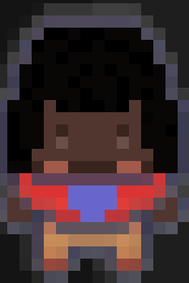
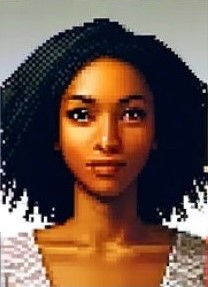
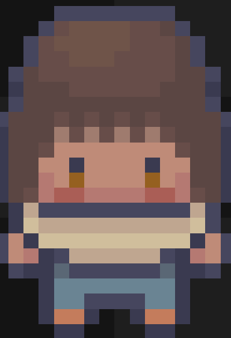
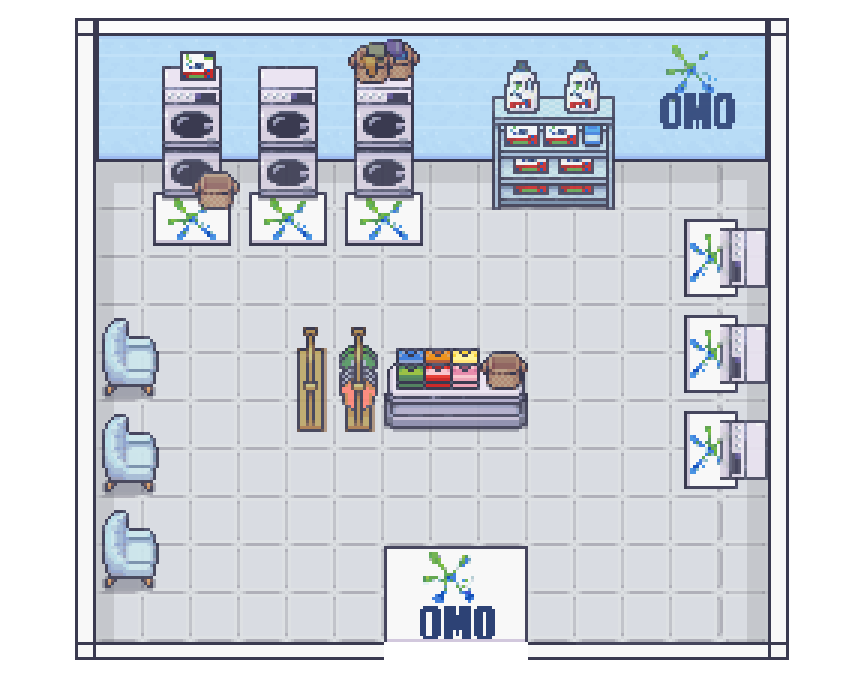
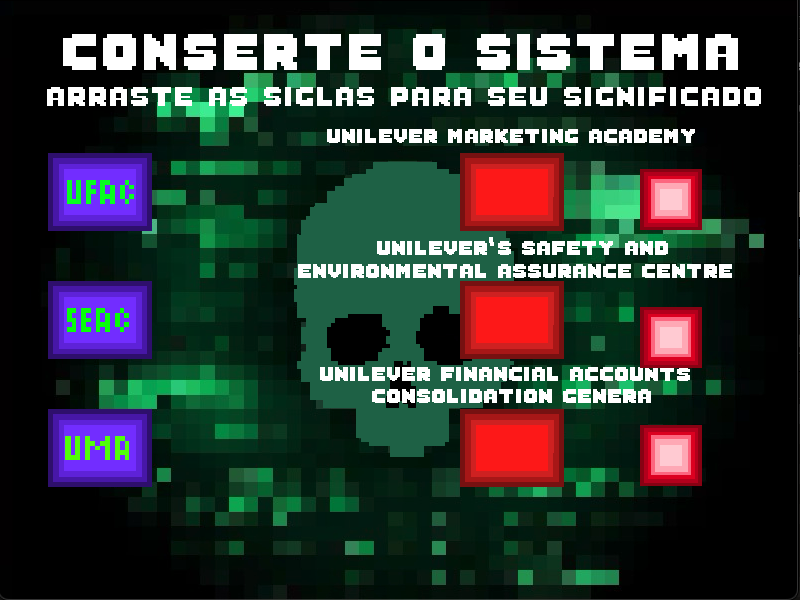

<div alignt="center">

</div>

# GDD - Game Design Document - Módulo 1 - Inteli

## Green Tech

#### *Nomes dos Integrantes:*
#### Andre Dleizer
#### André Lobo
#### Gabriel Nascimento
#### Laura Rodrigues
#### Lucca Pereira
#### Milena Castro
#### Ryan Gartlan
      


## Sumário

[1. Introdução](#c1)

[2. Visão Geral do Jogo](#c2)

[3. Game Design](#c3)

[4. Desenvolvimento do jogo](#c4)

[5. Casos de Teste](#c5)

[6. Conclusões e trabalhos futuros](#c6)

[7. Referências](#c7)

[Anexos](#c8)

<br>

## Lista de figuras

Figura 1 - Análise SWOT da Empresa Unilever

Figura 2 - Value Proposition Canva

Figura 3 - Matriz de Riscos

Figura 4 - 5 forças de Porter

Figura 5 - Personagens Controláveis

Figura 6 - Personagens Jogáveis Humanoides

Figura 7 - Personagens Não Controláveis

Figura 8 - Concept art inicial do jogo

Figura 9 - Concept art dos Personagens Jogáveis

Figura 10 - Concept art do cenário "Sorveteria Kibon"

Figura 11 - Concept art dos cenários do jogo

Figura 12 - Parte Inicial do Jogo

Figura 13 - Introdução da missão e primeiro minigame

Figura 14 - Celular

Figura 15 - Minigame Hack

Figura 16 - Cena Cidade

Figura 17 - Minigame jogo da memória

Figura 18 - Funcionamento dos cenários internos dos estabelecimentos

Figura 19 - Funcionamento dos cenários internos dos estabelecimentos parte 2

Figura 20 - Finalização do quiz por cenário

Figura 21 - Quiz final

Figura 22 - Classes das Telas do Jogo

Figura 23 - Classes das Telas do Jogo parte 2

Figura 24 - Protótipo 1

Figura 25 - Mapa Escritório

Figura 26 - Sprite Personagem

Figura 27 - Tela inicial

Figura 28 - Tela inicial com Botão "Play" Acionado

Figura 29 - Tela de Seleção de Personagem

Figura 30 - Personagem Selecionado

Figura 31 - Interação com NPC

Figura 32 - Fala com NPC

Figura 33 - Lavanderia Omo Parte Externa

Figura 34 -  Lavanderia Omo Parte Interna

Figura 35 - Kibon Parte Externa

Figura 36 -  Kibon Parte Interna

Figura 37 - Clear Parte Externa

Figura 38 - Clear parte interna

Figura 39 - Cenário Rexona

Figura 40 - Cenário Mãe Terra

Figura 41 - Secretário do Escritório

Figura 42 - Computador para Minigame Hacker

Figura 43 - Minigame Hacker

Figura 44 - Tela Game Over do Minigame Hacker

Figura 45 - Tela Tutorial

Figura 46 - Balão de fala do NPC

Figura 47 - Tela de adição do nome do jogador

Figura 48 - NPC dizendo nome do jogador

Figura 49 -  HUD de tasks

Figura 50 - Jogo da memória

Figura 51 - Quiz: tela play

Figura 52 - Quiz

Figura 53 - Celular

Figura 54 - GPS

Figura 55 - Links

Figura 56 - Mapa dos pedaços

Figura 57 - Pedaços coletados

Figura 58 - "U" fachada do prédio

Figura 59 -  "U" fachada do prédio restaurado

Figura 60 - Quiz no cenário Kibon

Figura 61 - Pop-up elemento U

Figura 62 - Tela final do jogo

Figura 63 - Tela Cidade Unilever

## Lista de tabelas

Tabela 1 - Requisitos do Projeto

Tabela 2 - Personagens Não Controláveis

Tabela 3 - Cenários do Jogo

Tabela 4 - Trilhas Sonoras

Tabela 5 - Itens Coletáveis

Tabela 6 - Mecânicas do Jogo

Tabela 7 - Casos de Teste


<br>

# <a name="c1"></a>1. Introdução
&nbsp;&nbsp;&nbsp;&nbsp;Um Game Design Document (GDD) é uma descrição detalhada e abrangente de um jogo proposto. No contexto deste projeto, o GDD tem como objetivo fornecer uma visão completa do jogo que, de acordo com o TAPI (termo de abertura de projeto do Inteli), destina-se a aumentar o engajamento e absorção, facilitando a experiência de On Boarding do funcionário de IT da Unilever<sup>1</sup>. Através deste documento, explora-se as mecânicas de jogo, narrativa, personagens, níveis, arte, interface do usuário e outros elementos essenciais que compõem esta experiência interativa. Ele serve como um guia essencial para a equipe de desenvolvimento, delineando claramente a visão, objetivos e direção do projeto, bem como para o cliente que se informará detalhadamente sobre o desenvolvimento do projeto<sup>2</sup>.


## 1.1. Escopo do Projeto
&nbsp;&nbsp;&nbsp;&nbsp;Nesta subseção, aborda-se uma análise completa do cenário da indústria, utilizando ferramentas como a análise SWOT, a descrição detalhada da solução desenvolvida, proposta de valor canvas, matriz de riscos e a análise das 5 forças de Porter. Essa abordagem aprofundada oferece uma compreensão holística do ambiente no qual o jogo será inserido, destacando oportunidades estratégicas, desafios potenciais e áreas críticas para o sucesso. Ao explorar cada aspecto com detalhes, torna-se mais fácil tomar decisões embasadas e conduzir o projeto de maneira eficiente e eficaz.


### 1.1.1. Contexto da indústria

&nbsp;&nbsp;&nbsp;&nbsp;A Unilever é uma das maiores empresas de bens de consumo do mundo, com uma gama de marcas populares em alimentos, cuidados pessoais e limpeza doméstica e está presente em mais de 190 países<sup>3</sup>. Seu modelo de negócios inclui marcas globais, regionais e locais, permitindo uma abordagem adaptada às necessidades específicas de cada mercado, sendo assim, o faturamento da empresa é de 59,6 bilhões de euros em 2023, sendo 58% em mercados emergentes<sup>4</sup>. Ainda, a indústria de alimentos é denominada por 11 marcas tradicionais, sendo elas a Unilever, Nestlé, Coca-Cola entre outras concorrentes<sup>5</sup>. A empresa opera com uma estratégia de sustentabilidade e responsabilidade social buscando melhores condições das comunidades onde atuam (Unilever Brasil).


### 1.1.2. Análise SWOT

&nbsp;&nbsp;&nbsp;&nbsp;A Análise SWOT de planejamento estratégico concede uma visão holística dos ambientes internos e externos da empresa. Ela é feita a partir de uma matriz 2x2 que engloba forças (strenghts), fraquezas (weakness), oportunidades (opportunities) e ameaças (threats). Desse modo, abaixo está a análise SWOT da empresa Unilever<sup>6</sup>.
<div align="center">
	
<sub>Figura 1 - Análise SWOT da Empresa Unilever</sub>


<sub>Fonte: Autoria própria (2024)</sub>
</div>

&nbsp;&nbsp;&nbsp;&nbsp;A empresa se destaca por sua presença global, portfólio forte e variado, compromisso com a sustentabilidade e valorização da diversidade. Essa combinação lhe garante uma vantagem competitiva em termos de alcance, reconhecimento, atratividade para consumidores e investidores, e criatividade. No entanto, a Unilever enfrenta desafios em mercados já desenvolvidos, devido à alta concorrência. A complexidade da cadeia de distribuição e a flutuação dos custos de matérias-primas também representam obstáculos para o crescimento.


&nbsp;&nbsp;&nbsp;&nbsp;Para superar esses desafios e alcançar o sucesso, a companhia deve explorar novos mercados, como mercados emergentes, para aumentar sua base de clientes. Aproveitar as tendências do mercado, como a sustentabilidade, também é uma estratégia importante para se diferenciar da concorrência. Encontrar pessoas com um perfil profissional adaptável é fundamental para lidar com as mudanças constantes do mercado e implementar novas estratégias. Além disso, é preciso estar atento à grande e variada concorrência, às flutuações cambiais e à resistência à mudança por parte dos funcionários. Ao explorar suas forças, aproveitar as oportunidades, minimizar as fraquezas e se preparar para as ameaças, a empresa estará no caminho certo para o seu desenvolvimento.

### 1.1.3. Descrição da Solução Desenvolvida

&nbsp;&nbsp;&nbsp;&nbsp;O problema central do parceiro Unilever é a necessidade de aumentar o engajamento e absorção do conteúdo sobre a empresa durante o processo de Onboarding dos funcionários de TI da empresa. O desafio é tornar a experiência mais atrativa, eficiente e alinhada à cultura híbrida de trabalho da Unilever.
De acordo com a transparência de dados em seu relatório anual de informações, a Unilever está presente em 190 países e tem 400 marcas presentes no mundo inteiro, dividido em 5 grandes segmentos: beleza e bem estar; cuidado pessoal; cuidados domiciliares; nutrição e sorvete<sup>7</sup>. Além disso, 3,4 bilhões de pessoas usam produtos da Unilever todos os dias.


&nbsp;&nbsp;&nbsp;&nbsp;A solução proposta é um jogo para combater a falta de engajamento no Onboarding, apresentando informações da empresa e direcionando os jogadores para trilhas específicas na intranet. O jogo aborda suporte, equipe e estrutura organizacional entre outros conteúdos da trilha de maneira interativa, com puzzles, minigames e diálogos com NPCs para obter conquistas. 


&nbsp;&nbsp;&nbsp;&nbsp;O jogo será incorporado como uma etapa essencial no processo de integração de novos funcionários de TI na Unilever a partir de materiais mais lúdicos e interativos. Para garantir que tenham completado com sucesso o programa de integração, será necessário que joguem online e atendam aos requisitos estabelecidos. 


&nbsp;&nbsp;&nbsp;&nbsp;A solução do jogo para o problema do parceiro agrega alguns benefícios para a empresa, pois terá maior índice de funcionários que concluíram o Onboarding, aumentando o engajamento e a absorção do conteúdo. Assim, a empresa integra melhor seus funcionários na cultura da empresa e tem oportunidade de se identificar com os valores e propósitos da Unilever.


&nbsp;&nbsp;&nbsp;&nbsp;Para saber o sucesso da proposta será medido a melhoria do engajamento e absorção do conteúdo do Onboarding. Isso através de testes em forma de puzzles, minigames entre outros, que ajudam na fixação do conteúdo e feedbacks dos jogadores para coletar informações sobre dificuldade, aprendizado, satisfação e etc.


### 1.1.4. Proposta de Valor

&nbsp;&nbsp;&nbsp;&nbsp;A Proposta de Valor identifica as necessidades do cliente, aponta os benefícios do produto e destaca de forma clara e objetiva como aquele produto satisfaz a necessidade do cliente e seu valor diante dos benefícios em relação aos concorrentes<sup>8</sup>.
<div align="center">
	
<sub>Figura 2 - Value Proposition Canva</sub>

 


<sub>Fonte: Autoria própria (2024)</sub>
</div>

&nbsp;&nbsp;&nbsp;&nbsp;No Business Model Canvas, a Proposta de Valor é essencialmente dividida em dois elementos-chave para análise de negócios: Value Proposition e Customer Segments.

&nbsp;&nbsp;&nbsp;&nbsp;A Value Proposition contém informações sobre o que a empresa oferece aos clientes para resolver seus problemas ou satisfazer suas necessidades. Isso inclui detalhes sobre os produtos ou serviços da empresa, assim como os benefícios específicos que proporcionam aos clientes. No Canvas em questão (Figura 2), encontramos os Gain Creators, que geram benefícios ou "ganhos" para os clientes, como um ambiente interativo, conteúdo de fácil acesso e feedbacks dos funcionários. Também temos Products & Services, que descreve os principais produtos ou serviços da empresa, como um jogo sobre a empresa. Além disso, temos o Pain Relievers, que são os alívios de dores da proposta, como puzzles, quizzes e um jogo interativo.

&nbsp;&nbsp;&nbsp;&nbsp;O Customer Segments identifica e descreve os diferentes grupos de clientes que a empresa pretende atingir com sua Proposta de Valor. Ele é composto por Gains, Customer Jobs e Pains. Os Gains são os benefícios específicos que os clientes esperam ou desejam receber ao adquirir um produto ou serviço de uma empresa, como a solidificação da cultura da empresa, integração rápida dos funcionários e funcionários mais bem preparados. Os Customer Jobs se concentram nas necessidades e desejos dos clientes em relação a um determinado produto ou serviço, como a apresentação da cultura e da influência da empresa, a empresa multinacional de bens de consumo e a integração e ambientação dos novos funcionários de TI. Por último, os Pains referem-se aos problemas, desafios, frustrações ou obstáculos que enfrentam em suas vidas diárias e que podem ser aliviados ou resolvidos por meio da oferta de produtos ou serviços de uma empresa, como desconhecimento das marcas e da cultura da Unilever, falta de engajamento no processo de onboarding e dificuldades de ambientação dos novos funcionários de TI na empresa.

### 1.1.5. Matriz de Riscos

&nbsp;&nbsp;&nbsp;&nbsp;A Matriz de Riscos expõe todos os riscos e impactos reais ou potenciais no desenvolvimento de um projeto, assim possibilitando o gerenciamento das incertezas existentes no processo de evolução do produto<sup>9</sup>. A criação de uma matriz é feita por meio de uma tabela que relaciona a probabilidade e o impacto da ocorrência do risco analisado, classificando-o como baixo (cor verde), médio (cor amarela) ou alto (cor vermelha). Dessa forma, ao fazer uso da Matriz de Riscos, torna-se possível realizar a avaliação dos prováveis danos, facilitando assim a priorização na realização de tarefas.
<div align="center">
	
<sub>Figura 3 - Matriz de Riscos<sub>


<sub>Fonte: Autoria própria (2024)</sub>
</div>

&nbsp;&nbsp;&nbsp;&nbsp;Diante do exposto, para realizar o desenvolvimento do jogo proposto pela empresa Unilever, tornou-se necessário identificar e pontuar os possíveis riscos apresentados na tabela exposta acima. Além disso, é importante estabelecer o planejamento e as respostas para cada desses riscos. Logo foi elaborado um plano de ação para cada um deles:

* Atrasos no desenvolvimento: Utilizar uma metodologia ágil para ter mais controle das datas de entrega e tarefas, além de redistribuir tarefas quando necessário. Ou seja, realizar revisões semanais do cronograma do projeto, identificando possíveis atrasos e tomando medidas corretivas imediatas, como alocação de recursos adicionais ou redefinição de prioridades.

* Problemas técnicos: Implementar revisões de código semanais, utilizando ferramentas de análise estática e revisões por pares para identificar e corrigir potenciais problemas técnicos.

* Falta de engajamento dos funcionários: Realizar reuniões semanais de equipe para avaliar o nível de engajamento e identificar áreas de melhoria, como introdução de atividades de colaboração em equipe e reconhecimento público das contribuições dos membros da equipe.

* Dificuldades de aprendizado:  Implementar um sistema de tutorial integrado ao jogo, oferecendo orientação contextualizada conforme o jogador avança nas fases, além de fornecer recursos de ajuda e dicas opcionais.

* Problemas de compatibilidade:  Realizar uma análise técnica para determinar a causa raiz do problema de compatibilidade, envolvendo testes em diferentes versões do sistema operacional, hardware e outros softwares relevantes. Implementar soluções específicas para cada plataforma identificada.

* Problemas na equipe de projeto: Estabelecer um canal de comunicação aberto para que os membros da equipe relatem quaisquer problemas ou preocupações. Realizar reuniões regulares para avaliar o progresso do projeto e identificar potenciais desafios na equipe, tomando medidas proativas para resolvê-los.

* Risco de não atender às expectativas dos usuários: Realizar pesquisas de mercado e entrevistas com o público-alvo para entender suas preferências e expectativas em relação ao jogo. Incorporar feedback dos usuários durante todo o processo de desenvolvimento e testes feitos para garantir que o produto final atenda às suas necessidades e expectativas.

* Risco de obsolescência tecnológica: Manter-se atualizado sobre as tendências tecnológicas emergentes e avaliar regularmente a viabilidade de incorporar novas tecnologias ao jogo. Implementar um ciclo de vida de desenvolvimento que permita atualizações regulares do jogo para manter sua relevância e compatibilidade com as plataformas atuais.

* Mudanças na estratégia de negócios: Estabelecer um ponto de contato dedicado na equipe de desenvolvimento para coordenar a comunicação com a empresa e garantir que as mudanças na estratégia de negócios sejam prontamente avaliadas e incorporadas ao planejamento do projeto. Realizar reuniões regulares com os stakeholders para revisar e ajustar os requisitos do jogo conforme necessário,  como as sprints de validação. 


 &nbsp;&nbsp;&nbsp;&nbsp;Portanto, a elaboração de planos de ação concretos para cada risco identificado na matriz é crucial para o sucesso do projeto de desenvolvimento do jogo proposto pela Unilever. Ao adotar uma abordagem proativa e pragmática, a equipe pode mitigar eficazmente os riscos, garantindo a entrega de um produto de alta qualidade que atenda às expectativas dos usuários.

### 1.1.6. As 5 forças de Porter
&nbsp;&nbsp;&nbsp;&nbsp;As cinco forças de Porter são um modelo que ajuda empresas a entenderem o ambiente competitivo em que estão inseridas, incluindo rivalidade entre concorrentes, poder de barganha de fornecedores e compradores, ameaça de novos concorrentes e ameaça de produtos substitutos<sup>10</sup>. São importantes porque influenciam diretamente a lucratividade e a competitividade da empresa, permitindo que ela desenvolva estratégias mais eficazes para enfrentar a concorrência e identificar oportunidades de crescimento.

<div align="center">
	
<sub>Figura 4 - 5 forças de Porter<sub>


<sub>Fonte: Autoria própria (2024)</sub>
</div>


1. A rivalidade entre os concorrentes existentes é uma característica marcante do ambiente competitivo na indústria de bens de consumo embalados<sup>11</sup>, onde a Unilever opera. Esta rivalidade é intensificada pela agressiva competição por participação de mercado, receita e fidelidade do cliente.

A Unilever, atuando em diversos segmentos como alimentos, cuidados pessoais e produtos de limpeza, enfrenta desafios únicos em cada um desses mercados. Por exemplo, no segmento de alimentos, a Unilever compete com empresas como Nestlé e Kraft Heinz, que têm uma forte presença global e uma ampla gama de produtos. No segmento de cuidados pessoais, a Unilever enfrenta a concorrência de empresas como Procter & Gamble e L'Oréal, que são conhecidas por sua inovação e fortes estratégias de marketing.

A intensa rivalidade muitas vezes se traduz em uma guerra de preços, onde as empresas reduzem os preços de seus produtos para atrair clientes. Isso pode impactar as margens de lucro da Unilever. Por exemplo, a Unilever teve que reduzir os preços de seus produtos de cuidados pessoais na Índia em resposta à agressiva estratégia de preços da Patanjali Ayurved.

Para manter sua posição competitiva, a Unilever precisa inovar constantemente e desenvolver novos produtos que atendam às demandas e tendências dos consumidores. Um exemplo disso é o lançamento da Unilever de produtos veganos e sem glúten em resposta à crescente demanda dos consumidores por opções de alimentos mais saudáveis.

Além disso, a Unilever precisa continuar aprimorando sua estratégia competitiva, investindo em inovação, fortalecendo sua presença global e mantendo um foco contínuo na satisfação do cliente. A empresa tem feito isso através de várias iniciativas, como a aquisição da Dollar Shave Club para fortalecer sua presença no mercado de cuidados pessoais online.

Ao entender e gerenciar adequadamente a rivalidade entre os concorrentes existentes, a Unilever pode navegar com sucesso neste ambiente competitivo e manter sua posição de liderança no mercado. Através de uma gestão eficaz da rivalidade entre os concorrentes, a Unilever pode enfrentar os desafios que essa posição impõe e continuar a ser uma escolha preferida para os consumidores.
</p>

2. O poder de barganha dos fornecedores<sup>12</sup> é uma força que pode ter um impacto significativo na Unilever, uma empresa global que opera em diversos segmentos, como alimentos, cuidados pessoais e produtos de limpeza. Este poder pode variar dependendo dos materiais e ingredientes necessários para a produção de seus produtos.

Em alguns casos, a Unilever pode estar sujeita a fornecedores com um poder de negociação significativo. Por exemplo, a Unilever depende de fornecedores de óleo de palma para muitos de seus produtos. No entanto, o mercado de óleo de palma é dominado por um pequeno número de fornecedores, o que pode dar a esses fornecedores um poder de barganha significativo. Em resposta a isso, a Unilever tem trabalhado para diversificar seus fornecedores de óleo de palma e também tem investido em iniciativas para produzir seu próprio óleo de palma de maneira sustentável.

Além disso, flutuações nos preços de commodities globais podem afetar o poder de barganha dos fornecedores. Por exemplo, em 2020, a pandemia de COVID-19 causou uma interrupção significativa na cadeia de suprimentos global, o que levou a um aumento nos preços de muitas commodities. Isso deu aos fornecedores de tais commodities um maior poder de barganha. A Unilever respondeu a isso através de uma combinação de estratégias, incluindo a diversificação de fornecedores, a busca por eficiências na cadeia de suprimentos e o investimento em parcerias estratégicas de longo prazo com fornecedores confiáveis.

Para lidar com o poder de barganha dos fornecedores, a Unilever adota várias estratégias. Por exemplo, a empresa tem uma parceria de longo prazo com a Symrise, um dos principais fornecedores de fragrâncias e sabores do mundo. Esta parceria permite à Unilever garantir o fornecimento de ingredientes essenciais a preços estáveis, ao mesmo tempo em que trabalha com a Symrise para desenvolver novos produtos e inovações.

Ao entender e gerenciar adequadamente o poder de barganha dos fornecedores, a Unilever pode garantir o abastecimento eficiente e sustentável de materiais essenciais para seus produtos. Isso permite que a Unilever continue a oferecer produtos de alta qualidade aos seus clientes, mesmo diante de desafios na cadeia de suprimentos. Através de uma gestão eficaz do poder de barganha dos fornecedores, a Unilever pode manter sua posição competitiva no mercado.
</p>


3. O poder de barganha dos compradores é uma força significativa no contexto da Unilever, uma empresa global que atua em diversos segmentos de bens de consumo embalados<sup>13</sup>. Esta força é particularmente evidente quando se considera os grandes varejistas e supermercados, que são compradores importantes dos produtos da Unilever.


Estes compradores, devido ao volume de suas compras e à disponibilidade de alternativas no mercado, têm a capacidade de influenciar os preços e condições de venda. Eles podem pressionar por descontos, promoções especiais, prazos de pagamento estendidos e até mesmo exigir produtos personalizados ou exclusivos para atender às demandas dos consumidores.

Um exemplo concreto disso pode ser visto na relação da Unilever com o Walmart, um dos maiores varejistas do mundo. O Walmart tem a capacidade de negociar preços mais baixos devido ao seu volume de compras, o que pode pressionar as margens da Unilever. Em resposta a isso, a Unilever tem trabalhado para desenvolver produtos exclusivos para o Walmart, como a linha de sorvetes Ben & Jerry's "Moo-phoria", que é vendida exclusivamente nas lojas do Walmart.

Além disso, em mercados altamente competitivos, onde os consumidores têm muitas opções para escolher, os compradores podem facilmente trocar de fornecedor se não estiverem satisfeitos com os termos oferecidos pela Unilever. Isso coloca pressão sobre a empresa para manter a qualidade, inovação e eficiência em seus produtos e serviços.

Para lidar com essa força, a Unilever adota diversas estratégias. Por exemplo, a empresa desenvolveu um programa de fidelidade chamado "Unilever Plus" em alguns mercados, que oferece descontos e recompensas aos clientes que compram regularmente produtos da Unilever. Além disso, a empresa investe em marketing para fortalecer a percepção da marca e estabelece parcerias estratégicas com clientes-chave para desenvolver soluções personalizadas que agreguem valor aos seus negócios.

A Unilever também busca constantemente melhorias em seus processos de produção e distribuição para reduzir custos e manter margens competitivas. Um exemplo disso é a iniciativa "Unilever Sustainable Living Plan", que visa reduzir pela metade o impacto ambiental da produção e uso de seus produtos até 2030. Esta iniciativa não só ajuda a Unilever a reduzir custos, mas também fortalece sua imagem de marca entre os consumidores conscientes do meio ambiente.

Ao entender e gerenciar o poder de barganha dos compradores, a Unilever pode construir relacionamentos sólidos com seus clientes e garantir sua posição competitiva no mercado. Através de estratégias eficazes e inovação contínua, a Unilever está bem posicionada para enfrentar o poder de barganha dos compradores e continuar a ser uma escolha preferida para os consumidores.
</p>

4. A ameaça de novos entrantes refere-se à possibilidade de novas empresas entrarem no mercado e competirem com as empresas existentes<sup>14</sup>. No caso da Unilever, que opera em diversos setores de bens de consumo embalados, essa ameaça pode variar dependendo da facilidade de entrada em cada segmento de mercado.

&nbsp;&nbsp;&nbsp;&nbsp;Para a Unilever, a entrada de novos concorrentes pode representar uma ameaça significativa, especialmente em mercados onde as barreiras à entrada são relativamente baixas. Por exemplo, em segmentos de produtos de consumo mais genéricos, como produtos de limpeza doméstica ou produtos alimentícios básicos, novas marcas podem entrar com facilidade no mercado com baixos custos de produção e investimento em marketing.

&nbsp;&nbsp;&nbsp;&nbsp;No entanto, em segmentos de mercado mais especializados ou tecnologicamente avançados, como produtos de cuidados pessoais de alta performance ou alimentos funcionais, as barreiras à entrada podem ser mais altas devido à necessidade de investimentos em pesquisa e desenvolvimento, distribuição e construção de uma marca forte.

&nbsp;&nbsp;&nbsp;&nbsp;Para enfrentar essa ameaça, a Unilever pode adotar várias estratégias defensivas. Por exemplo, a empresa pode investir em inovação para manter a diferenciação de seus produtos. No entanto, isso pode implicar em custos significativos de pesquisa e desenvolvimento. Além disso, a Unilever pode expandir sua presença global para dificultar a entrada de novos concorrentes. Isso pode exigir um investimento substancial em marketing e distribuição. A empresa também pode estabelecer parcerias estratégicas com fornecedores e distribuidores para fortalecer sua posição no mercado, o que pode envolver custos de negociação e coordenação.

&nbsp;&nbsp;&nbsp;&nbsp;Além disso, a Unilever pode aproveitar sua escala e recursos para reduzir os custos de produção e distribuição, tornando-se mais competitiva em relação aos novos entrantes. No entanto, isso pode exigir investimentos significativos em tecnologia e infraestrutura.

&nbsp;&nbsp;&nbsp;&nbsp;Ao compreender e monitorar constantemente a ameaça de novos entrantes, a Unilever pode tomar medidas proativas para proteger sua participação de mercado e sustentar seu crescimento a longo prazo. No entanto, é importante que a empresa avalie regularmente o custo e o impacto dessas estratégias defensivas para garantir que elas sejam eficazes e sustentáveis a longo prazo.
</p>

5. A ameaça de produtos ou serviços substitutos é uma realidade constante para empresas como a Unilever, que atua em diversos segmentos de bens de consumo embalados. Essa ameaça pode surgir de várias fontes e é crucial para a Unilever entender e monitorar essas ameaças para manter sua posição competitiva no mercado.

No setor de alimentos e bebidas, por exemplo, a Unilever enfrenta a concorrência de marcas que oferecem produtos similares a preços competitivos. Um exemplo recente disso pode ser a crescente popularidade dos alimentos plant-based, que estão sendo adotados por um número crescente de consumidores devido às suas credenciais de saúde e sustentabilidade. Em resposta a isso, a Unilever lançou uma série de produtos plant-based sob suas marcas existentes para atender a essa demanda.

Além disso, as mudanças nas preferências dos consumidores em direção a opções mais saudáveis, sustentáveis ou éticas podem criar demanda por produtos alternativos. Por exemplo, a crescente conscientização sobre os impactos ambientais dos plásticos descartáveis levou a um aumento na demanda por embalagens recicláveis ou biodegradáveis. A Unilever respondeu a isso através de seu compromisso de garantir que 100% de suas embalagens de plástico sejam reutilizáveis, recicláveis ou compostáveis até 2025.

No segmento de cuidados pessoais e produtos de limpeza, a ameaça de substituição pode vir de novas tecnologias ou abordagens que ofereçam benefícios superiores. Por exemplo, a crescente popularidade dos produtos de limpeza orgânicos ou biodegradáveis representa uma ameaça aos produtos convencionais da Unilever. Em resposta, a Unilever tem investido em pesquisa e desenvolvimento para criar produtos de limpeza mais sustentáveis e eficazes.

Para enfrentar essas ameaças, a Unilever adota estratégias de inovação contínua, desenvolvendo produtos que atendam às necessidades e preferências em evolução dos consumidores. Além disso, a empresa investe em marketing e educação do consumidor para destacar os benefícios exclusivos de seus produtos em comparação com as alternativas disponíveis.

Ao compreender e monitorar a ameaça de produtos ou serviços substitutos, a Unilever pode ajustar sua estratégia de negócios para garantir que seus produtos continuem a ser a escolha preferida dos consumidores. Isso permite que a Unilever mantenha sua posição competitiva no mercado, mesmo diante de ameaças emergentes.
</p>

## 1.2. Requisitos do Projeto

&nbsp;&nbsp;&nbsp;&nbsp;Os requisitos do projeto são as necessidades e expectativas fundamentais que guiam seu desenvolvimento e execução. Eles definem o que deve ser alcançado, como e sob quais condições. Esta seção aborda os requisitos funcionais e não funcionais, técnicos, de qualidade e conformidade do projeto. Essenciais para garantir os objetivos, esses requisitos formam a base para o planejamento, implementação e avaliação do projeto<sup>1</sup>.

<div align="center">

<sub>Tabela 1 - Requisitos do Projeto<sub>

\# | Requisitos  
--- | ---
1 | O controle do personagem é realizado usando as teclas direcionais para navegar pelo mundo
2 | O personagem se movimenta em um mundo semi-aberto para todas as direções
3 | O personagem é personalizável para atender a diversidade de pessoas
4 | O jogo funciona com foco na web
5 | O jogo disponibiliza links para o hub do parceiro
6 | O jogo fornece puzzles e quizes para interagir com o player 
7 | O jogo testa o conhecimento do player sobre a trilha de Onboarding
8 | O jogo traz informações sobre as principais marcas da Unilever
9 | O jogo testa o conhecimento do player sobre essas marcas
10 | Os NPCs representam a grande diversidade de pessoas que tem dentro da Unilever
11 | As instruções do jogo são claras e direcionam bem o jogador ao longo do jogo, permitindo que ele o complete até o fim
12 | O jogo utiliza cores e temas disponibilizados pela Unilever

&nbsp;&nbsp;&nbsp;&nbsp;Em conclusão, os requisitos estabelecidos fornecem um quadro claro e abrangente para o desenvolvimento do nosso jogo para o processo de onboarding da Unilever. Eles representam não apenas as expectativas e necessidades do cliente, mas também vão servir como uma bússola para toda a equipe de desenvolvimento durante o ciclo de produção. 

<sub>Fonte: Autoria própria (2024)<sub>

</div>

## 1.3. Público-alvo do Projeto
&nbsp;&nbsp;&nbsp;&nbsp;O jogo de onboarding desenvolvido para os novos funcionários da Uniops da companhia Unilever é cuidadosamente projetado para atender às necessidades e aos interesses específicos do público-alvo do game. Ao considerar os dados demográficos e as preferências pessoais dos colaboradores que ingressam no time Unilever, durante o processo de Onboarding na área de TI, identifica-se um perfil diversificado, mas com características comuns que direcionam o design e o conteúdo do jogo.


&nbsp;&nbsp;&nbsp;&nbsp;Para traçar o perfil e obter os dados, foi realizada uma pesquisa de campo feita com funcionários da Uniops, na qual coletou-se um total de 28 respostas para questionamentos como gênero, idade, tempo na Unilever, em qual área atua, gêneros de jogos que mais gostam, plataformas e nomes de jogos que eles costumam jogar. Dessa forma, com uma análise feita das respostas, foi possível obter métricas importantes sobre público alvo.


&nbsp;&nbsp;&nbsp;&nbsp;Em primeiro lugar, o público-alvo do nosso projeto é composto predominantemente por jovens profissionais que  têm formação acadêmica recente e estão no início de suas carreiras, visto que quando perguntados sobre a idade que ingressaram na empresa, observa-se que, em sua maioria, possuem entre 17 e 30 anos. Além disso, quando perguntado sobre o tempo de atuação na empresa, a maioria dos respondentes dessa faixa etária tem cerca de um ano de empresa.


&nbsp;&nbsp;&nbsp;&nbsp;Já quando questionado sobre a área de atuação, o perfil desse público possui um forte interesse em tecnologia e inovação e são motivados pelo aprendizado contínuo e pela oportunidade de crescimento profissional na empresa, já que em sua maioria são jovens em primeiras experiências profissionais. 
Com relação à preferência de jogos, foi perguntado aos colaboradores os tipos e gêneros que mais gostam e o que eles costumam jogar, entre as respostas observa-se uma grande tendência a jogos de ação, estratégia, curiosidade, aventura, quebra-cabeças e jogos como Ludo, League of legends, GTA e Candy Crush. Sendo assim, o jogo em desenvolvimento possui características de todos esses segmentos, pois há a exploração de uma “cidade unilever” onde é possível realizar minigames  de forma interativa e dinâmica.


&nbsp;&nbsp;&nbsp;&nbsp;Em termos de preferências pessoais, tem-se que a Unilever e seus colaboradores da Uniops valorizam a autonomia e a flexibilidade no ambiente de trabalho. Ainda, a companhia oferece a plataforma Flex que proporciona aos colaboradores explorarem uma área que não seja a que eles estão. 


&nbsp;&nbsp;&nbsp;&nbsp;Em resumo, o público-alvo do jogo de onboarding da área de TI da Unilever não é composto somente por jovens profissionais com interesse em tecnologia, aprendizado contínuo e desenvolvimento de carreira, mas também de pessoas já experientes da área ou advindas de outras áreas da empresa. Dessa forma, o jogo foi desenvolvido levando em consideração o público-alvo e seu perfil, características demográficas e preferências pessoais, proporcionando uma experiência de integração que visa a personalização e a eficácia.


# <a name="c2"></a>2. Visão Geral do Jogo

&nbsp;&nbsp;&nbsp;&nbsp;Esta seção de Visão Geral do Jogo é um ponto de partida essencial para compreender a essência e os objetivos fundamentais por trás da criação do nosso jogo. Aqui, apresenta-se uma visão abrangente que aborda o objetivo, o público-alvo, a proposta única do jogo e os principais pilares que irão orientar o desenvolvimento. Esta seção é fundamental para alinhar a equipe de desenvolvimento em relação à visão global do projeto, estabelecendo uma base sólida para orientar todas as decisões criativas e estratégicas que serão tomadas ao longo do processo de desenvolvimento do jogo.


## 2.1. Objetivos do Jogo
&nbsp;&nbsp;&nbsp;&nbsp;O objetivo do jogo desenvolvido é proporcionar uma boa experiência de Onboardig para os novos colaboradores da Unilever, para que dessa forma eles possam conhecer melhor sobre a empresa e sua cultura. Para isso, o objetivo do jogo é recuperar as 3 partes do U roubado.E preciso completar minigames inspirados na Uniops da Unilever contendo informações do processo de entrada como estrutura organizacional,  e principais marcas da companhia, além de recuperar as partes do U roubado. Após concluídas, uma última fase seria liberada, onde um npc iria parabenizar pelos obstáculos completados e trazer informações finais sobre o onboarding.

## 2.2. Características do Jogo

&nbsp;&nbsp;&nbsp;&nbsp;Aqui exploram-se as características fundamentais que definirão a experiência do jogo proposto. Ao abordar o gênero do jogo, a plataforma de lançamento, o número de jogadores suportados, títulos semelhantes e fontes de inspiração, além do tempo estimado de jogo, buscando fornecer uma visão abrangente das especificidades que moldaram a identidade e a experiência do do projeto. Cada subseção discutida desempenha um papel importante na definição do game proposto para o projeto e no potencial envolvimento dos jogadores, fundamentais para o sucesso do jogo.


### 2.2.1. Gênero do Jogo

&nbsp;&nbsp;&nbsp;&nbsp;Um jogo de aventura é um gênero que se caracteriza principalmente por um enredo que gira em torno da exploração de um mundo virtual. O jogador assume o papel de protagonista e se depara com diversos quebra-cabeças e desafios ao mesmo tempo em que interage com NPCs, tudo isso com o objetivo de completar sua missão.
Dessa forma, através de links e minigames, o gênero que melhor descreve nosso jogo é a aventura. No início, o player tem a opção de escolher entre dois personagens. Em seguida, ele vai explorar os diferentes ambientes de trabalho da Unilever. Nesses espaços, o personagem vai interagir com NPCs além de ser redirecionado por links para aprender conteúdo sobre a empresa, posteriormente sendo testado por meio de minigames, recebendo uma recompensa caso complete adequadamente o desafio. 

### 2.2.2. Plataforma do Jogo

&nbsp;&nbsp;&nbsp;&nbsp;A plataforma é desktop, utilizando a plataforma web como solicitado pelo parceiro, sem necessidade de instalação, para facilitar o acesso, possíveis atualizações, coleta de dados e monitoramento, sem dependências de outras plataformas. A ideia seria o usuário assim que ingressar na empresa, receber um notebook de trabalho e a primeira coisa que ele abriria no computador seria o site do jogo para o início do processo do onboarding.

### 2.2.3. Número de jogadores

&nbsp;&nbsp;&nbsp;&nbsp;O jogo é de 1 player, pois é projetado oferecer uma experiência individual focada na jornada de desafios com foco no aprendizado da trilha de Onboarding do parceiro.  

### 2.2.4. Títulos semelhantes e inspirações

&nbsp;&nbsp;&nbsp;&nbsp;Para a concepção do jogo foi fundamental conhecer e pesquisar sobre outros jogos que possuem mecânicas, objetivos, minigames, ou design similares para servirem de inspiração. 
Como inspirações tem-se os jogos “Stardew Valley” desenvolvido por Eric "ConcernedApe" Barone<sup>15</sup>, onde os jogadores cuidam de uma fazenda em um jogo de RPG; “The Legend of Zelda” desenvolvido por Shigeru Miyamoto e Takashi Tezuka<sup>16</sup>, um jogo de ação-aventura com elementos do RPG; e Pokémon versões de Gameboy, onde o jogador viaja pelo mundo capturando os monstrinhos, feito pela desenvolvedora de jogos Game Freak<sup>17</sup>. 
Todos possuem dinâmicas de movimentação e mapas similares de exploração, que será utilizado para o usuário percorrer e conhecer os ambientes de trabalho da Unilever, conhecendo mais sobre a empresa, a área da Uniops e informações gerais, sendo desafiado por minigames ao decorrer do jogo que os recompensaram com um pedaço do grande U roubado do prédio Unilever.


### 2.2.5. Tempo estimado de jogo

 &nbsp;&nbsp;&nbsp;&nbsp;O jogo pode ser concluído em aproximadamente 15 minutos por partida, proporcionando uma experiência rápida e dinâmica para os jogadores. Essa estimativa visa oferecer uma perspectiva clara sobre o tempo necessário para desfrutar completamente do jogo, porém, é sem considerar o tempo de aprendizado dos jogadores nos links de conteúdo.

# <a name="c3"></a>3. Game Design

&nbsp;&nbsp;&nbsp;&nbsp;A seção de Game Design é fundamental para estabelecer as bases criativas e estruturais do nosso jogo. Aqui, explora-se todos os aspectos que moldam a experiência interativa, desde o enredo e os personagens até a diversidade e representatividade, o mundo do jogo e o concept art, a trilha sonora, o inventário e as regras e mecânicas do jogo. O Game Design não se limita apenas à jogabilidade; ele é a essência criativa que define a identidade e o apelo do jogo para os jogadores. Portanto, esta seção busca delinear todas as nuances e elementos que contribuirão para uma experiência envolvente e imersiva, enriquecida por uma narrativa envolvente, personagens cativantes, e uma mecânica de jogo atraente e equilibrada.


## 3.1. Enredo do Jogo

&nbsp;&nbsp;&nbsp;&nbsp;O jogo "Cidade Unilever" mergulha os jogadores em uma aventura emocionante, enquanto acompanham a jornada do protagonista, cujo nome é personalizável conforme a escolha do jogador. Como recém-contratado na empresa Unilever, o protagonista é imerso em um processo de integração peculiar: a recuperação do "U" que ornamenta a fachada do edifício da Unilever. Este símbolo vital foi misteriosamente roubado e espalhado pela "Cidade Unilever".


&nbsp;&nbsp;&nbsp;&nbsp;Iniciando sua missão, o jogador controla o protagonista em uma busca pela cidade, começando pela recuperação do controle do servidor central, que detém informações cruciais sobre a localização dos símbolos. Com esta valiosa informação em mãos, o protagonista parte para explorar os estabelecimentos temáticos espalhados pela cidade, como a Lavanderia Omo, o Salão de Cabelo Clear, a Sorveteria Kibon, a Floresta Mãe Terra e a Quadra Rexona.


&nbsp;&nbsp;&nbsp;&nbsp;Em cada local, o protagonista interage com os NPCs locais, buscando pistas e auxílio para recuperar cada parte do "U" perdido e, para isso, é peciso responder corretamente um quiz sobre a marca do cenário em que ele está. No entanto, durante sua exploração, o protagonista se vê em situações desafiadoras, chegando a se perder em meio à cidade. Após uma ligação para a central de atendimento da empresa, o protagonista retoma sua jornada com determinação, recuperando os símbolos perdidos e devolvendo à empresa seu precioso "U".


&nbsp;&nbsp;&nbsp;&nbsp;Ao final da jornada, o protagonista volta à sua rotina de trabalho, porém agora enriquecido com conhecimentos sobre a empresa adquiridos durante sua aventura. Através de um teste de conhecimento, o protagonista demonstra sua familiaridade com a cultura e valores da Unilever, refletindo o aprendizado e a superação ao longo de sua jornada em busca dos símbolos perdidos.


## 3.2. Personagens

&nbsp;&nbsp;&nbsp;&nbsp;No universo dos jogos, os personagens são elementos essenciais que dão vida e profundidade à experiência do jogador. Eles representam os protagonistas, antagonistas, aliados e figuras secundárias que habitam o mundo virtual e interagem com o jogador. Os personagens desempenham papéis diversos, desde impulsionar a narrativa até oferecer suporte e desafios ao longo da jornada do jogador.


&nbsp;&nbsp;&nbsp;&nbsp;Existem dois tipos principais de personagens em um jogo: os controláveis e os não controláveis (NPCs). Os personagens controláveis são aqueles que o jogador pode manipular diretamente, assumindo seu controle para explorar o ambiente, realizar ações e enfrentar desafios. Por outro lado, os NPCs são personagens não controlados pelo jogador, mas que desempenham funções importantes na progressão da história, fornecendo informações, desafios ou suporte ao protagonista.


&nbsp;&nbsp;&nbsp;&nbsp;Nesta seção, explora-se em detalhes o papel dos personagens no jogo "Cidade Unilever", abordando tanto os personagens controláveis quanto os NPCs, e destacando sua importância para a jogabilidade e imersão do jogador na narrativa do jogo.

### 3.2.1. Controláveis

&nbsp;&nbsp;&nbsp;&nbsp;No processo de desenvolvimento do personagem controlável, uma série de requisitos foi cuidadosamente considerada. Primeiramente, buscou-se criar personagens que escapem de representações estereotipadas, priorizando a diversidade e a originalidade. Além disso, houve uma ênfase na promoção da identificação do jogador com o avatar controlável, buscando criar uma conexão emocional e imersiva. Para garantir uma experiência de jogo fluida, optou-se por uma movimentação isométrica e com poucos controles, facilitando a jogabilidade e proporcionando uma curva de aprendizado suave aos jogadores. Assim, criando uma experiência acessível e envolvente para os mesmos, mantendo a diversão e a acessibilidade como prioridades-chave durante o desenvolvimento.


&nbsp;&nbsp;&nbsp;&nbsp;Sendo assim, com base nos requisitos listados, idealizou-se quatro opções de personagens controláveis, sendo que o jogador pode escolher uma de sua preferência logo após a tela de início do jogo e nomeá-la com seu próprio nome. Para a realização do desenvolvimento das ideias propostas, fez-se uso do software de desenvolvimento de personagens “Character Generator 2.0”<sup>18</sup>, plataforma que possibilita a geração de sprites personalizadas de personagens de forma intuitiva e interativa. Dessa maneira, de acordo com os recursos disponíveis no software foram geradas as sprites das quatro possibilidades de personagens controláveis.


&nbsp;&nbsp;&nbsp;&nbsp;Para isso, desenvolveu-se uma aparência para o personagem principal baseada em um humanoide com tom de pele que trouxesse identificação com a paleta de cores apresentada pela empresa e fugisse da falta de representação de algum tom de pele real, portanto foram escolhidas as cores azul e rosa para serem as cores principais dos avatares retratados ao longo do game. Diante do processo criativo descrito, o personagem escolhido pelo jogador é o protagonista da jornada desenvolvida ao longo do game e caracteriza-se por ser um humanoide de pele azul ou rosa e aparência jovem, representando um recém contratado da empresa e que tem como objetivo provar sua capacidade através dos testes de treinamento (minigames) para se tornar um colaborador apto a trabalhar na empresa.

<div align="center">
	
<sub>Figura 5 - Personagens Controláveis</sub>


<sub>Fonte: Opengameart.org (2024)</sub>
</div>


&nbsp;&nbsp;&nbsp;&nbsp;Em suma, a criação dos personagens controláveis no jogo "Cidade Unilever" foi guiada por uma abordagem voltada para o jogador, com ênfase na diversidade, originalidade e identificação. A seleção criteriosa de características visuais e mecânicas de jogo visou proporcionar uma experiência fluida e imersiva, enquanto a capacidade de personalização permitiu uma conexão mais profunda com o avatar controlável. Por meio do uso de ferramentas de desenvolvimento de personagens, foram concebidas quatro opções distintas, cada uma refletindo o compromisso com a representatividade e a identidade visual da empresa. Dessa forma, os jogadores são convidados a se aventurar em uma jornada única, assumindo o papel de um protagonista determinado a superar desafios e provar sua competência como novo membro da equipe Unilever.


### 3.2.2. Non-Playable Characters (NPC)

&nbsp;&nbsp;&nbsp;&nbsp;No desenvolvimento dos personagens não controláveis, levou-se em conta o compromisso da Unilever em promover a interação entre seus colaboradores. Independentemente do cargo, é comum que os membros de uma mesma área se conectem e estabeleçam laços. Por essa razão, o jogo "Cidade Unilever" incorpora a presença de NPCs, os quais representam a diversidade dos colaboradores presentes na empresa. A função desses personagens no jogo é crucial para garantir uma experiência de jogabilidade fluida e imersiva. Espalhados pelo mapa, os NPCs desempenham um papel vital ao fornecer instruções, missões, dicas e itens, contribuindo significativamente para o progresso e compreensão do jogador no jogo.


&nbsp;&nbsp;&nbsp;&nbsp;Com isso em mente, os NPCs foram cuidadosamente desenvolvidos por meio do software "Character Generator 2.0". Esse processo de desenvolvimento tem como objetivo garantir que os personagens sejam autênticos e representativos da diversidade encontrada na Unilever. Com uma variedade de personagens desempenhando diferentes papéis e possuindo diversas personalidades, eles enriquecem o mundo do jogo, tornando-o mais dinâmico e envolvente para o jogador. Sendo assim, segue abaixo a tabela de personagens não controláveis:

<div align="center">

<sub>Tabela 2 - Personagens Não Controláveis<sub>

\# | NPC | Foto  
--- | --- | --- |
1 |  | 
2 |  |  
3 |  |   
4 |  |  
5 |  |  
6 |  |  
7 |  |  
8 |  |  
9 |  | 
10 |  |  
11 |  |  
12 |  |  

<sub>Fonte: Autoria própria (2024)<sub>

</div>

&nbsp;&nbsp;&nbsp;&nbsp;Em resumo, os NPCs desempenham um papel fundamental na experiência de jogo, ajudando a criar um ambiente imersivo e interativo para o jogador explorar. Sua presença no jogo é crucial para proporcionar uma experiência de jogo envolvente para os jogadores, reforçando os valores e a cultura da Unilever ao longo da jornada do protagonista.


### 3.2.3. Diversidade e Representatividade dos Personagens

&nbsp;&nbsp;&nbsp;&nbsp;No desenvolvimento do jogo, a diversidade e a representatividade assumem um papel crucial para criar uma experiência inclusiva e acolhedora, alinhada aos valores e propósitos da empresa Unilever. Compreendendo o perfil do público-alvo, que abrange tanto jovens profissionais com grande interesse na tecnologia e no desenvolvimento de uma carreira quanto profissionais mais experientes, oriundos de diversas áreas dentro da empresa, tornou-se evidente a necessidade de criar personagens que atendam a esses dois grupos distintos.


&nbsp;&nbsp;&nbsp;&nbsp;Para garantir uma abordagem inclusiva, optou-se por desenvolver personagens jogáveis de forma lúdica, permitindo que os jogadores escolham aquele com o qual mais se identificam e se sentem confortáveis. Para isso, são oferecidas quatro opções de personagens humanoides, evitando características que pudessem alienar qualquer segmento do público-alvo. Assim, foram escolhidas as cores azul e rosa para os tons de pele, que também estão associadas à identidade da empresa, conferindo uma estética atraente e alinhada aos valores da Unilever.

<div align="center">
	
<sub>Figura 6 - Personagens Jogáveis Humanoides</sub>


<sub>Fonte: Autoria própria (2024)</sub>
</div>


&nbsp;&nbsp;&nbsp;&nbsp;Essa abordagem permite abranger uma ampla gama de jogadores, independentemente de idade ou experiência profissional. Ao oferecer uma variedade de opções de personagens, busca-se promover um ambiente inclusivo e receptivo, onde todos os jogadores se sintam representados e bem-vindos.


&nbsp;&nbsp;&nbsp;&nbsp;Além dos personagens controláveis, os NPCs (Personagens Não Jogáveis) desempenham um papel fundamental no jogo, especialmente quando se trata de representar a diversidade e inclusão na Unilever. Eles são os primeiros a fazer contato com o jogador, apresentando a área de TI da empresa e fornecendo informações cruciais sobre suas operações e cultura organizacional. Para garantir que eles transmitam uma sensação de pertencimento a um time diverso e inclusivo, foi criada uma variedade de personagens não jogáveis que refletem a ampla gama de colaboradores que compõem a Unilever, desde funcionários mais jovens até aqueles com longa experiência na empresa, representando a diversidade em todas as suas formas.


&nbsp;&nbsp;&nbsp;&nbsp;Os nove NPCs presentes no jogo foram desenvolvidos para representar diferentes tons de pele, gêneros, etnias e estilos de vestimenta. Essa diversidade visual e cultural demonstra claramente que na empresa há espaço para todos, independentemente de sua origem, identidade ou trajetória profissional.


&nbsp;&nbsp;&nbsp;&nbsp;A diversidade presente nos NPCs reflete diretamente a diversidade étnica, cultural e social encontrada na sociedade brasileira. Tendo em vista que o Brasil é conhecido por sua vasta miscigenação, resultante da interação de diferentes grupos étnicos ao longo da história, essa diversidade é visível não apenas nas diferenças de tons de pele, mas também nas variadas origens étnicas e culturais dos brasileiros. Ao criar personagens não jogáveis que abrangem características diversas, representa-se a realidade do Brasil, onde há uma riqueza de culturas e identidades. Essa diversidade é essencial para refletir a sociedade brasileira de forma autêntica e inclusiva.

<div align="center">
	
<sub>Figura 7 - Personagens Não Controláveis</sub>


<sub>Fonte: Autoria própria (2024)</sub>
</div>


&nbsp;&nbsp;&nbsp;&nbsp;Portanto, a variedade de personagens gera um impacto não apenas de enriquecimento da experiência de jogo, mas também de reflexão sobre o compromisso da Unilever com a inclusão e a igualdade, valores fundamentais para a construção de um ambiente de trabalho mais justo e diversificado que se alinhe com a diversidade existente no Brasil e no mundo.


## 3.3. Mundo do jogo

&nbsp;&nbsp;&nbsp;&nbsp;O mundo de um jogo é onde a narrativa se desenrola, os personagens interagem e os jogadores exploram, estabelecendo não apenas o cenário, mas também o clima e as regras desse universo fictício. Sua importância reside na capacidade de imergir os jogadores em uma experiência envolvente e cativante, oferecendo oportunidades de exploração, descoberta e conexão emocional com a história e os personagens.


&nbsp;&nbsp;&nbsp;&nbsp;No jogo "Cidade Unilever", optou-se por criar um mundo semi-aberto, combinando elementos de mundo aberto e níveis lineares. Nesse tipo de mundo, os jogadores têm liberdade para explorar e interagir com o ambiente, dentro dos limites estabelecidos pelo jogo. As locações e mapas foram cuidadosamente planejados, considerando não apenas a estética, mas também a funcionalidade e a representatividade. Inicialmente, o jogador explora uma cidade onde o prédio da Unilever é o destaque central, permitindo a navegação pelo ambiente, que se expande à medida que a narrativa avança.


&nbsp;&nbsp;&nbsp;&nbsp;Ao adentrar no prédio, o jogador é recebido por um colaborador da Unilever em um ambiente inspirado no escritório real da empresa. Esse espaço foi recriado para proporcionar uma experiência acolhedora e agradável, alinhada com a atmosfera da empresa. Posteriormente, o jogador é incentivado a explorar os estabelecimentos da cidade que demonstram na prática o uso das marcas, convidando-os a mergulhar em uma jornada que reflete os valores e a identidade da Unilever.


### 3.3.1. Locações Principais e/ou Mapas

&nbsp;&nbsp;&nbsp;&nbsp;No universo do jogo "Cidade Unilever", as locações principais e os mapas desempenham um papel crucial na construção da experiência de jogo. Inspirados nos valores de sustentabilidade e diversidade da própria empresa, esses ambientes foram elaborados para proporcionar uma imersão completa na narrativa.


&nbsp;&nbsp;&nbsp;&nbsp;Essa construção foi possível através do uso de tilesets produzidos pelo LimeZu. Tilesets são conjuntos de gráficos ou imagens que contêm os elementos visuais necessários para criar os mapas do jogo, como terrenos, objetos e elementos de cenário. A plataforma Tiled, amplamente utilizada pelos desenvolvedores de jogos, foi empregada para organizar e montar esses elementos de forma eficiente, possibilitando a criação de mapas detalhados e envolventes.


&nbsp;&nbsp;&nbsp;&nbsp;Desde a cidade inicial até o interior do prédio da Unilever, cada cenário foi projetado com cuidado, oferecendo não apenas um cenário visualmente atraente, mas também uma oportunidade para os jogadores explorarem, descobrirem e se conectarem com o mundo do jogo. Assim, os jogadores são convidados a mergulhar em uma jornada que reflete os valores e a identidade da Unilever, enquanto desfrutam de uma experiência imersiva e cativante visualmente.

<div align="center">
	
<sub>Tabela 3 - Cenários do Jogo</sub>

\# | Cenário | Mapa
--- | --- | --- 
1 | Cidade |  
2 | Escritório |  
3 | Lavanderia Omo | 
4 | Salão de Cabelo Clear | 
5 | Sorveteria Kibon | 

<sub>Fonte: Autoria própria (2024)</sub>

</div>


&nbsp;&nbsp;&nbsp;&nbsp;Em suma, as locações principais e os mapas desempenham um papel fundamental na criação do universo do jogo "Cidade Unilever". Inspirados nos valores da empresa, os ambientes foram desenvolvidos para proporcionar uma imersão completa na narrativa, utilizando tilesets e a plataforma Tiled para criar mapas detalhados. Desde a cidade inicial até o interior do estabelecimentos, cada cenário foi projetado com cuidado, oferecendo oportunidades para os jogadores explorarem, descobrirem e se conectarem com o mundo do jogo. 


### 3.3.2. Navegação pelo mundo

&nbsp;&nbsp;&nbsp;&nbsp;O jogo é Isométrico, isso é, o personagem anda em 8 direções, frente, trás,  esquerda, direita e as diagonais entre cada direção, portanto a movimentação dele será bastante simples, sem ter que pular e agachar para acessar nenhum lugar. A troca de cenários será feita de modo bastante intuitivo, portas e passagens estão desenhadas claramente no mapa e o jogador ao encostar na passagem irá para o cenário designado. Para impedir que o jogador se confunda, diversos NPCs estarão espalhados pelo mapa, guiando e orientando o jogador a entrar nos lugares corretos e fazer as coisas corretas.


### 3.3.3. Condições climáticas e temporais

Esta seção não se aplica ao jogo desenvolvido.

### 3.3.4. Concept Art

&nbsp;&nbsp;&nbsp;&nbsp;O concept Art ou concepção de arte é a representação visual, quase sempre através de desenhos simples de traços finos, com bastante anotações sobre as primeiras ideias sobre algum projeto<sup>19</sup>. No caso de games pode ser rascunhado os primeiros cenários, personagens, adereços, entre outros que servem de ponto de partida para o deselvolvimento do jogo. Desse modo, abaixo na figura 5 está a concept Art do jogo e dos personagens.

<div align="center">

<sub>Figura 8 - Concept art inicial do jogo</sub>


<sub>Fonte: Autoria própria (2024)</sub>

</div>

&nbsp;&nbsp;&nbsp;&nbsp;A ilustração acima (Figura 7) representa a concepção inicial do prédio da empresa Unilever, mostrando tanto o seu exterior quanto o seu interior. Esta representação inclui as primeiras ideias para os estabelecimentos que seriam aplicações reais das marcas da empresa. Além disso, são apresentadas as primeiras propostas do primeiro minigame, o jogo da memória, bem como a ideia de personalização dos personagens. Vale destacar também a proposta de utilizar tons de pele não humanos para os personagens, acrescentando uma dimensão criativa ao universo do jogo.

<div align="center">

<sub>Figura 9 - Concept art dos Personagens Jogáveis</sub>


<sub>Fonte: Autoria própria (2024)</sub>

</div>

&nbsp;&nbsp;&nbsp;&nbsp;Após conceber a ideia de desenvolver personagens controláveis com tons de pele não convencionais, foi elaborado o esboço apresentado acima (Figura 8). Este consiste no desenvolvimento de quatro opções de personagens humanoides com tonalidades de pele azul e rosa, complementadas por características como cabelos e roupas que possuem cores que se assemelham ao tom de pele ou são em tons neutros.

<div align="center">

<sub>Figura 10 - Concept art do cenário "Sorveteria Kibon"</sub>


<sub>Fonte: Autoria própria (2024)</sub>

</div>

&nbsp;&nbsp;&nbsp;&nbsp;Expandindo a ideia dos estabelecimentos com a aplicação das marcas conforme concebido no primeiro esboço (Figura 7), foi desenvolvido o rascunho do cenário "Sorveteria Kibon" (Figura ..). Neste cenário, é apresentada uma sorveteria com diversas mesas e cadeiras, além de freezers de sorvete. Adicionalmente, há a presença de um personagem não controlável responsável por fornecer informações úteis ao jogador.

<div align="center">

<sub>Figura 11 - Concept art dos cenários do jogo</sub>


<sub>Fonte: Autoria própria (2024)</sub>

</div>

&nbsp;&nbsp;&nbsp;&nbsp;Na continuidade do processo de idealização dos cenários vinculados às marcas, foram elaborados esboços para a "Quadra de Esportes Rexona", o "Salão de Cabelo Clear" e a "Lavanderia Omo". Cada desenho representa tanto a área interna quanto externa desses ambientes, destacando as respectivas logos das marcas e aderindo às paletas de cores características de cada uma. Na "Lavanderia Omo", visualizou-se uma lavanderia self-service, repleta de elementos que remetem à identidade da marca. Já no "Salão de Cabelo Clear", considerou-se a inclusão de quadros decorativos para evidenciar a marca. Quanto à "Quadra de Esportes Rexona", pensou-se em elementos que enfatizem o espírito esportivo da marca. Em todos os cenários, a presença de NPCs é planejada para auxiliar e orientar os jogadores durante sua jornada.


&nbsp;&nbsp;&nbsp;&nbsp;Os concept arts apresentados nesta seção representam o estágio inicial do desenvolvimento do jogo "Cidade Unilever", fornecendo uma visão das ideias e conceitos explorados para criar uma experiência autêntica. Desde os cenários até os personagens e elementos de marca, cada arte reflete o cuidado dedicado à integração dos valores da Unilever. Esses conceitos estabelecem a base visual do jogo e servem como pontos de partida para o refinamento e expansão das ideias à medida que o desenvolvimento avança, prometendo aos jogadores uma experiência diversificada e envolvente.


### 3.3.5. Trilha sonora

&nbsp;&nbsp;&nbsp;&nbsp;A trilha sonora desempenha um papel crucial na experiência imersiva de qualquer jogo, influenciando as emoções dos jogadores, estabelecendo o tom de cada cena e aprofundando a narrativa. Assim, a elaboração da trilha sonora não apenas complementa os aspectos visuais do jogo, mas também cria uma conexão emocional com os jogadores, incentivando-os a se envolverem mais profundamente na aventura proposta. Nesse sentido, para o jogo desenvolvido pelo grupo, foram cuidadosamente selecionadas e implementadas trilhas sonoras e sons de interatividade, visando enriquecer ainda mais a atmosfera e a jogabilidade.

&nbsp;&nbsp;&nbsp;&nbsp;Uma trilha sonora principal foi aplicada no jogo, funcionando como música de fundo, transmitindo uma sensação de tranquilidade almejada para representar um passeio pelo mundo, navegando e conhecendo os espaços. Adicionalmente, trilhas sonoras específicas foram escolhidas para cada um dos minigames do jogo, como no caso do "minigame Hacker", no qual foi inserida uma música que transmite a sensação de estar realizando uma tarefa desafiadora e envolvente. Além disso, foram incluídos sons para aprimorar o feedback das interações do jogador com o mundo, como a adição de sons de passos ao caminhar do personagem e efeitos sonoros ao interagir com botões e ao pressionar a tecla "E" para interação.

&nbsp;&nbsp;&nbsp;&nbsp;Segue abaixo a tabela com as trilhas sonoras escolhidas para o jogo:

<div align="center">
	
<sub>Tabela 4 - Trilhas Sonoras</sub> 

<table>
  <tr>
    <th>#</th>
    <th>Título</th>
    <th>Ocorrência</th>
    <th>Autoria</th>
    <th>Descrição</th>
    <th>Sensação Causada</th>
  </tr>
  <tr>
    <td>1</td>
    <td>A Town with an Ocean view</td>
    <td>Música de fundo</td>
    <td><a href="https://www.youtube.com/watch?v=CvRC2LUCNtc&ab_channel=RobinAppelqvistlComposer">Kiki’s Delivery Service</a></td>
    <td>- Melodia suave e relaxante<br>- Tocada no piano<br>- Ritmo lento e estável</td>
    <td>Transmite uma sensação de paz e relaxamento</td>
  </tr>
  <tr>
    <td>2</td>
    <td>Happy Orchestral Music</td>
    <td>Música para quiz</td>
    <td><a href="https://www.youtube.com/watch?v=_oPOU05Oh6A&ab_channel=Waterflame">Wingless</a></td>
    <td>- Melodia brilhante e otimista<br>- Utiliza instrumentos como flautas e violinos<br>- Ritmo rápido e energético</td>
    <td>Inspira uma emoção vibrante de empolgação e alegria</td>
  </tr>
  <tr>
    <td>3</td>
    <td>Theme of Wargroove</td>
    <td>Música para jogo da memória</td>
    <td><a href="https://www.youtube.com/watch?v=6aNJcNyra3I&ab_channel=Chucklefish">Wargroove</a></td>
    <td>- Melodia empolgante e épica<br>- Utiliza instrumentos como flautas, tambores e violinos<br>- Ritmo rápido e dinâmico</td>
    <td>Evoca uma sensação de urgência e dinamismo</td>
  </tr>
  <tr>
    <td>4</td>
    <td>Footsteps</td>
    <td>Passos do player</td>
    <td><a href="https://freesound.org/people/Dec1234/sounds/726254/">FreeSound</a></td>
    <td>- Sonoridades que remetem a passos</td>
    <td>Provoca uma sensação de movimento e imersão</td>
  </tr>
  <tr>
    <td>5</td>
    <td>Game UI (high)</td>
    <td>Som ao interagir</td>
    <td><a href="https://freesound.org/people/phoenix_the_maker/sounds/721602/">FreeSound</a></td>
    <td>- Sons que representam interações</td>
    <td>Cria uma conexão imediata e envolvente com o ambiente</td>
  </tr>
  <tr>
    <td>6</td>
    <td>HyperSonic Hackers</td>
    <td>Minigame dos hackers</td>
    <td><a href="https://freesound.org/people/Xcreenplay/sounds/721847/">FreeSound</a></td>
    <td>- Transmite uma atmosfera eletrizante e futurista<br>- Utiliza uma combinação de instrumentos eletrônicos<br>- Incorpora elementos de suspense e mistério</td>
    <td>Desperta adrenalina e uma sensação de urgência</td>
  </tr>
</table>

<sub>Fonte: Autoria própria (2024)</sub> 

</div>

## 3.4. Inventário e Bestiário
&nbsp;&nbsp;&nbsp;&nbsp;O inventário e o bestiário são componentes importantes em um jogo, cada um desempenhando um papel significativo na experiência do jogador. O inventário oferece aos jogadores a capacidade de gerenciar e organizar os itens que coletam ao longo da jornada, desde armas e equipamentos até itens consumíveis e recursos essenciais. Por outro lado, o bestiário funciona como um catálogo detalhado de todas as criaturas e inimigos encontrados no mundo do jogo, fornecendo informações valiosas sobre suas habilidades, fraquezas e comportamentos. Ambos os sistemas são projetados para enriquecer a imersão do jogador, incentivando a exploração e o envolvimento com o mundo do jogo de maneira significativa.

### 3.4.1. Inventário

&nbsp;&nbsp;&nbsp;&nbsp;O sistema de inventário em um jogo desempenha um papel crucial na experiência do jogador, fornecendo uma maneira organizada de gerenciar itens, poderes e recursos adquiridos ao longo da aventura. Portanto, através dele pode-se organizar os diferentes itens coletáveis disponíveis no jogo, destacando sua função, meios de obtenção e eventuais efeitos sonoros associados. Esses itens não apenas oferecem benefícios específicos para o jogador, mas também contribuem para a narrativa e a progressão do jogo.

&nbsp;&nbsp;&nbsp;&nbsp;A tabela abaixo detalha cada item coletável desenvolvido até o momento <sup>20</sup> - ainda não implementados nesta versão do jogo - criados para serem utilizados para remontar a logo do "U" presente na fachada do prédio da empresa Unilever representado no cenário desenvolvido e coletados por meio da visitação dos cenários de cada uma das marcas. Pretende-se ainda, realizar o desenvolvimento de mais símbolos coletáveis que serão obtidos após a conclusão dos minigames.

<div align="center">
	
<sub>Tabela 5 - Itens Coletáveis</sub> 

\# | item |  | como obter | função | efeito sonoro
--- | --- | --- | --- | --- | ---
1 | Brilho |  | interagindo com o NPC presente no cenário "Salão de Cabelo Clear" | símbolo que completa as partes perdidas do "U" presente na fachada do prédio da empresa no jogo| som de interação
2 | Recipiente |  | interagindo com o NPC presente no cenário "Salão de Cabelo Clear" | símbolo que completa as partes perdidas do "U" presente na fachada do prédio da empresa no jogo | som de interação
3 | Roupa |  | interagindo com o NPC presente no cenário "Lavanderia Omo" | símbolo que completa as partes perdidas do "U" presente na fachada do prédio da empresa no jogo | som de madeiras
4 | Reciclar |  | interagindo com o NPC presente no cenário "Floresta Mãe Terra" | símbolo que completa as partes perdidas do "U" presente na fachada do prédio da empresa no jogo | som de interação
5 | Sorvete |  | interagindo com o NPC presente no cenário "Sorveteria Kibon" | símbolo que completa as partes perdidas do "U" presente na fachada do prédio da empresa no jogo | som de interação

<sub>Fonte: Autoria própria</sub> 

</div>

### 3.4.2. Bestiário

Esta seção não se aplica ao jogo desenvolvido.

## 3.5. Gameflow (Diagrama de cenas)

&nbsp;&nbsp;&nbsp;&nbsp;O diagrama de cenas tem como objetivo ilustrar o fluxo de eventos do jogo, expondo a sequência de cenas que compõem o enredo proposto. Ao desenvolvê-lo, é possível compreender as etapas necessárias para a programação do jogo, incluindo a implementação de botões e transições entre cenas.


&nbsp;&nbsp;&nbsp;&nbsp;Para a concepção do jogo "Cidade Unilever", foi elaborado o diagrama de cenas apresentado abaixo, acessível de forma completa clicando [aqui](https://www.figma.com/file/NbU9pSF0ZSvAbFxdLnfgIG/Diagrama-de-Cenas---atualizado?type=whiteboard&node-id=0%3A1&t=7XIvOFR1Cj743x5v-1). Nele, o fluxo do jogo tem início na tela inicial, oferecendo opções para acessar os créditos, sair do jogo ou personalizar o personagem antes de explorar o mundo aberto da "Cidade Unilever". Dentro desse ambiente, o jogador interage com personagens não jogáveis espalhados pelo mapa.


&nbsp;&nbsp;&nbsp;&nbsp;Ao explorar a cidade, é possível acessar o prédio da empresa Unilever, onde estão localizadas as tarefas representadas por minigames, visando recuperar as partes roubadas do "U" que deveriam estar presentes na fachada do edifício. Durante a execução dos minigames, existem duas possibilidades de caminhos de tela a serem seguidos: o primeiro leva à tela de conclusão e, depois disso, ao escritório, enquanto o segundo, caso o jogador não complete o minigame, resulta na tela de "game over". Após cumprir todas as tarefas, o jogador é redirecionado para a tela de fim de jogo. Abaixo apresenta-se o diagrama de cenas dividido em partes de acordo com a ordem de acontecimentos do jogo.

Inicialização do Jogo "Cidade Unilever" e personalização do personagem jogável: 
<div align="center">
	
<sub>Figura 12 - Parte Inicial do Jogo</sub>

 


<sub>Fonte: Autoria própria (2024)</sub>

</div>

Recebimento da missão de recuperação do "U" e inicialização do primeiro minigame:

<div align="center">
	
<sub>Figura 13 - Introdução da missão e primeiro minigame</sub>

 


<sub>Fonte: Autoria própria (2024)</sub>

</div>

Acesso a cena celular e suas funcionalidades, tendo em vista que essa cena pode ser iniciada em qualquer momento do jogo clicando a tecla "C":

<div align="center">
	
<sub>Figura 14 - Celular</sub>


 

<sub>Fonte: Autoria própria (2024)</sub>

</div>

Diagrama de funcionamento do primeiro minigame:

<div align="center">
	
<sub>Figura 15 - Minigame Hack</sub>


<sub>Fonte: Autoria própria (2024)</sub>

</div>

Funcionamento da cena principal do jogo:

<div align="center">
	
<sub>Figura 16 - Cena Cidade</sub>


<sub>Fonte: Autoria própria (2024)</sub>

</div>

Diagrama de funcionamento do jogo da memória:

<div align="center">
	
<sub>Figura 17 - Minigame jogo da memória</sub>


<sub>Fonte: Autoria própria (2024)</sub>

</div>

Cenário interno dos estabelecimentos da "Cidade Unilever":

<div align="center">
	
<sub>Figura 18 - Funcionamento dos cenários internos dos estabelecimento</sub>


<sub>Fonte: Autoria própria (2024)</sub>

</div>

<div align="center">
	
<sub>Figura 19 - Funcionamento dos cenários internos dos estabelecimentos parte 2</sub>


<sub>Fonte: Autoria própria (2024)</sub>

</div>

Tendo em vista que cada cenário apresentado acima possui um quiz, apresenta-se abaixo as condições de finalização do quiz:

<div align="center">
	
<sub>Figura 20 - Finalização do quiz por cenário</sub>


<sub>Fonte: Autoria própria (2024)</sub>

</div>

Após passar por todo o jogo, apresenta-se o quiz final para a conclusão do treinamento do colaborador:

<div align="center">
	
<sub>Figura 21 - Quiz final</sub>


<sub>Fonte: Autoria própria (2024)</sub>

</div>


&nbsp;&nbsp;&nbsp;&nbsp;Além disso, definem-se também as seguintes classes, estruturas que servem como modelos para criar objetos que constituem o jogo,  para realizar o desenvolvimento do projeto.

<div align="center">
	
<sub>Figura 22 - Classes das Telas do Jogo</sub>


<sub>Fonte: Autoria própria (2024)</sub>

</div>

<div align="center">
	
<sub>Figura 23 - Classes das Telas do Jogo parte 2</sub>


<sub>Fonte: Autoria própria (2024)</sub>

</div>


## 3.6. Regras do jogo

&nbsp;&nbsp;&nbsp;&nbsp;As regras do jogo estabelecem o início, o progresso dos jogadores, as ações permitidas e o desfecho do jogo, sendo fundamentais para garantir clareza e diversão, proporcionando uma estrutura para a jogabilidade. Assim, foram delineadas as seguintes regras para o jogo "Cidade Unilever", seguindo uma divisão dos acontecimentos no jogo:

1. Fase de navegação

* O jogador tem liberdade para andar no mapa e explorar os diferentes cenários, sem obstáculos. Durante essa fase o jogador será obrigado a interagir com diferentes NPCs e ler os diálogos mostrados, para que só assim consiga prosseguir no jogo de maneira correta;

* A progressão dentro do jogo terá estágios, o primeiro estágio será o prédio de escritório da Unilever onde o jogador deverá concluir o primeiro miniGame e assim poderá seguir em frente;

* O segundo estágio será a visitação e recuperação das partes do U de Unilever, onde o jogador deverá interagir com NPCs específicos para recuperar os "U"s;

* No meio do segundo estágio o jogador deverá jogar o minigame de jogo da memória para desbloquear novas missões e conseguir continuar a progressão do jogo;

* O último estágio será a conclusão das visitações e minigame do quiz onde o jogador colocará o "U" da Unilever novamente na fachada do prédio.


2. Minigame Hacker

* O minigame será constituído de algumas fases onde o jogador deverá conectar corretamente palavras e seu significado.
O jogador usará apenas o cursor para realizar o jogo, ele não será isométrico mas sim um puzzle 2d;


3. Minigame jogo da memória

* O minigame da memória será a segunda fase do jogo, na qual o jogador deverá memorizar a posição de algumas cartas e clicar em duas cartas relacionadas formando pares de cartas;

* O jogador deve clicar corretamente em todos os pares de cartas, caso contrário o jogo reiniciará com as cartas em lugares diferentes.


4. Minigame Quiz

* O jogador perguntará algumas coisas sobre a empresa e assuntos relacionados, e terá que escolher entre algumas opções de resposta, clicando na correta;

* Caso o jogador clique na resposta errada, as perguntas serão alteradas e ele deverá iniciar o quiz;

* O minigame acaba quando o jogador acertar 4 perguntas em seguida.


&nbsp;&nbsp;&nbsp;&nbsp;As regras do jogo "Cidade Unilever" foram elaboradas para proporcionar uma experiência clara e envolvente aos jogadores. Desde a fase de navegação até os minigames, cada elemento foi projetado para guiar os jogadores através da narrativa, desafiando-os de maneira divertida e contribuindo para a imersão no universo do jogo. Essas regras estabelecem não apenas o curso do jogo, mas também os desafios e ações permitidas, garantindo uma experiência coesa e cativante para todos os participantes.


## 3.7. Mecânicas do jogo

&nbsp;&nbsp;&nbsp;&nbsp;As mecânicas de um jogo referem-se ao sistema de interações aplicado para que seja possível executar ações dentro do jogo e progredir durante a experiência de jogo. Elas abrangem desde os recursos necessários para a movimentação dos personagens até aqueles para a resolução de quebra-cabeças e para cenas de combate. O objetivo das mecânicas é proporcionar desafios, entretenimento e uma experiência de jogo envolvente para os jogadores, permitindo-lhes explorar o mundo do jogo, alcançar metas e superar obstáculos dentro do contexto estabelecido pela narrativa e pelos objetivos do jogo. Diante disso, para a construção de uma mecânica de fácil compreensão e usabilidade, foram escolhidas teclas associadas a cada uma ou mais funções diferentes:

<div align="center">
	
<sub>Tabela 6 - Mecânicas do Jogo</sub>

| #  | Tecla | Ícone | Função | Efeito Sonoro |
-|-|-|-|-
| 1  | Setas       | | Movimentação do personagem             | Som de passos                   |
| 2  | Tecla "E"   | | Interação com o mundo do jogo          | Sem som específico              |
| 3  | Cursor Mouse| | Clique e interação em minigames        | Sons de interação e de minigames|

<sub>Fonte: Autoria própria (2024)</sub>

</div>

&nbsp;&nbsp;&nbsp;&nbsp;O jogo apresenta uma interface de usuário intuitiva e controles simplificados para garantir uma experiência acessível e envolvente para todos os jogadores.

* **Movimentação Isométrica:** O jogo utiliza um sistema de movimentação isométrica, permitindo que o jogador se mova livremente em oito direções distintas. Isso é alcançado através do uso das setas direcionais, onde cada seta corresponde a uma direção básica. Combinações dessas setas permitem a movimentação diagonal, proporcionando uma exploração fluída e dinâmica do ambiente virtual.
  
* **Interatividade Simplificada:** Todas as interações dentro do jogo são executadas por meio da tecla "E". Esta abordagem unificada abrange desde o início de diálogos com personagens não jogáveis (NPCs), passando pela troca de falas, até a interação com objetos que iniciam minigames ou ações específicas. Esse design focado na simplicidade visa facilitar o acesso e a jogabilidade, tornando o jogo mais inclusivo.
  
* **Controle pelo Mouse:** Além dos controles de teclado, o jogo incorpora funcionalidades do mouse, como clicar, selecionar e arrastar. Essas ações são essenciais para a navegação em menus, seleção de opções e a participação em minigames interativos, enriquecendo a interação do jogador com o mundo do jogo.


&nbsp;&nbsp;&nbsp;&nbsp;**Mecânicas dos Minigames:**

* **Minigame Conexões:** O jogador é apresentado a duas colunas de palavras: uma com siglas referentes a termos do dicionário Unilever e outra com o significado de cada uma dessas siglas. Utilizando o cursor, o jogador deve arrastar as siglas para os significados correspondentes.


* **Minigame Jogo da Memória:** O jogador tem acesso a um conjunto de cartas com seus versos virados para cima. Entre elas, existem duplas de cartas correspondentes, onde uma carta apresenta uma dica e a outra contém a resposta para essa dica. O jogador utiliza o cursor para clicar em uma carta, virando-a, e em seguida em outra carta que ele acredita ser o par da primeira escolhida. Esse processo é repetido até que todas as duplas de cartas sejam encontradas.


* **Minigame Quiz:** O jogador é apresentado a uma tela com uma pergunta, seguida de alternativas de resposta representadas por botões. Uma dessas alternativas é correta. O jogador seleciona a alternativa que considera certa usando o cursor do mouse e, em seguida, confirma sua escolha clicando em um botão de confirmação. Este processo é repetido para quatro perguntas. Se o jogador acertar todas, ele conclui o quiz. Caso erre uma pergunta, será necessário reiniciar o minigame.


&nbsp;&nbsp;&nbsp;&nbsp;As mecânicas do jogo "Cidade Unilever" foram projetadas visando oferecer uma experiência acessível e envolvente. Com uma interface intuitiva e controles simplificados, os jogadores podem explorar o mundo virtual, interagir com personagens e objetos, além de participar de minigames desafiadores. A movimentação isométrica e as interações simplificadas garantem uma jogabilidade fluida. Os minigames, como o de conexões, jogo da memória e quiz, oferecem variedade e entretenimento, desafiando os jogadores de forma divertida. Em suma, as mecânicas foram elaboradas para garantir diversão e acessibilidade, incentivando a imersão dos jogadores na jornada proposta pelo jogo.


# <a name="c4"></a>4. Desenvolvimento do Jogo

&nbsp;&nbsp;&nbsp;&nbsp;A seção de Desenvolvimento do Jogo abrange todas as etapas essenciais envolvidas na criação e evolução do projeto. Dividida em subseções que refletem diferentes estágios do processo, desde o desenvolvimento preliminar até as fases básica, intermediária e final, esta seção oferece uma visão abrangente do progresso e dos marcos alcançados ao longo do caminho. E por isso, cada estágio é essencial para o jogo, abordando desde a concepção inicial da ideia até a versão final do MVP.


## 4.1. Desenvolvimento preliminar do jogo


&nbsp;&nbsp;&nbsp;&nbsp;O protótipo é composto por um mapa ortogonal e uma sprite de um personagem para que fosse possível a animação do mesmo. O mapa do protótipo é ambientado em uma ilha no meio do mar, onde posteriormente será substituído por um escritório, para que a ambientação seja de acordo com a proposta de UniOps. 


<div align="center">
	
<sub>Figura 24 - Protótipo 1</sub>
 


<sub>Fonte: Autoria própria (2024)</sub>

</div>

<div align="center">

<sub>Figura 25 - Mapa Escritório</sub>


<sub>Fonte: Autoria própria (2024)</sub>
</div>

&nbsp;&nbsp;&nbsp;&nbsp;As animações dos personagens foram feitas a partir de Sprites, onde foi possível inserir dentro do código a partir de poucas linhas. Além de alinhar a colisão do personagem com os objetos e bordas da ilha. 


<div align="center">
	
<sub>Figura 26 - Sprite Personagem</sub>


 


<sub>Fonte: LimeZu (2024)</sub>
</div>

&nbsp;&nbsp;&nbsp;&nbsp;Tem-se como principal meta a inserção de um npc dentro do mapa para que posteriormente, um diálogo seja atribuído a esse personagem. Dessa forma, as informações mais importantes sobre os conceitos do parceiro de projeto (Unilever) serão passadas de forma simples.
  
## 4.2. Desenvolvimento básico do jogo

&nbsp;&nbsp;&nbsp;&nbsp;Durante a segunda sprint de desenvolvimento, a equipe concentrou-se em expandir os recursos básicos do jogo e consolidar sua estrutura fundamental. Em vista disso, abaixo está o progresso alcançado no que tange o desenvolvimento, dificuldades encontradas e os passos futuros. 
Descrição do desenvolvimento: 

1. Cena Inicial: Implementamos uma cena inicial que apresenta o título do jogo, o cenário principal e um botão "play". O botão "play" foi refinado com efeitos visuais ativados quando o jogador passa o mouse sobre ele.
<div align ="center">
	
<sub>Figuras 27 - Tela inicial</sub>


<sub>Fonte: Autoria própria (2024)</sub> 

</div>

<div align ="center">
	
<sub>Figuras 28 - Tela inicial com Botão "Play" Acionado</sub>


<sub>Fonte: Autoria própria (2024)</sub> 

</div>

2. Implementação da Seleção de Personagem: Desenvolvemos uma cena de seleção de personagem com quatro opções. Cada opção possui efeitos visuais distintos ao passar o mouse sobre elas, proporcionando uma experiência interativa ao jogador. 

<div align="center">
	
<sub>Figuras 29 - Tela de Seleção de Personagem</sub>


<sub>Fonte: Autoria própria (2024)</sub>

</div>

<div align="center">
	
<sub>Figuras 30 - Personagem Selecionado</sub>


<sub>Fonte: Autoria própria (2024)</sub>

</div>

3. Integração das Cenas: - Realizamos a integração entre todas as cenas do jogo, garantindo uma transição suave entre elas. Ao pressionar o botão "play", o jogador é redirecionado para a seleção de personagem e, posteriormente, para a cena principal do jogo.

4. Adição de Interatividade: - Introduzimos o botão 'E' como principal meio de interação do jogador. Esse botão permite interações com NPCs e acesso a diferentes áreas do jogo.
<div align="center">
	
<sub>Figura 31 - Interação com NPC</sub>


<sub> Fonte: Autoria própria(2024)</sub>
</div>

5. Adição de Balões de Fala: - Implementamos balões de fala nos NPCs para fornecer instruções, dicas e informações úteis ao jogador durante o jogo, melhorando a imersão e a jogabilidade.
<div align="center">
	
<sub>Figura 32 - Fala com NPC</sub>


<sub>Fonte: Autoria própria (2024)</sub>

</div>

6. Melhorias no Código: - Adicionamos comentários ao código para facilitar a compreensão e manutenção futura. - Modularizamos o código, promovendo uma estrutura mais organizada e expansível.

````JavaScript
<body>
    <script type="module" src="main.js"></script>
</body>
````

&nbsp;&nbsp;&nbsp;&nbsp;Durante esta sprint, enfrentamos desafios significativos, sendo assim algumas das dificuldades encontradas estão: 

1. Integração das Cenas: Encontramos dificuldades ao conectar a cena de seleção de personagem à cena principal do jogo, exigindo uma análise mais aprofundada da lógica de transição entre as cenas. 

2. Implementação dos Balões de Fala: Encontramos obstáculos na implementação dos balões de fala para garantir uma interação eficaz entre NPCs e jogadores, exigindo iterações adicionais para alcançar a funcionalidade desejada. 

&nbsp;&nbsp;&nbsp;&nbsp;Para superar esses obstáculos, realizamos uma distribuição de tarefas entre os membros da equipe, permitindo diferentes perspectivas e abordagens para solucionar os problemas encontrados. Além disso, buscamos orientação de colegas que enfrentaram desafios semelhantes. 

&nbsp;&nbsp;&nbsp;&nbsp;Entre os próximos passos no projeto, incluem-se:

1. Desenvolvimento de Novas Cenas (Fases): Expandir o jogo com a criação de novos níveis contendo desafios únicos e mecânicas de jogo aprimoradas. 

2. Polimento Gráfico e Sonoro: Continuar aprimorando os aspectos visuais e sonoros do jogo para proporcionar uma experiência imersiva e envolvente aos jogadores.

3. Testes de Jogabilidade: Realizar testes rigorosos para garantir uma experiência de jogo satisfatória e livre de problemas.

&nbsp;&nbsp;&nbsp;&nbsp;Esta sprint foi fundamental para estabelecer uma base sólida para o jogo e nos preparar para implementações mais avançadas nas próximas iterações. Embora tenhamos enfrentado algumas dificuldades, avançamos consideravelmente no desenvolvimento do jogo.


## 4.3. Desenvolvimento intermediário do jogo

&nbsp;&nbsp;&nbsp;&nbsp;Durante esta fase de desenvolvimento intermediário, focou-se em expandir significativamente o jogo, implementando novas cenas (fases), polindo os aspectos gráficos e sonoros, e realizando testes de jogabilidade.

&nbsp;&nbsp;&nbsp;&nbsp;**Novas cenas:** Implementou-se cinco novos cenários dentro do mundo aberto (código abaixo) do jogo, incluindo a "Lavanderia Omo", "Kibon", "Clear", "Rexona" e "Mãe Terra". Cada cenário foi personalizado, incorporando cores e elementos das marcas da Unilever para uma imersão total do jogador no universo da empresa. Além disso, foi introduzido NPCs (personagens não jogáveis) em cada cenário, os quais fornecem informações sobre a empresa e orientações essenciais para a progressão do jogo.

````JavaScript
//Importa cenas e classes de outros arquivos (Modulos)
import cenaInicial from "./inicio/cenaInicial.js";
import cenaEscritorio from "./scenes/cenaEscritorio.js";
import cenaCidade from "./scenes/cenaCidade.js";
import cenaLavanderia from "./scenes/cenaLavanderia.js";
import cenaHack1 from "./minigames/Hack/cenaHack1.js"
import cenaGameOver from "./minigames/Hack/cenaGameOver.js"
import cenaEscolhaPersonagem from "./inicio/cenaEscolhaPersonagem.js";
import PreloadScene from "./inicio/preload.js";
import cenaKibon from "./scenes/cenaKibon.js";
import cenaClear from "./scenes/cenaClear.js"
import cenaHack2 from "./minigames/Hack/cenaHack2.js";
import cenaMapaHack from "./minigames/Hack/cenaMapaHack.js";
import jogoMemoria from "./minigames/memoria/jogoMemoria.js";
import gameOver from "./minigames/memoria/gameOverMemoria.js";


//Configuracoes globais do phaser que serao usadas no jogo
const config = {
    type: Phaser.AUTO, //Define automaticamente o Phaser a ser usado
    width: 800, //Largura da tela do jogo
    height: 600, //Altura da tela do jogo
    dom: {
        createContainer: true // Isso habilita o suporte a elementos DOM no Phaser
    },
    pixelArt: true,
    physics: { //Cria fisica
        default: 'arcade', //Fisica 'arcade' do Phaser
        arcade: {
            gravity: { y: 0}, //Gravidade 0
            debug: false 
        }
    },
    scene: [cenaInicial, PreloadScene, cenaEscolhaPersonagem, cenaHack1, cenaHack2, cenaGameOver, jogoMemoria, gameOver, cenaMapaHack, cenaCidade, cenaEscritorio, cenaLavanderia, cenaKibon, cenaClear] //Define ordem das cenas

};

let game = new Phaser.Game(config) //Cria jogo a partir das configuracoes definidas
````

<div align="center">

<sub>Figura 33 - Lavanderia Omo Parte Externa</sub>


<sub>Fonte: Autoria própria (2024)</sub>
</div>

<div align="center">

<sub>Figura 34 - Lavanderia Omo Parte Interna</sub>


<sub>Fonte: Autoria própria (2024)</sub>
</div>

<div align="center">

<sub>Figura 35 - Kibon Parte Externa</sub>


<sub>Fonte: Autoria própria (2024)</sub>
</div>

<div align="center">

<sub>Figura 36 - Kibon Parte Interna</sub>


<sub>Fonte: Autoria própria (2024)</sub>
</div>

<div align="center">

<sub>Figura 37 - Clear Parte Externa</sub>


<sub>Fonte: Autoria própria (2024)</sub>
</div>

<div align="center">

<sub>Figura 38 - Clear parte interna</sub>


<sub>Fonte: Autoria própria (2024)</sub>
</div>

<div align="center">

<sub>Figura 39 - Cenário Rexona</sub>


<sub>Fonte: Autoria própria (2024)</sub>
</div>

<div align="center">

<sub>Figura 40 - Cenário Mãe Terra</sub>


<sub>Fonte: Autoria própria (2024)</sub>
</div>


&nbsp;&nbsp;&nbsp;&nbsp;Para navegar pelos cenários, as mecânicas de controle permanecem as mesmas, utilizando as teclas de seta (cima, baixo, esquerda e direita) para mover o personagem e a tecla "E" para interagir com os NPCs. Além dos novos cenários, foi intruduzido elementos interativos no escritório dentro do prédio da Unilever. Por exemplo, ao interagir com um secretário NPC (figura 32), o jogador receberá instruções através de um balão de fala.

<div align="center">

<sub>Figura 41 - Secretário do Escritório </sub>


<sub>Fonte: Autoria própria (2024)</sub>
</div>

&nbsp;&nbsp;&nbsp;&nbsp;Ao adentrar o cenário do escritório, os jogadores podem interagir com um computador para iniciar o primeiro minigame. Este minigame tem como tema a atividade de hackear (figura 33), onde o jogador é desafiado a ligar as siglas do dicionário da Unilever aos seus significados, arrastando o mouse de forma estratégica para completar o objetivo. Quando o jogador acerta, ele retorna ao escritório para continuar sua jornada. No entanto, se o jogador erra, uma tela de "Game Over" (figura 34) é exibida, permitindo que o jogador reinicie o minigame ou retorne ao último ponto de salvamento.

<div align="center">

<sub>Figura 42 - Computador para Minigame Hacker </sub>


<sub>Fonte: Autoria própria (2024)</sub>
</div>

<div align="center">

<sub>Figura 43 - Minigame Hacker </sub>



<sub>Fonte: Autoria própria (2024)</sub>
</div>

<div align="center">

<sub>Figura 44 - Tela Game Over do Minigame Hacker </sub>


<sub>Fonte: Autoria própria (2024)</sub>

</div>
Código do minigame hacker:

````JavaScript
// Cena do jogo onde os blocos serão arrastados para posições específicas
export default class cenaHack1 extends Phaser.Scene {
    constructor(){
        super({key: 'cenaHack1'});
    }
    // Cria os elementos do jogo
    create (){
        let jogoTerminado = this.game.registry.get('jogoTerminado');
        this.scene.get('HUD').hide();

        if (!this.musicaHack || !this.musicaHack.isPlaying) {
        this.musicaHack = this.sound.add('musicaHack', { volume: 0.1, loop: true })
        this.musicaHack.play()
        }
        this.cameras.main.fadeIn(1000); //fade sempre que a cena for iniciada
        
        // Adiciona a imagem de fundo na cena
        this.add.image(400, 300, 'fundoHack');

        // Cria áreas de destino para os blocos
        this.add.image(512, 192, 'buracoHack').setScale(0.18);
        this.add.image(512, 320, 'buracoHack').setScale(0.18);
        this.add.image(512, 448, 'buracoHack').setScale(0.18);
        //Cria as luzes indicadoras
        this.luzes = [];
        this.luzes.push(this.add.image(670, 200, 'luzVermelha').setScale(0.18));
        this.luzes.push(this.add.image(670, 338, 'luzVermelha').setScale(0.18));
        this.luzes.push(this.add.image(670, 456, 'luzVermelha').setScale(0.18));

        // Cria os blocos que podem ser arrastados
        const block1 = this.add.sprite(100, 192, 'sigla3', 1).setScale(0.18);
        const block2 = this.add.sprite(100, 448, 'sigla2', 1).setScale(0.18);
        const block3 = this.add.sprite(100, 320, 'sigla1', 1).setScale(0.18);
        
        // Torna os blocos interativos e arrastáveis
        block1.setInteractive({ draggable: true });
        block2.setInteractive({ draggable: true });
        block3.setInteractive({ draggable: true });
        // Variáveis para verificar se os blocos estão sobre as áreas corretas
        let over1 = false;
        let over2 = false;
        let over3 = false;
        // Evento que é acionado durante o arrasto de um bloco
        this.input.on('drag', (pointer, gameObject, dragX, dragY) => {
            // Faz o arrasto do bloco ser 'snap' (encaixado) em uma grade de 64x64
            dragX = Phaser.Math.Snap.To(dragX, 64);
            dragY = Phaser.Math.Snap.To(dragY, 64);
            gameObject.setPosition(dragX, dragY);
        });

        // Evento que é acionado quando o arrasto de um bloco é finalizado
        this.input.on('dragend', (pointer, gameObject) => {
            //Coleta posicao do bloco arrastado
            const x = gameObject.x;
            const y = gameObject.y;

            // Verifica se o bloco está sobre uma área de destino correta e define-o nessa posição
            if (block1.x === 512 && block1.y === 448 && !over1)
            {
                over1 = true;
                gameObject.setFrame(0);
                gameObject.disableInteractive();
                this.luzes[2].setTexture('luzVerde');
            }
            else if (block2.x === 512 && block2.y === 192 && !over2)
            {
                over2 = true;
                gameObject.setFrame(0);
                gameObject.disableInteractive();
                this.luzes[0].setTexture('luzVerde');
            }
            else if (block3.x === 512 && block3.y === 320 && !over3)
            {
                over3 = true;
                gameObject.setFrame(0);
                gameObject.disableInteractive();
                this.luzes[1].setTexture('luzVerde');
            }

            //Caso o bloco nao esteja na area correta inicia cena gameOver
            if(block1.x === 512 && block1.y === 192 || block1.x === 512 && block1.y === 320){
            this.scene.start('cenaGameOver', this.game);
            }
            if(block2.x === 512 && block2.y === 448 || block2.x === 512 && block2.y === 320){
                this.scene.start('cenaGameOver', this.game);
            }
            if(block3.x === 512 && block3.y === 448|| block3.x === 512 && block3.y === 192){
                this.scene.start('cenaGameOver', this.game);
            }

            
            if(over1 == true && over2 == true && over3 == true){
              // Inicia um temporizador para atrasar o carregamento da próxima cena
        this.time.delayedCall(1000, () => {
            // Carrega a próxima cena após 2 segundos (1000 milissegundos = 1s)
            this.scene.start('cenaHack2');//Inicia segunda fase do miniGame
        });
    }
});
    }
}
`````


&nbsp;&nbsp;&nbsp;&nbsp;**Polimento Gráfico e Sonoro:** Durante esta etapa, empregou-se esforços consideráveis para aprimorar os aspectos visuais e sonoros do jogo, visando proporcionar uma experiência mais imersiva aos jogadores. Optou-se por utilizar o modo de pixel art no framework Phaser (código abaixo), o que nos permitiu elevar a qualidade gráfica do jogo. Refinamos minuciosamente algumas texturas, garantindo uma estética mais coesa e atraente em todo o ambiente do jogo.

````JavaScript
//Configuracoes globais do phaser que serao usadas no jogo
const config = {
    type: Phaser.AUTO, //Define automaticamente o Phaser a ser usado
    width: 800, //Largura da tela do jogo
    height: 600, //Altura da tela do jogo
    dom: {
        createContainer: true // Isso habilita o suporte a elementos DOM no Phaser
    },
    pixelArt: true,
````

&nbsp;&nbsp;&nbsp;&nbsp;Além disso, implementou-se uma variedade de efeitos sonoros para enriquecer a experiência auditiva dos jogadores. Desde sons de ambiente até efeitos de interação, cada elemento sonoro foi cuidadosamente selecionado e integrado ao jogo para criar uma atmosfera envolvente e imersiva.

&nbsp;&nbsp;&nbsp;&nbsp;**Testes de Jogabilidade:** Para garantir uma experiência de jogo satisfatória e livre de problemas, foi realizado testes abrangentes com alunos de outro ateliê, visando obter feedback sobre o jogo. Com base nesses feedbacks, implementou-se melhorias significativas, incluindo a introdução de uma tela de tutorial na abertura do jogo (figura 35). Esta tela fornece orientações claras sobre as mecânicas e controles do jogo, ajudando os jogadores a se familiarizarem rapidamente com o ambiente e as interações.

<div align="center">

<sub>Figura 45 - Tela Tutorial </sub>


<sub>Fonte: Autoria própria (2024)</sub>
</div>


&nbsp;&nbsp;&nbsp;&nbsp;Além disso, indentificou-se e corrigiu erros de colisão, garantindo uma experiência de jogo mais fluida e consistente. Para adicionar mais profundidade visual ao jogo, foi oolocado o efeito de paralaxe, proporcionando uma sensação de profundidade e movimento aos cenários. Essas melhorias não apenas corrigiram problemas existentes, mas também enriquecem a experiência geral do jogador, tornando-a mais envolvente e imersiva.

&nbsp;&nbsp;&nbsp;&nbsp;**Dificuldades:** Durante o desenvolvimento intermediário do jogo, deparou-se com algumas dificuldades. Uma delas foi a integração do novo recurso de balão de diálogo (figura 36), que demandou a instalação de um plugin. Esse processo consumiu mais tempo do que o inicialmente previsto.

<div align="center">

<sub>Figura 46 - Balão de fala do NPC </sub>


<sub>Fonte: Autoria própria (2024)</sub>
</div>

&nbsp;&nbsp;&nbsp;&nbsp;Também enfrentou-se outros desafios relacionados à otimização de desempenho, especialmente devido à quantidade crescente de elementos no mapa. A melhoria das colisões tornou-se uma prioridade depois dos teste, pois envidenciou-se que não era legal para a expêriencia do jogador que seu personagem passe em cima de uma lampada, por exemplo. Desse jeito, a adição de novos cenários e mecânicas aumentou a complexidade do jogo. Então, trabalhou-se para garantir que as interações entre o jogador e o ambiente fossem precisas e fluidas.

&nbsp;&nbsp;&nbsp;&nbsp;Outra dificuldade foi o início do desenvolvimento de um minigame dentro do jogo. Integrar essa nova mecânica exigiu uma cuidadosa consideração de como ela se encaixaria na experiência geral do jogador e como ela cumpriria seu objetivo para o público-alvo do jogo, o que demandou tempo e esforço adicional da equipe.

&nbsp;&nbsp;&nbsp;&nbsp;**Próximos Passos:** para o próximo desenvolvimento a atenção estará voltada para a introdução de mais dois minigames, a fim de enriquecer a experiência de jogo e a construção da recompensa. Estes minigames serão projetados para proporcionar desafios aos jogadores, contribuindo para uma jornada mais envolvente e gratificante. 

&nbsp;&nbsp;&nbsp;&nbsp;Ademais, pretende-se elaborar a recompensa do jogo com base na mecânica de resgate dos símbolos do "U" da Unilever. Este elemento-chave da narrativa será central na progressão do jogador e na obtenção de recompensas significativas ao longo do jogo. Ao resgatar os símbolos, os jogadores serão recompensados com itens especiais, desbloqueios ou vantagens que agregam valor à sua experiência.

&nbsp;&nbsp;&nbsp;&nbsp;Haverá a continuação do refinamento dos aspectos gráficos e sonoros do jogo para garantir uma imersão completa dos jogadores no mundo da Unilever. Paralelamente, será feito a resolução de quaisquer problemas que surgirem de desempenho e ao aprimoramento contínuo da jogabilidade com base em feedback obtidos por testadores. Essas melhorias contínuas visam garantir uma experiência de alta qualidade e cativante para todos os jogadores.

## 4.4. Desenvolvimento final do MVP

&nbsp;&nbsp;&nbsp;&nbsp;Nesta fase final do desenvolvimento, foram implementadas as últimas etapas para concluir o jogo, incorporando os próximos passos planejados e ajustes adicionais para aprimorar ainda mais a experiência do jogador.

&nbsp;&nbsp;&nbsp;&nbsp;Na tela de seleção do personagem, foi adicionada uma caixa para que os jogadores possam inserir seus nomes. Esse nome será usado ao interagir com os NPCs no jogo, proporcionando uma experiência mais personalizada e imersiva e de pertencimento a marca. 

<div align="center">

<sub>Figura 47 - Tela de adição do nome do jogador </sub>


<sub>Fonte: Autoria própria (2024)</sub>
</div>

<div align="center">

<sub>Figura 48 - NPC dizendo nome do jogador </sub>


<sub>Fonte: Autoria própria (2024)</sub>
</div>

&nbsp;&nbsp;&nbsp;&nbsp; Um HUD de tasks foi adicionado ao jogo, proporcionando aos jogadores uma visão clara e acessível das tarefas a serem realizadas em todo o jogo. Essa adição facilita o acompanhamento do progresso e das metas do jogador durante a jornada. Então, logo quando nasce no jogo, já é possível visualizar tasks (figura 39).

<div align="center">

<sub>Figura 49 - HUD de tasks </sub>


<sub>Fonte: Autoria própria (2024)</sub>
</div>


&nbsp;&nbsp;&nbsp;&nbsp;**Introdução de Novos Minigames:** Para enriquecer ainda mais a jogabilidade e oferecer desafios adicionais aos jogadores, foram introduzidos dois novos minigames. Cada minigame foi projetado para proporcionar uma experiência única e trazer conhecimentos sobre a trilha de Onboarding da Unilever, contribuindo para a variedade e profundidade do jogo. Um deles é o jogo da memória que foi pensando para testar os conhecimentos da "UNA" central de atendimento da Uniops.

<div align="center">

<sub>Figura 50 - Jogo da memória </sub>


<sub>Fonte: Autoria própria (2024)</sub>
</div>


&nbsp;&nbsp;&nbsp;&nbsp;Ainda, foi feito o segundo minigame, o quiz. Ele fica dentro de um celular e é só liberado para jogar quando o jogador coleta os 7 pedaços do U espalhados pela cidade.

<div align="center">

<sub>Figura 51 - Quiz: tela play </sub>


<sub>Fonte: Autoria própria (2024)</sub>
</div>

<div align="center">

<sub>Figura 52 - Quiz </sub>


<sub>Fonte: Autoria própria (2024)</sub>
</div>

&nbsp;&nbsp;&nbsp;&nbsp;**HUB de links:** O hub de links revelou-se uma parte crucial durante o estágio final do desenvolvimento. Representado por um celular, acessível ao pressionar a tecla "C", esta ferramenta proporciona uma gama de funcionalidades essenciais para a experiência do jogador. Dentro do celular, o usuário pode visualizar o GPS, oferecendo uma visão abrangente do mapa do jogo, incluindo sua localização atual. Além disso, o hub disponibiliza links de conteúdo indispensáveis para orientar o jogador no processo de integração ao jogo, bem como para a conclusão dos minigames. Adicionalmente, o celular oferece acesso a um minigame de Quiz, proporcionando ao jogador a oportunidade de testar e expandir seu conhecimento sobre a empresa. Essa adição não apenas enriquece a jogabilidade, mas também oferece uma plataforma interativa para aprimorar a imersão do jogador no universo do jogo.

<div align="center">

<sub>Figura 53 - celular </sub>


<sub>Fonte: Autoria própria (2024)</sub>
</div>

<div align="center">

<sub>Figura 54 - GPS </sub>


<sub>Fonte: Autoria própria (2024)</sub>
</div>

<div align="center">

<sub>Figura 55 - Links </sub>


<sub>Fonte: Autoria própria (2024)</sub>
</div>

&nbsp;&nbsp;&nbsp;&nbsp; **Refinamento da Recompensa do Jogo:** Para o sistema de recompensas do jogo, foram dispersados sete pedaços do "U" roubado, conforme estabelecido pelo enredo do jogo. Ao completar o minigame do hacker, o jogador automaticamente adquire um pedaço do "U" e recebe um mapa indicando a localização dos demais pedaços restantes. A partir daí, cabe ao jogador explorar a cidade e interagir com os NPCs para coletar os pedaços restantes. Essa mecânica adiciona uma camada de exploração e interação ao jogo, incentivando os jogadores a explorarem o ambiente e se envolverem com os personagens não jogáveis para completar a sua missão. 

<div align="center">

<sub>Figura 56 - Mapa dos pedaços </sub>


<sub>Fonte: Autoria própria (2024)</sub>
</div>

<div align="center">

<sub>Figura 57 - Pedaços coletados</sub>


<sub>Fonte: Autoria própria (2024)</sub>
</div>

<div align="center">

<sub>Figura 58 - "U" fachada do prédio</sub>


<sub>Fonte: Autoria própria (2024)</sub>
</div>

<div align="center">

<sub>Figura 59 - "U" fachada do prédio restaurado</sub>


<sub>Fonte: Autoria própria (2024)</sub>
</div>

&nbsp;&nbsp;&nbsp;&nbsp;Conforme os pedaços do "U" são recuperados, a fachada do prédio vai se reconstituindo até ficar completamente azul.

&nbsp;&nbsp;&nbsp;&nbsp; **Melhorias Contínuas:** Foram realizadas melhorias significativas nos diálogos com os NPCs para garantir uma narrativa mais fluida e envolvente ao longo do jogo. Além disso, o aspecto gráfico do jogo passou por refinamentos adicionais, visando aprimorar a estética visual e proporcionar uma experiência mais imersiva aos jogadores. Foram feitos ajustes adicionais nas colisões, aprimorando a precisão e a consistência das interações entre o jogador e o ambiente do jogo. Essas melhorias, juntamente com outras implementadas, contribuem para uma experiência de jogo mais polida, envolvente e gratificante para os jogadores.

&nbsp;&nbsp;&nbsp;&nbsp; **Ajustes finais e Polimento:** Após os testes feitos com colaboradores da empresa Unilever foi percebido alguns ajustes e refinamento que é preciso ser feito para este MVP. 

1.Melhoria do Design Gráfico do Minigame do Hacker: Planejamos aprimorar o design gráfico do minigame do hacker para proporcionar uma experiência visual mais atraente e coesa em relação ao restante do jogo.

2.Ajuste de Colisões com NPCs: Faremos ajustes nas colisões com NPCs para garantir interações mais suaves e consistentes durante o jogo, promovendo uma experiência mais fluida para os jogadores.

3.Melhoria das Instruções para o Hub de Links (Celular): Buscaremos tornar as instruções relacionadas ao hub de links mais claras, facilitando a compreensão dos jogadores sobre como utilizar o celular para acessar diferentes funcionalidades e conteúdos.

4.Correção de um Pequeno Bug no Seletor de Personagens: Corrigiremos um pequeno bug identificado no seletor de personagens para assegurar que o processo de seleção ocorra sem problemas.

5.Adição de um Pop-up para Quando o "U" for Coletado: Incluiremos um pop-up informativo sempre que um fragmento do "U" for coletado, esclarecendo sua importância e relevância para a progressão do jogo.

6.Inclusão de uma Tela Final de Parabéns pela Conclusão do Jogo: Ao finalizar o jogo, os jogadores serão recebidos com uma tela de parabéns pela conclusão bem-sucedida da jornada, proporcionando uma sensação de realização e gratificação.

7.Implementação de uma Tela Inicial para o Minigame Jogo da Memória: Acrescentaremos uma tela inicial dedicada ao minigame do jogo da memória, oferecendo uma introdução clara e convidativa antes do início do jogo.

8.Adição de um Botão para Sair do Diálogo com NPCs a Qualquer Momento: Implementaremos um botão que permitirá aos jogadores sair do diálogo com NPCs a qualquer momento, proporcionando maior controle sobre a interação com os personagens do jogo.

&nbsp;&nbsp;&nbsp;&nbsp;Esses ajustes e refinamentos visam aprimorar a experiência geral do jogador, garantindo que o jogo seja mais envolvente, acessível e satisfatório para todos os usuários.

## 4.5. Revisão do MVP

&nbsp;&nbsp;&nbsp;&nbsp;Após intensos esforços de desenvolvimento do jogo, o objetivo desta seção de revisão do MVP (mínimo produto viável), é consolidar as implementações anteriores e introduzir novos elementos para enriquecer ainda mais a experiência do jogador. Foi colocado um quiz com perguntas de dominío público sobre as marcas em seus respectivos cenários. Esses quizzes oferecem aos jogadores a oportunidade de testar seus conhecimentos sobre os produtos e valores da Unilever relacionados a cada marca presente no jogo. Ao completar com sucesso o quiz em cada cenário, os jogadores são recompensados com um pedaço do "U" da Unilever, cuja objetivo é obter 7 pedaços.

<div align="center">

<sub>Figura 60 - Quiz no cenário Kibon</sub>


<sub>Fonte: Autoria própria (2024)</sub>
</div>

&nbsp;&nbsp;&nbsp;&nbsp;Além disso, implementou-se pop-ups com Elemento do "U", ou seja, sempre que um fragmento do "U" é coletado pelo jogador esse pop-up aparece ilustrando a conquista para o jogador e esclarece a importância do fragmento na progressão do jogo, mantendo os jogadores engajados e informados sobre seu progresso na missão de restaurar o símbolo roubado da Unilever.

<div align="center">

<sub>Figura 61 - Pop-up elemento U</sub>


<sub>Fonte: Autoria própria (2024)</sub>
</div>

&nbsp;&nbsp;&nbsp;&nbsp;Ao concluir todas as tarefas e desafios do jogo, os jogadores serão recebidos com uma tela final de parabéns pela conclusão bem-sucedida da jornada. Essa tela proporciona uma sensação de realização e gratificação aos jogadores, destacando sua conquista ao restaurar a fachada do prédio da Unilever e completar sua missão.

<div align="center">

<sub>Figura 62 - Tela final do jogo</sub>


<sub>Fonte: Autoria própria (2024)</sub>
</div>

&nbsp;&nbsp;&nbsp;&nbsp;Durante o processo de correção de bugs, concentrou-se em resolver diversos problemas que afetavam a jogabilidade e a experiência do usuário. Um dos principais bugs corrigidos foi relacionado à física do personagem em interação com os NPCs, garantindo movimentos mais suaves e realistas durante as interações. Além disso, a HUD de tarefas passou por um polimento significativo para oferecer uma visualização mais clara e intuitiva das missões disponíveis. Outra correção importante foi feita no seletor de personagem, que anteriormente estava apresentando falhas ao selecionar mais de um personagem simultaneamente, agora garantindo uma seleção precisa e individual. Essas correções foram essenciais para aprimorar a estabilidade e a qualidade geral do jogo, proporcionando uma experiência mais fluida e livre de problemas para os jogadores.

&nbsp;&nbsp;&nbsp;&nbsp;Além das correções de bugs, também nos dedicamos ao aprimoramento de diversos elementos de design para enriquecer a experiência do jogador. Isso incluiu melhorias significativas em áreas como os quizzes, mini games e telas do jogo da memória. Como exemplo deste refinamento foi a mudança na tela play do jogo que foi repensada, mudando até alguma de suas cores (figura 56). Os quizzes foram reformulados para oferecer uma variedade maior de perguntas e desafios, proporcionando uma experiência mais envolvente e educativa. Os mini games foram ajustados para serem mais intuitivos e divertidos, proporcionando momentos de descontração e entretenimento durante a jornada do jogador. 

<div align="center">

<sub>Figura 63 - Tela Cidade Unilever</sub>


<sub>Fonte: Autoria própria (2024)</sub>
</div>

&nbsp;&nbsp;&nbsp;&nbsp;Esses aprimoramentos foram essenciais para garantir que cada aspecto do jogo oferecesse uma experiência mais imersiva e satisfatória para os jogadores, incentivando-os a explorar e aproveitar ao máximo tudo o que o jogo tem a oferecer. 


# <a name="c5"></a>5. Testes

## 5.1. Casos de Teste

&nbsp;&nbsp;&nbsp;&nbsp;Nesta seção, apresentamos uma série de casos de teste detalhados que foram desenvolvidos para avaliar o funcionamento e a integração das partes do jogo. Cada caso de teste é projetado para testar uma funcionalidade específica do jogo, desde a inicialização até a interação com personagens e transições entre telas.

&nbsp;&nbsp;&nbsp;&nbsp;Além disso, os casos de teste abordam a configuração adequada do ambiente de teste, garantindo resultados precisos e consistentes. Também destacamos possíveis melhorias futuras identificadas durante o processo de teste, visando aprimorar a qualidade e a experiência do jogo para os usuários finais.

&nbsp;&nbsp;&nbsp;&nbsp;Os casos de teste são organizados em uma tabela que contém informações sobre a pré-condição, a descrição do teste e a pós-condição. Cada caso de teste é numerado para facilitar a referência e a rastreabilidade durante o processo de teste.

&nbsp;&nbsp;&nbsp;&nbsp;Esses casos de teste desempenham um papel fundamental na garantia da qualidade do jogo, ajudando a identificar e corrigir problemas antes do lançamento, bem como sugerindo melhorias para futuras iterações do desenvolvimento.

## 5.1.1. Configuração de Ambiente de Teste

&nbsp;&nbsp;&nbsp;&nbsp;Antes de iniciar os testes, é crucial configurar adequadamente o ambiente de teste para garantir resultados precisos e consistentes. Abaixo estão os requisitos básicos necessários para configurar o ambiente de teste para o jogo.

## Requisitos do Ambiente de Teste:

1. **Computador com Navegador Compatível:**
   - Certifique-se de ter acesso a um computador que suporte os navegadores modernos, como Google Chrome, Mozilla Firefox, Safari ou Microsoft Edge.

2. **Tela Colorida:**
   - Utilize um monitor ou tela colorida com boa resolução para visualizar adequadamente o jogo e seus elementos gráficos.

3. **Sistema de Som Funcional:**
   - Verifique se o dispositivo de teste possui um sistema de som funcional para garantir a reprodução adequada de áudio dentro do jogo.

4. **Habilitar JavaScript no Navegador:**
   - Certifique-se de que o JavaScript esteja habilitado no navegador utilizado para garantir que o jogo seja executado corretamente.

5. **Compatibilidade com Phaser Framework:**
   - O ambiente de teste deve suportar o framework Phaser para executar o jogo sem problemas. Certifique-se de que o navegador e o dispositivo atendam aos requisitos mínimos do Phaser.

6. **Espaço em Disco Suficiente:**
   - Certifique-se de ter espaço em disco adequado disponível para armazenar o jogo e outros recursos necessários para os testes.

&nbsp;&nbsp;&nbsp;&nbsp;Ao cumprir esses requisitos, você estará pronto para configurar um ambiente de teste adequado para realizar testes eficazes no jogo.

## 5.1.2. Ambiente de Teste Utilizado

### Dispositivos de Teste

- **Modelo:** Dell Latitude 3440
- **Processador:** 13ª Geração Intel(R) Core(TM) i5-1335U @ 1.30 GHz
- **RAM Instalada:** 16,0 GB (utilizável: 15,7 GB)
- **Tipo de Sistema:** Sistema operacional de 64 bits, processador baseado em x64

### Especificações do Windows

- **Edição:** Windows 10 Pro
- **Versão:** 22H2

### Navegador

- **Navegador:** Chrome
- **Versão:** 122.0.6261.112 (Compilação oficial) (64 bits)

## 5.1.3. Testes
<div align="center">

<sub>Tabela 7 - Casos de Teste </sub>

| #   | Título do Caso de Teste                             | Pré-condição                                           | Descrição do Teste                                                                                                             | Pós-condição                                                                                          |
| --- | ---------------------------------------------------- | ------------------------------------------------------ | ------------------------------------------------------------------------------------------------------------------------------ | ----------------------------------------------------------------------------------------------------- |
| 1   | Teste de Início do Jogo                              | O jogo foi iniciado                                    | Mover o cursor até o botão "play" e clicar uma vez sobre ele                                                                  | O botão "play" deve ser afetado por um efeito visual indicando que o jogador passou o cursor por cima dele e o jogador deve ser enviado para a tela de controles do jogo. |
| 2   | Teste de Transição para Tela de Escolha de Personagem | O jogo está na tela de controles                      | Mover o cursor até o botão "play" e clicar uma vez sobre ele                                                                  | O botão "play" deve ser afetado por um efeito visual indicando que o jogador passou o cursor por cima dele e o jogador deve ser enviado para a tela de escolha de personagens. |
| 3   | Teste de Escolha de Personagem e adição do nome do jogador | O jogo está na tela de escolha de personagem        | Escolher qualquer um dos quatro personagens, clicar uma vez sobre o escolhido, escrever seu nome no campo indicado e clicar uma vez sobre o botão "iniciar"                                     | Os personagens devem ser afetados por um efeito indicando que o jogador passou o cursor por cima dele, após escolher, o jogador deve ser enviado para a tela do jogo com o personagem escolhido e o nome do jogador deve aparecer nos diálogos com os NPCs |
| 4   | Teste de Efeito do personagem quando parado          | O jogo está em andamento e o jogador está parado      | Não é necessária nenhuma ação do jogador                                                                                      | A trilha sonora do jogo deve tocar constantemente enquanto o jogador estiver na aba do jogo e, quando totalmente parado, o personagem do jogador deve iniciar uma animação |
| 5   | Teste de Trilha Sonora                                | O jogo está em andamento                               | Não é necessária nenhuma ação do jogador                                                                                      | A trilha sonora do jogo deve tocar constantemente enquanto o jogador estiver na aba do jogo |
| 6   | Teste de Movimentação do Personagem, dos sons de passos e da animação de andar | O jogo está em andamento e o jogador está em um ambiente aberto | Acionar todas as 4 setas direcionais do teclado                                                                       | O personagem deve se mover em velocidade constante através das teclas direcionais do teclado conforme as direções das mesmas, o som de passos deve ser ativado durante a movimentação e o personagem deve exibir uma animação indicando movimento. |
| 7   | Teste de Interação com NPCs                          | O jogo está em andamento e o personagem está próximo ao NPC | Se aproximar do NPC do jogo e acionar a tecla de interação "E"                                                             | O NPC deve mostrar um balão de fala indicando a tecla "E" e, ao interagir, o NPC deve falar com o jogador através de outro balão de fala. Além disso, o balão de fala deve mostrar uma foto do NPC ao lado dele. Sempre que o jogador acionar a tecla de interação "E" dentro de um diálogo, o som de interação deve ser ativado. O texto da fala sempre deve ficar dentro dele. O NPC sempre deve chamar o jogador pelo nome que ele inseriu no início do jogo. NPCs não humanos como o computador devem direcionar o jogador para um minigame. |
| 8   | Teste de Transição para o Minigame de hack           | O jogador está dentro do escritório e está próximo ao computador | O jogador interage com o computador dentro do escritório                                                                | A tela do minigame deve abrir normalmente e a sua trilha sonora deve começar a tocar. |
| 9   | Teste de acerto no Minigame de hack            | O jogo está na tela do minigame de hack                | Mover uma sigla para o significado correto.                                                                                                    | A sigla deve seguir o ponteiro do cursor enquanto o jogador estiver pressionando. A "luz" vermelha deve se tornar uma luz verde, indicando que a resposta está correta.              |
| 10   | Teste de erro no Minigame de hack            | O jogo está na tela do minigame de hack                | Mover uma sigla para o significado errado.                                                                                                    | A sigla deve seguir o ponteiro do cursor enquanto o jogador estiver pressionando. A "luz" vermelha deve continuar vermelha indicando que a resposta está errada.              |
| 11   | Teste de Transição de fase no Minigame de hack            | O jogo está na tela do minigame de hack                | Vencer a primeira fase do minigame.                                                                                                    | O jogador deve ser enviado para a proxima fase do minigame.              |
| 12   | Teste de Transição ao Vencer o Minigame de hack            | O jogo está na tela do minigame de hack, em sua segunda e ultima fase.               | Jogar a fase e vencer                                                                                                    | Deve ser exibida uma tela mostrando o mapa do jogo com indicacoes de onde estao os simbolos do u. O jogador deve ser redirecionado para a cena dentro do escritório Unilever.              |
| 13   | Teste de Transição ao Perder o Minigame de hack             | O jogo está na tela do primeiro minigame                | Jogar o minigame e perder                                                                                                    | O jogo deve exibir uma tela de gameover com um botão de "Recomeçar". Após clicar no botão, o jogador deve recomeçar o jogo do início. |
| 14   | Teste de Recomeçar o Jogo Após Gameover            | O jogo está na tela de gameover do primeiro minigame   | Mover o cursor até o botão de "recomeçar" e clicar uma vez sobre ele                                                          | O botão "recomeçar" deve ser afetado por um efeito indicando que o jogador passou o cursor por cima dele e ao clicar uma vez, o minigame deve recomeçar. |
| 15  | Teste de Colisões no Jogo                           | O jogo está em andamento e o jogador está se movendo   | Tentar atravessar as estruturas do mapa como prédios, árvores, arbustos e NPCs                                                 | O personagem não deve ser capaz de atravessar as estruturas do mapa, e deve interagir com elas de acordo com a lógica do jogo.                                   |
| 16   | Teste de Entrada em Diferentes Ambientes            | O jogo está em andamento                               | Movimentar-se para diferentes áreas ou ambientes do jogo                                                                        | O personagem deve conseguir entrar em diferentes áreas ou ambientes do jogo sem problemas, sem travamentos ou interrupções inesperadas. |
| 17  | Teste de Transição ao Vencer o Minigame da memória               | O jogo está na tela do Minigame de memória             | Completar com sucesso o minigame de memória                                                                                  | O jogador deve ser redirecionado para a cena da cidade com sucesso, avançando na progressão do jogo. |
| 18  | Teste de Transição ao Perder o Minigame da memória               | O jogo está na tela do Minigame de memória             | Perder o minigame de memória                                                                                                 | O jogador deve ser redirecionado para a tela de game over, onde poderá recomeçar o jogo.            |
| 19  | Teste de Recomeçar o Jogo Após Game over                        | O jogo está na tela de game over                        | Mover o cursor até o botão "recomeçar" e clicar uma vez sobre ele                                                              | O jogo deve recomeçar do começo.                                                                   |
| 20  | Teste de Transição ao recomeçar o Minigame de memória           | O minigame está na tela de game over                    | Mover o cursor até o botão "recomeçar" e clicar uma vez sobre ele                                                              | O minigame deve recomeçar do começo.                                                               |
| 21  | Teste de Transição ao Perder o Minigame da memória              | O jogo está na tela do minigame e o jogador perdeu o jogo | Perder o jogo virando cartas que não formam pares até perder todas as vidas.                                                    | O jogo deve exibir uma tela de game over com um botão de "Recomeçar".                              |
| 22  | Teste de Transição ao recomeçar o Minigame de memória           | O minigame está na tela de game over                    | Mover o cursor até o botão "recomeçar" e clicar uma vez sobre ele                                                              | O jogo deve recomeçar do começo.                                                                   |
| 23  | Teste de Abrir e Fechar o Celular                   | O jogo está em andamento e o jogador já interagiu com o primeiro NPC | Pressionar a tecla de interação "C" uma vez para abrir o celular e outra vez para fechar | O celular deve abrir e fechar normalmente                                                   |
| 24  | Teste de Abrir, Fechar e Navegar pelo Minimapa dentro do Celular | O jogador está com o celular aberto                    | Clicar no botão "GPS" uma vez para abrir o minimapa, clicar na seta indicando a próxima parte do minimapa e, em seguida, clicar no ícone da casa para retornar à tela inicial do celular | O jogo deve mostrar o minimapa corretamente                                                    |
| 25  | Teste de Abrir, Navegar e Fechar o Hub de Links     | O jogador está com o celular aberto                    | Clicar no botão "URL" para abrir o hub de links, clicar nos três links disponíveis e, em seguida, clicar no ícone da casa para retornar à tela inicial do celular | O hub de links deve exibir os links clicáveis e redirecionar corretamente o jogador após clicar neles |
| 26  | Teste do Quiz                                        | O jogador está com o celular aberto e coletou todos os pedaços do "U" | Clicar no botão "Quiz" para iniciar o quiz e, em seguida, clicar no botão "Play" para começar o jogo | O quiz deve iniciar corretamente e avançar para as perguntas após clicar em "Play"               |
| 27  | Teste de Responder Errado no Quiz                    | O jogador está jogando o quiz                         | Clicar em uma alternativa incorreta durante o quiz                                                                       | A alternativa selecionada deve ficar vermelha e o jogador deve avançar para a próxima pergunta sem contabilizar a resposta incorreta                       |
| 28  | Teste de Responder Corretamente no Quiz             | O jogador está jogando o quiz                          | Clicar em uma alternativa correta durante o quiz                                                                       | A alternativa selecionada deve ficar verde e o jogador deve avançar para a próxima pergunta, contabilizando a resposta correta                      |
| 29  | Teste de Finalizar o Quiz                           | O jogador está jogando o quiz                         | Responder todas as perguntas do quiz, independentemente das respostas                                                        | O quiz deve exibir uma tela informando quantas perguntas o jogador respondeu corretamente     |
| 30  | Teste da Barra de Tarefas                           | O jogo está em andamento                              | Completar todas as tarefas do jogo                                                                                       | A barra de tarefas deve ser atualizada para refletir o progresso do jogador                                                                               |

<sub>Fonte: Autoria Própria (2024) </sub>

</div>

1. Teste de Início do Jogo
   - **Resultado:** O botão "play" respondeu corretamente ao ser clicado, e o jogador foi redirecionado para a tela de controles do jogo conforme esperado.
   - **Veredito:** Sucesso.

2. Teste de Transição para Tela de Escolha de Personagem
   - **Resultado:** O botão "play" funcionou corretamente, enviando o jogador para a tela de escolha de personagem após ser clicado, porém ele demorou um pouco para responder, sendo necessário vários cliques para que o jogador fosse enviado para a próxima tela.
   - **Veredito:** Sucesso, com ressalva quanto à velocidade de resposta.

3. Teste de Escolha de Personagem
   - **Resultado:** A escolha de personagem funcionou como esperado, com os personagens sendo destacados e o jogador sendo enviado para a tela do jogo com o personagem escolhido. No entanto, foi observada a possibilidade de dois personagens ficarem sob o efeito do cursor.
   - **Veredito:** Sucesso, com ressalva quanto ao efeito do cursor.

4. Teste de Trilha Sonora
   - **Resultado:** A trilha sonora do jogo tocou continuamente enquanto o jogador estava na tela do jogo.
   - **Veredito:** Sucesso.

5. Teste de Movimentação do Personagem
   - **Resultado:** A movimentação do personagem funcionou conforme esperado, com o personagem respondendo às teclas direcionais do teclado e o som de passos sendo ativado durante o movimento. No entanto, o personagem pode atravessar alguns objetos e ficar invisível em uma determinada parte do mapa.
   - **Veredito:** Sucesso, com ressalva quanto aos problemas de colisão e visibilidade.

6. Teste de Interação com NPCs
   - **Resultado:** As interações com os NPCs foram parcialmente bem-sucedidas. Alguns textos ultrapassam o espaço do balão de fala, e os NPCs podem ser atravessados pelo jogador.
   - **Veredito:** Sucesso, com ressalva quanto ao layout dos balões de fala e à colisão com os NPCs.

7. Teste de Transição ao Vencer o Minigame
   - **Resultado:** Após vencer o minigame, o jogador foi redirecionado para a porta de entrada dentro do escritório Unilever conforme o esperado.
   - **Veredito:** Sucesso.

8. Teste de Transição ao Perder o Minigame
   - **Resultado:** Ao perder o minigame, o jogo exibiu corretamente a tela de game over, permitindo que o jogador recomeçasse o jogo.
   - **Veredito:** Sucesso.

9. Teste de Recomeçar o Jogo Após Game over
   - **Resultado:** O botão "recomeçar" na tela de game over funcionou corretamente, permitindo que o jogador recomeçasse o minigame.
   - **Veredito:** Sucesso.

10. Teste de Colisões no Jogo
    - **Resultado:** Durante o teste, foram encontrados alguns problemas com colisões inadequadas do personagem com certas estruturas do mapa, que precisam ser corrigidos.
    - **Veredito:** Sucesso, com ressalva quanto aos problemas de colisão.

11. Teste de Entrada em Diferentes Ambientes
    - **Resultado:** A entrada nos diferentes ambientes do jogo foi bem-sucedida, com o personagem entrando nos ambientes sem dificuldades.
    - **Veredito:** Sucesso.

12. Teste de Transição para o Minigame de Jogo da Memória
    - **Resultado:** O jogador foi capaz de acessar o minigame da memória após completar a primeira fase do jogo.
    - **Veredito:** Sucesso.

13. Teste de Erro no Minigame de Jogo da Memória
    - **Resultado:** O jogo respondeu corretamente ao virar duas cartas que não formavam um par, indicando a perda de uma vida e escondendo as cartas novamente.
    - **Veredito:** Sucesso.

14. Teste de Acerto no Minigame de Jogo da Memória
    - **Resultado:** O jogo respondeu corretamente ao virar duas cartas que formavam um par, mantendo as cartas viradas para cima.
    - **Veredito:** Sucesso

15. Teste de Acerto no Minigame de Jogo da Memória
      - **Resultado:** O jogo respondeu corretamente ao virar duas cartas que formavam um par, mantendo as cartas viradas para cima.
      - **Veredito:** Sucesso.

16. Teste de Transição ao Vencer o Minigame da Memória
      - **Resultado:** Após vencer o minigame, o jogador retornou à cena da cidade com sucesso, avançando na progressão do jogo.
      - **Veredito:** Sucesso.

17. Teste de Transição ao Perder o Minigame da Memória
      - **Resultado:** Ao perder o minigame, o jogador foi redirecionado para a tela de game over, onde pôde recomeçar o jogo.
      - **Veredito:** Sucesso.

18. Teste de Recomeçar o Jogo Após Game Over
      - **Resultado:** O botão "recomeçar" na tela de game over funcionou corretamente, permitindo que o jogador recomeçasse o minigame.
      - **Veredito:** Sucesso.

19. Teste de Transição ao Recomeçar o Minigame de Memória
      - **Resultado:** Após selecionar a opção "recomeçar", o minigame reiniciou corretamente, permitindo ao jogador tentar novamente.
      - **Veredito:** Sucesso.

20. Teste de Colisões no Jogo
      - **Resultado:** Alguns objetos podem ser atravessados pelo jogador.
      - **Veredito:** Sucesso, com ressalva quanto aos problemas de colisão.

21. Teste de Entrada em Diferentes Ambientes
      - **Resultado:** O jogador ainda pode entrar em diferentes ambientes do jogo sem problemas, garantindo uma transição suave entre as áreas.
      - **Veredito:** Sucesso.

22. Teste de Transição ao Perder o Minigame da Memória
      - **Resultado:** Durante o teste, o jogador perdeu o jogo ao virar cartas que não formavam pares até perder todas as vidas.
      - **Veredito:** Sucesso. O jogo exibiu corretamente uma tela de game over com um botão "Recomeçar".

23. Teste de Transição ao Recomeçar o Minigame de Memória
      - **Resultado:** Durante o teste, o jogador moveu o cursor até o botão "recomeçar" na tela de game over e clicou uma vez sobre ele.
      - **Veredito:** Sucesso. O jogo recomeçou do começo após o jogador selecionar a opção "recomeçar".

24. Teste de Abrir e Fechar o Celular
      - **Resultado:** O celular abriu e fechou normalmente em resposta às interações do jogador.
      - **Veredito:** Sucesso.

25. Teste de Abrir, Fechar e Navegar pelo Minimapa dentro do Celular
      - **Resultado:** O minimapa abriu corretamente quando solicitado, permitindo a navegação entre as diferentes partes. Ao clicar no ícone da casa, o jogador foi redirecionado para a tela inicial do celular conforme esperado.
      - **Veredito:** Sucesso.

26. Teste de Abrir, Navegar e Fechar o Hub de Links
      - **Resultado:** O hub de links foi aberto com sucesso, permitindo que o jogador interagisse com os links disponíveis. Ao clicar no ícone da casa, o jogador retornou à tela inicial do celular conforme esperado.
      - **Veredito:** Sucesso.

27. Teste do Quiz
    - **Resultado:** O quiz iniciou corretamente após o jogador coletar todos os pedaços do "U" e clicar nos botões correspondentes. Após clicar em "Play", o quiz avançou para as perguntas.

    - **Veredito:** Sucesso.

28. Teste de Responder Errado no Quiz
      - **Resultado:** Durante o quiz, ao responder incorretamente a uma pergunta, a alternativa selecionada ficou vermelha e o jogador avançou para a próxima pergunta sem que a resposta incorreta fosse contabilizada.
      - **Veredito:** Sucesso.

29. Teste de Responder Corretamente no Quiz
      - **Resultado:** Ao responder corretamente a uma pergunta no quiz, a alternativa selecionada ficou verde e o jogador avançou para a próxima pergunta, com a resposta correta sendo contabilizada.
      - **Veredito:** Sucesso.

30. Teste de Finalizar o Quiz
      - **Resultado:** Após responder todas as perguntas do quiz, independentemente das respostas, o jogo exibiu uma tela informando quantas perguntas o jogador respondeu corretamente.
      - **Veredito:** Sucesso.

31. Teste da Barra de Tarefas
      - **Resultado:** A barra de tarefas foi atualizada corretamente para refletir o progresso do jogador, mostrando todas as tarefas completadas durante o jogo.
      - **Veredito:** Sucesso.

**Problemas Encontrados e melhorias futuras.**

### 1. Problema de Resposta do Botão "Play" na Tela de Escolha de Personagem
- **Descrição:** Durante o teste de transição para a tela de escolha de personagem, foi observado um atraso na resposta do botão "play" ao ser clicado, exigindo vários cliques para que o jogador fosse enviado para a próxima tela.
- **Gravidade:** Baixa
- **Status:** Pendente de correção.
- **Observações:** O atraso na resposta do botão pode impactar negativamente a experiência do jogador, causando frustração e prejudicando a usabilidade do jogo.

### Melhorias Futuras Relacionadas ao Problema de Resposta do Botão "Play"

1. **Otimização do Código:** Revisar e otimizar o código responsável pela transição entre telas para reduzir o tempo de resposta do botão "play" e garantir uma experiência mais fluida para o jogador.

2. **Testes de Usabilidade:** Realizar testes de usabilidade específicos para identificar problemas de resposta do botão "play" em diferentes dispositivos e condições de uso, garantindo que a transição entre telas seja rápida e intuitiva.

3. **Feedback Visual:** Implementar feedback visual imediato ao clicar no botão "play", como uma animação de clique ou alteração visual, para informar ao jogador que sua ação foi reconhecida e que a transição para a próxima tela está em andamento.

### 2. Problema de Colisão do Personagem com Objetos do Mapa
- **Descrição:** Durante o teste de movimentação do personagem, foi observado que o personagem pode atravessar alguns objetos no mapa, como árvores, arbustos e NPCs.
- **Gravidade:** Média
- **Status:** Pendente de correção.
- **Observações:** Problemas de colisão podem afetar a imersão do jogador e a consistência do mundo do jogo, levando a uma experiência de jogo menos realista.

### Melhorias Futuras Relacionadas aos Problemas de Colisões

1. **Refinamento das Colisões:** Realizar uma revisão detalhada das áreas problemáticas do mapa e ajustar as colisões dos objetos para garantir que o personagem não possa atravessá-los indevidamente.

2. **Implementação de Colisões Precisas:** Utilizar técnicas de detecção de colisão mais precisas, como colisões baseadas em formas geométricas ou colisões pixel-perfect, para garantir que a interação entre o personagem e os objetos do cenário seja mais realista e consistente.

3. **Testes Extensivos de Colisões:** Realizar testes abrangentes em diferentes partes do mapa e em diversas condições de jogo para identificar e corrigir quaisquer problemas de colisão remanescentes, assegurando uma experiência de jogo mais estável e imersiva.

### 3. Problema de Visibilidade do Personagem em Determinada Parte do Mapa
- **Descrição:** Durante o teste de movimentação do personagem, foi observado que o personagem pode ficar invisível em uma determinada parte do mapa.
- **Gravidade:** Média
- **Status:** Pendente de correção.
- **Observações:** Problemas de visibilidade podem prejudicar a experiência do jogador, tornando difícil a navegação e a interação com o ambiente do jogo.

### Melhorias Futuras Relacionadas ao Problema de Visibilidade do Personagem

1. **Análise do Cenário:** Investigar a área específica do mapa onde o personagem fica invisível para identificar as causas subjacentes do problema, como problemas de renderização ou configurações de câmera inadequadas.

2. **Ajustes de Renderização:** Realizar ajustes nas configurações de renderização do jogo para garantir que o personagem seja sempre visível, independentemente da posição do jogador no mapa.

3. **Testes de Renderização:** Realizar testes extensivos de renderização em diferentes plataformas e condições de hardware para verificar a visibilidade do personagem em todas as áreas do mapa e garantir uma experiência consistente para todos os jogadores.

### 4. Problema de Layout dos Balões de Fala e Colisão com NPCs
- **Descrição:** Durante o teste de interação com NPCs, foi observado que alguns textos ultrapassam o espaço do balão de fala, e os NPCs podem ser atravessados pelo jogador.
- **Gravidade:** Baixa
- **Status:** Pendente de correção.
- **Observações:** Embora não seja um problema crítico, a má formatação dos balões de fala pode prejudicar a legibilidade do texto e a compreensão das interações com os NPCs.

### Melhorias Futuras Relacionadas ao Problema de Layout dos Balões de Fala e Colisão com NPCs

1. **Ajustes de Layout:** Realizar ajustes no layout dos balões de fala para garantir que o texto permaneça dentro dos limites do balão, tornando-o completamente legível para o jogador.

2. **Configuração das Colisões:** Ajustar as áreas de colisão dos NPCs para evitar que o jogador os atravesse, garantindo uma interação mais consistente e imersiva com esses personagens.

3. **Testes de Interatividade:** Realizar testes específicos de interação com NPCs para verificar se os ajustes feitos no layout e nas colisões melhoraram a experiência do jogador em relação a esses elementos.

&nbsp;&nbsp;&nbsp;&nbsp;Essas melhorias futuras visam resolver os problemas identificados com as colisões no jogo, garantindo uma experiência de jogo mais suave, imersiva e livre de falhas para os jogadores.

### Conclusão
&nbsp;&nbsp;&nbsp;&nbsp;Os casos de teste apresentados nesta seção ofereceram uma visão abrangente do funcionamento do jogo, fornecendo feedbacks valiosos para o aprimoramento contínuo do projeto. Embora tenhamos alcançado sucesso em muitos testes, alguns problemas foram identificados durante o processo, destacando áreas que podem exigir ajustes adicionais.

&nbsp;&nbsp;&nbsp;&nbsp;Durante os testes, observamos problemas relacionados à colisão com estruturas do mapa e à exibição inadequada da foto do NPC no escritório Unilever. Esses problemas são considerados de gravidade média e baixa, respectivamente, e estão pendentes de correção em futuras iterações do desenvolvimento.

&nbsp;&nbsp;&nbsp;&nbsp;Além disso, reconhecemos a importância de testes adicionais para validar novas funcionalidades e melhorias implementadas no jogo. Em resumo, os casos de teste desempenham um papel fundamental na garantia da qualidade do jogo, ajudando a identificar e corrigir problemas antes do lançamento. Com uma abordagem iterativa e focada em melhorias contínuas, esperamos oferecer uma experiência de jogo cada vez mais fluida e envolvente para os jogadores.


## 5.2. Testes de jogabilidade (playtests)
&nbsp;&nbsp;&nbsp;&nbsp;Na subseção de Testes de Jogabilidade (Playtests) busca-se garantir a qualidade, usabilidade e diversão da experiência para os jogadores. Nesta fase, realizamos uma série de testes rigorosos com participantes reais, avaliando diferentes aspectos da jogabilidade, desde a mecânica do jogo até a interface do usuário e a dificuldade dos desafios. Por meio desses testes, buscamos identificar áreas de melhoria, corrigir possíveis problemas e refinar a experiência geral do jogo para garantir que ela atenda às expectativas dos jogadores e alcance seus objetivos.

### 5.2.1 Registros de testes

&nbsp;&nbsp;&nbsp;&nbsp;Com o propósito de aprimorar o processo de Onboarding de TI da Unilever, nosso projeto busca gamificar essa etapa, tornando-a mais eficiente e envolvente. Reconhecendo a importância do feedback dos colaboradores atuais da empresa, os quais já vivenciaram o processo de Onboarding, conduzimos uma série de testes com eles. Esses colaboradores oferecem insights valiosos que serão fundamentais para a etapa final de revisão do jogo.

Nome | Diego Cabral 
--- | ---
Teste conduzido por | Lucca, Laura e Ryan
Tempo na Empresa | 8 anos 
Já possuía experiência prévia com games? | Sim, é um jogador casual
Conseguiu iniciar o jogo? | Sim
Entendeu as regras e mecânicas do jogo? | Entendeu as regras e as mecânicas
Conseguiu progredir no jogo? | Sim, com poucas dificuldades  
Apresentou dificuldades? | Sim, mas foram resolvidas rapidamente 
O que gostou no jogo? | Gostou do design do jogo e dos cenários, da sua simplicidade e fácil compreensão e dos mini games
O que poderia melhorar no jogo? | A colisão com os NPCs, tasks melhor elaboradas, botão de exit na fala do NPC, um pop-up para indicar que recebeu um pedaço do U e melhorar a cena de seletor de personagens 
Acha que o jogo teria ajudado durante seu processo de onboarding? | Sim, acha que facilitaria consideravelmente no processo de introdução a empresa

Nome | Augustinho Bieber 
--- | ---
Teste conduzido por | Lucca, Laura e Ryan
Tempo na Empresa |  
Já possuía experiência prévia com games? | Sim, é um jogador casual
Conseguiu iniciar o jogo? | Sim
Entendeu as regras e mecânicas do jogo? | Entendeu as regras e as mecânicas
Conseguiu progredir no jogo? | Sim, sem dificuldades  
Apresentou dificuldades? | Não, conseguiu jogar com facilidade 
O que gostou no jogo? | Gostou do design do jogo, dos cenários, da história e a facilidade na jogabilidade
O que poderia melhorar no jogo? | Mensagem de aviso quando começa o jogo da memória, mais interações com as marcas, ao invés de colocar marcas específicas, colocar business units e expandir a tela do jogo
Acha que o jogo teria ajudado durante seu processo de onboarding? | Sim, acha que é uma proposta inovadora para o processo de integração e que o tornaria mais divertido e interessante.

Nome | Adriana Musk
--- | ---
Teste conduzido por | Lucca, Laura e Ryan
Tempo na Empresa | 2 anos 
Já possuía experiência prévia com games? | Não, não tem costume de jogar games
Conseguiu iniciar o jogo? | Sim
Entendeu as regras e mecânicas do jogo? | Entendeu as regras e as mecânicas
Conseguiu progredir no jogo? | Sim, sem dificuldades  
Apresentou dificuldades? | Não, conseguiu jogar com facilidade e afirmou ser fácil
O que gostou no jogo? | Gostou de sua simplicidade e objetividade
O que poderia melhorar no jogo? | Ao invés de colocar apenas as marcas principais, colocar as business units 
Acha que o jogo teria ajudado durante seu processo de onboarding? | Sim, acha que ajudaria a reter informações, pois coloca em prática as informações que aprendeu nos links

Nome | Lila Asterix 
--- | ---
Teste conduzido por | Lucca, Laura e Ryan
Tempo na Empresa | 2 anos 
Já possuía experiência prévia com games? | Não, não tem costume de jogar games
Conseguiu iniciar o jogo? | Sim
Entendeu as regras e mecânicas do jogo? | Entendeu as regras e as mecânicas
Conseguiu progredir no jogo? | Não, encontrou algumas dificuldades  
Apresentou dificuldades? | Sim, enfrentou complicações ao tentar jogar e não sabia para onde tinha que ir
O que gostou no jogo? | Gostou da jornada do jogo e achou ele bem dinâmico
O que poderia melhorar no jogo? | Trazer mais conteúdo das marcas dentro de seus cenários e elaborar tasks mais explicativas que direcionem o player melhor
Acha que o jogo teria ajudado durante seu processo de onboarding? | Sim, acha que teria ajudado porque não é uma sobrecarga de conteúdos e deixa o processo mais divertido

Nome | Rony de Sá
--- | ---
Teste conduzido por | Laura
Tempo na Empresa | Não trabalha na empresa Unilever 
Já possuía experiência prévia com games? | Sim, é um jogador casual
Conseguiu iniciar o jogo? | Sim
Entendeu as regras e mecânicas do jogo? | Entendeu as regras e as mecânicas
Conseguiu progredir no jogo? | Não, encontrou algumas dificuldades  
Apresentou dificuldades? | Sim, enfrentou complicações em progredir no jogo
O que gostou no jogo? | Gostou da jornada do jogo e achou ele bem dinâmico
O que poderia melhorar no jogo? | Trazer mais conteúdo das marcas dentro de seus cenários e elaborar tasks mais explicativas que direcionem o player melhor
Acha que o jogo teria ajudado durante seu processo de onboarding? | Sim, acha que teria ajudado porque não é uma sobrecarga de conteúdos e deixa o processo mais divertido

&nbsp;&nbsp;&nbsp;&nbsp;Em conclusão, os resultados dos testes realizados com os colaboradores da Unilever foram altamente encorajadores e validaram a relevância de nosso jogo como uma ferramenta valiosa no processo de onboarding de TI. O feedback recebido demonstrou que o jogo foi bem recebido, considerado visualmente atraente, simples e objetivo pelos participantes. Por fim, as sugestões de melhorias, como a elaboração mais precisa das tarefas, serão consideradas no processo de refinamento para garantir que o jogo atenda às necessidades em constante evolução dos novos colaboradores da Unilever. 

### 5.2.2 Melhorias

&nbsp;&nbsp;&nbsp;&nbsp;Com base nos testes realizados e no feedback dos colaboradores da Unilever, planejamos algumas melhorias. Elas incluem: aprimorar a colisão com NPCs, elaborar tarefas mais claras para direcionar melhor os jogadores pelo mapa, adicionar condicionais no jogo que sigam o fluxo da storyline, incluir uma mensagem de aviso no início do jogo de memória para dar mais tempo ao jogador para se preparar, ampliar as interações e conteúdos dentro dos mapas das marcas, adicionar um botão de saída durante as conversas com NPCs caso o player clique no botão "E" de novo, criar um pop-up indicativo de progresso para toda vez que o jogador obtiver um novo pedaço do "U" e por último, melhorar a cena do seletor de personagens como o botão de "play", a caixinha para colocar o nome e a interatividade com as caixas dos personagens. Com essas melhorias, buscamos tornar a experiência do usuário ainda mais fluida e agradável.

# <a name="c6"></a>6. Conclusões e trabalhos futuros

&nbsp;&nbsp;&nbsp;&nbsp;A Cidade Unilever alcançou com sucesso uma série de objetivos delineados na seção 1 deste documento. Ao adotar uma abordagem centrada no usuário, focada na web e acessível através de simples controles direcionais, conseguimos criar uma experiência de jogo intuitiva e envolvente. A personalização do personagem e a variedade de interações proporcionaram aos jogadores uma sensação de imersão no mundo do jogo, permitindo-lhes explorar livremente e interagir com diversos elementos do ambiente virtual.

&nbsp;&nbsp;&nbsp;&nbsp;A inclusão de puzzles, quizzes e informações sobre a trilha de onboarding e as marcas da Unilever permitiu que o jogo cumprisse seu propósito educacional de forma eficaz. Os NPCs diversificados e as instruções claras garantiram que os jogadores se sentissem representados e orientados ao longo de sua jornada, promovendo uma experiência inclusiva e acessível para todos.

&nbsp;&nbsp;&nbsp;&nbsp;Abaixo listamos cada objetivo e discutimos como eles foram implementados e contribuíram para o sucesso do jogo:

1. **O controle do personagem é realizado usando as teclas direcionais para navegar pelo mundo**: Implementamos um sistema de controle simples e intuitivo, onde o jogador utiliza as teclas direcionais do teclado para movimentar o personagem pelo mundo do jogo. Essa escolha de controle proporciona uma experiência familiar e acessível para os jogadores, permitindo que eles naveguem pelo ambiente de forma fácil e natural.

2. **O personagem se movimenta em um mundo semi-aberto para todas as direções**: O mundo do jogo foi projetado de forma semi-aberta, oferecendo aos jogadores a liberdade de explorar diferentes direções e áreas. Isso cria uma sensação de imersão e descoberta, permitindo que os jogadores explorem o ambiente de acordo com sua curiosidade e interesse.

3. **O personagem é personalizável para atender a diversidade de pessoas**: Para promover a identificação dos jogadores com o protagonista, implementamos a personalização do personagem. Os jogadores têm a opção de inserir seus próprios nomes no personagem principal e também podem escolher entre uma variedade de opções de personagens predeterminados, cada um representando diferentes características e estilos.

4. **O jogo funciona com foco na web**: Optamos por desenvolver o jogo com foco na web, garantindo sua acessibilidade e disponibilidade em diferentes plataformas e dispositivos. Isso permite que os jogadores acessem e desfrutem do jogo de forma conveniente, sem a necessidade de baixar ou instalar qualquer software adicional.

5. **O jogo disponibiliza links para o hub do parceiro**: Integramos links para o hub do parceiro diretamente no jogo, proporcionando aos jogadores acesso rápido e fácil a recursos adicionais relacionados à Unilever. Essa integração promove uma experiência mais completa e conectada para os jogadores, incentivando-os a explorar mais sobre a empresa e sua cultura.

6. **O jogo fornece puzzles e quizzes para interagir com o player**: Para enriquecer a experiência de jogo, incluímos uma variedade de puzzles e quizzes que desafiam os jogadores e os incentivam a interagir ativamente com o jogo. Esses elementos proporcionam momentos de diversão e aprendizado, permitindo que os jogadores testem suas habilidades e conhecimentos enquanto avançam na história.

7. **O jogo testa o conhecimento do player sobre a trilha de Onboarding**: Através dos puzzles, quizzes e interações com NPCs, o jogo oferece oportunidades para os jogadores testarem e aprimorarem seu conhecimento sobre a trilha de onboarding da Unilever. Essa abordagem educativa e interativa permite que os jogadores aprendam de forma prática e envolvente, consolidando os conceitos apresentados durante o processo de onboarding.

8. **O jogo traz informações sobre as principais marcas da Unilever**: Integramos informações sobre as principais marcas da Unilever de diversas maneiras, incluindo diálogos com NPCs, pistas e localizações no mapa. Isso proporciona aos jogadores uma compreensão mais profunda e abrangente das marcas da empresa, enriquecendo sua experiência de jogo e sua familiaridade com a Unilever.

9. **O jogo testa o conhecimento do player sobre essas marcas**: Através dos quizzes e interações com NPCs, o jogo oferece oportunidades para os jogadores testarem seus conhecimentos sobre as marcas da Unilever. Essa abordagem educativa e interativa permite que os jogadores avaliem seu entendimento sobre as marcas e identifiquem áreas para aprendizado adicional.

10. **Os NPCs representam a grande diversidade de pessoas que tem dentro da Unilever**: Para refletir a diversidade presente na Unilever, diversificamos os NPCs no jogo, representando uma variedade de perfis e características. Isso contribui para uma experiência inclusiva e representativa para os jogadores, promovendo a valorização da diversidade dentro da empresa.

11. **As instruções do jogo são claras e direcionam bem o jogador ao longo do jogo, permitindo que ele o complete até o fim**: Implementamos instruções claras e direcionadas ao longo do jogo, utilizando diálogos com NPCs e indicadores visuais para orientar os jogadores durante suas jornadas. Isso garante que os jogadores saibam o que fazer em cada etapa do jogo, facilitando sua progressão e conclusão bem-sucedida.

12. **O jogo utiliza cores e temas disponibilizados pela Unilever**: Para manter a consistência com a identidade visual da Unilever, utilizamos cores e temas fornecidos pela empresa, bem como elementos visuais tradicionalmente associados à marca. Isso garante uma estética visual coesa e alinhada com a imagem da empresa, reforçando a identidade corporativa no jogo.

## Melhorias Futuras:

&nbsp;&nbsp;&nbsp;&nbsp;À medida que o desenvolvimento de jogos evolui, é essencial reconhecer que a jornada de aprimoramento e inovação é contínua. No contexto da criação de um jogo para a Unilever, identificamos áreas de aperfeiçoamento que podem elevar ainda mais a experiência dos jogadores e garantir que o jogo atenda plenamente às necessidades e expectativas do público-alvo. Nesta seção, exploraremos uma série de melhorias futuras que podem ser implementadas para enriquecer a jogabilidade, a acessibilidade e a relevância do jogo.

1. **Controle WASD:** Uma melhoria possível seria adicionar a opção de controle do personagem usando as teclas WASD, além das teclas direcionais. Isso proporcionaria uma alternativa de controle mais confortável para alguns jogadores, aumentando a acessibilidade do jogo.

2. **Expansão do Mundo do Jogo:** Para proporcionar uma experiência de jogo mais expansiva e imersiva, poderíamos expandir o mundo do jogo, adicionando novas áreas para os jogadores explorarem. Isso aumentaria a variedade de ambientes e cenários disponíveis, enriquecendo a experiência geral do jogador.

3. **Personalização Avançada de Personagens:** Poderíamos implementar uma ampliação das opções de personalização dos personagens, permitindo que os jogadores customizem seus avatares de acordo com suas preferências individuais. Isso incluiria opções adicionais de roupas, acessórios e características físicas, aumentando a diversidade e representatividade dos personagens.

4. **Compatibilidade com Dispositivos Móveis:** Uma melhoria significativa seria otimizar o jogo para dispositivos móveis, permitindo que os jogadores acessem e desfrutem da experiência de jogo em seus smartphones e tablets. Isso expandiria o alcance do jogo e proporcionaria maior conveniência aos jogadores que preferem jogar em dispositivos móveis.

5. **Adição de Links:** Poderíamos incluir mais links para recursos adicionais e informações relevantes relacionadas à Unilever, enriquecendo a experiência do jogador com acesso a conteúdos complementares e detalhes adicionais sobre a empresa e suas marcas.

6. **Variedade de Puzzles e Quizzes:** Aumentar a variedade e complexidade dos puzzles e quizzes no jogo seria uma maneira eficaz de aumentar o desafio e o engajamento dos jogadores. Isso poderia incluir a criação de novos tipos de desafios e a introdução de elementos mais interativos e inovadores.

7. **Avaliação Através de Quizzes e Puzzles:** A realização de testes adicionais, por meio de quizzes e puzzles mais abrangentes e diversificados, poderia ajudar a avaliar e aprimorar o conhecimento dos jogadores sobre a trilha de onboarding e as marcas da Unilever. Isso garantiria uma avaliação mais completa do aprendizado dos jogadores.

8. **Inclusão de Mais Marcas:** Poderíamos expandir a inclusão de informações sobre as marcas da Unilever, introduzindo conteúdos adicionais e detalhados sobre outras marcas importantes da empresa. Isso proporcionaria aos jogadores uma compreensão mais abrangente do portfólio de produtos da Unilever.

9. **Avaliação Contínua Através de Quizzes e Puzzles:** Continuar a realizar testes abrangentes, por meio de quizzes e puzzles variados e desafiadores, para garantir que os jogadores tenham uma compreensão sólida das marcas e conceitos apresentados no jogo.

10. **Diversidade de NPCs:** Introduzir uma maior variedade de NPCs no jogo, representando diversos perfis e backgrounds, refletiria a diversidade e inclusão dentro da Unilever. Isso enriqueceria a experiência do jogador com interações mais ricas e diversificadas.

11. **Sistema de Instruções Através de um Menu:** Implementar um sistema de instruções mais abrangente e acessível, talvez por meio de um menu de ajuda ou tutorial, ofereceria orientações claras aos jogadores em todos os aspectos do jogo. Isso garantiria uma compreensão mais completa e uma experiência de jogo mais suave para os jogadores, especialmente para os iniciantes.

12. **Esquema de Cores para pessas Daltônicas:** Considerar a implementação de um esquema de cores acessível, levando em consideração as necessidades das pessoas daltônicas. Isso poderia ser feito através da seleção de paletas de cores adequadas e da inclusão de elementos visuais diferenciados para garantir uma experiência de jogo acessível para todos os jogadores.

&nbsp;&nbsp;&nbsp;&nbsp;À medida que avançamos no processo de refinamento do jogo, é crucial manter um olhar atento para as oportunidades de melhoria contínua. As melhorias futuras identificadas oferecem um caminho claro para aprimorar a experiência do usuário, promovendo uma maior inclusão, engajamento e aprendizado. Ao implementar essas melhorias, estamos comprometidos em garantir que o jogo permaneça relevante, envolvente e eficaz como uma ferramenta valiosa no processo de onboarding da Unilever. Estamos ansiosos para continuar a evoluir e aprimorar o jogo, sempre buscando oferecer a melhor experiência possível para nossos jogadores.

&nbsp;&nbsp;&nbsp;&nbsp;Com base nos testes realizados com os colaboradores da Unilever, identificamos várias áreas de melhoria para aprimorar a experiência de jogo e garantir que o jogo atenda plenamente aos objetivos de onboarding estabelecidos. As principais melhorias evidenciadas nos testes incluem:

1. **Melhorar a Colisão com NPCs**: Recebemos feedback sobre a necessidade de aprimorar a interação dos jogadores com os NPCs, garantindo uma colisão mais precisa e consistente. Isso contribuirá para uma experiência mais fluida e imersiva durante as interações com os personagens não jogáveis.

2. **Elaborar Tarefas Mais Claras e Direcionadas**: Os testes destacaram a importância de elaborar tarefas mais claras e direcionadas para orientar melhor os jogadores pelo mapa e manter sua progressão no jogo. Refinaremos as instruções e objetivos das tarefas para garantir que os jogadores saibam exatamente o que fazer e para onde ir.

3. **Adicionar Mensagem de Aviso no Início do Jogo de Memória**: Uma sugestão relevante foi a inclusão de uma mensagem de aviso no início do jogo de memória, fornecendo aos jogadores mais tempo para se preparar e entender as regras antes de começar a jogar.

4. **Ampliar Interações e Conteúdos Dentro dos Mapas das Marcas**: Para enriquecer a experiência de jogo, expandiremos as interações e os conteúdos disponíveis dentro dos mapas das marcas. Isso incluirá a adição de mais elementos visuais, informações e tarefas relacionadas a cada marca da Unilever.

5. **Incluir Botão de Saída Durante as Conversas com NPCs**: Para oferecer mais controle aos jogadores, adicionaremos um botão de saída durante as conversas com NPCs, permitindo que eles interrompam ou encerrem as interações a qualquer momento, se desejado.

6. **Criar Pop-up Indicativo de Progresso ao Obter Novo Pedaço do "U"**: Implementaremos um pop-up indicativo de progresso toda vez que o jogador obtiver um novo pedaço do "U" roubado, fornecendo feedback visual imediato sobre seu progresso na recuperação do objeto.

7. **Melhorar a Cena do Seletor de Personagens**: A cena do seletor de personagens receberá melhorias visuais e de usabilidade, incluindo aprimoramentos no design dos botões, caixas de texto e interatividade geral com as opções de personagens disponíveis.

&nbsp;&nbsp;&nbsp;&nbsp;Essas melhorias serão incorporadas no processo de refinamento do jogo para garantir que ele ofereça uma experiência mais envolvente, satisfatória e alinhada com os objetivos de onboarding estabelecidos pela Unilever. O feedback dos testes será fundamental para orientar essas melhorias e garantir que o jogo atenda às necessidades e expectativas dos novos colaboradores da empresa.

&nbsp;&nbsp;&nbsp;&nbsp;As melhorias identificadas representam um compromisso contínuo com a excelência e a inovação na criação de uma experiência de jogo excepcional para os colaboradores da Unilever. Ao abordar os pontos levantados nos testes e incorporar as sugestões dos jogadores, estamos fortalecendo ainda mais a relevância e a eficácia do jogo como uma ferramenta de onboarding poderosa e envolvente. Com um foco incessante na melhoria contínua, estamos confiantes de que essas atualizações proporcionarão uma experiência ainda mais impactante, garantindo que os jogadores se sintam totalmente preparados e motivados para embarcar em sua jornada na Unilever.

# <a name="c7"></a>7. Referências

1. GOOGLE DOCS. TAPI - GAME_2023-REV01-UNILEVER.docx. Disponível em: <https://docs.google.com/document/d/15N5oW8QmYqfjOxKxEIWOoJ8nbC9CVtWd/edit>. Acesso em: 29 mar. 2024.

2. PRODUÇÃO DE JOGOS. Como (e quando) criar um GDD: formatos, dicas e exemplos práticos. Disponível em: <https://producaodejogos.com/gdd/>. Acesso em: 07 fev. 2024.

3. UNILEVER, P. L. C. Nossa empresa. Disponível em: <https://www.unilever.com.br/our-company/>. Acesso em: 15 mar. 2024.

4. MONITOR DO MERCADO. Lucro da Unilever supera expectativas, mas faturamento desaponta. Disponível em: <https://monitordomercado.com.br/noticias/empresas-e-acoes/71424-lucro-da-unilever-supera-expectativas-mas-faturamento-desaponta/>. Acesso em: 17 mar. 2024.

5. SINDIPETRO-LP. IBEPS apresenta 9 empresas privadas que não reclamam do seu próprio monopólio. Disponível em: <https://www.sindipetrolp.org.br/noticias/28079/ibeps-apresenta-9-empresas-privadas-que-nao-reclamam-do-seu-proprio-monopolio>. Acesso em: 30 fev. 2024.

6. ROCK CONTENT. Como fazer uma análise SWOT. Disponível em: <https://rockcontent.com/br/blog/como-fazer-uma-analise-swot/>. Acesso em: 28 fev. 2024. 

7. UNILEVER. Unilever Annual Report and Accounts 2023. Disponível em: <https://www.unilever.com/files/92ui5egz/production/b09c3510ee7cec58440d5f044f02bdefe85aa186.pdf>. Acesso em: 23 fev. 2024.

8. ROCK CONTENT. Proposta de valor: o que é e como criar a proposta perfeita para o seu cliente. Disponível em: <https://rockcontent.com/br/blog/proposta-de-valor/>. Acesso em: 16 mar. 2024.

9. NAPOLEÃO, B. M. Matriz de Riscos (Matriz de Probabilidade e Impacto). Disponível em: <https://ferramentasdaqualidade.org/matriz-de-riscos-matriz-de-probabilidade-e-impacto/>. Acesso em: 20 mar. 2024.

10. MAGRETTA, Joan. Entendendo Michael Porter : o guia essencial da competição e estratégia. Rio de Janeiro : Alta Books, 2019.

11. PORTAL INSIGHTS. Quais são as 4 variáveis que precisam ser analisadas na rivalidade entre concorrentes de Michael Porter? Disponível em: <https://www.portalinsights.com.br/perguntas-frequentes/quais-sao-as-4-variaveis-que-precisam-ser-analisadas-na-rivalidade-entre-concorrentes-de-michael-porter>. Acesso em: 9 abr. 2024.

12. BLOG.ESFERA. Poder de barganha dos fornecedores: o que é + como reduzir. Disponível em: <https://blog.esferaenergia.com.br/gestao-empresarial/poder-barganha-fornecedores>. Acesso em: 9 abr. 2024.

13. NEOGRID, E. O poder de barganha dos compradores na cadeia de suprimentos pode ser o vilão dos consumidores. Disponível em: <https://neogrid.com/o-poder-de-barganha-dos-compradores-na-cadeia-de-suprimentos-e-frequentemente-o-vilao-dos-consumidores/#:~:text=Poder%20de%20Barganha%3F->. Acesso em: 9 abr. 2024. 

14. PORTAL INSIGHTS. O que é a ameaça de novos entrantes? Disponível em: <https://www.portalinsights.com.br/perguntas-frequentes/o-que-e-a-ameaca-de-novos-entrantes>. Acesso em: 9 abr. 2024.

15. STARDOW VALLEY. [Jogo eletrônico]. Desenvolvido por ConcernedApe. Publicado por ConcernedApe. Ano de lançamento: 2016.

16. THE LEGEND OF ZELDA. [Jogo eletrônico]. Desenvolvido e publicado por Nintendo. Ano de lançamento: 1986.

17. POKÉMON CRYSTAL. [Jogo eletrônico]. Desenvolvido por Game Freak. Publicado por Nintendo. Ano de lançamento: 2000 (Japão), 2001 (outras regiões). Plataforma: Game Boy Color. 

18. LEGENDARYSWORDSMAN2. Character Generator 2.0. [Software de computador]. Ano de lançamento: [2024]. 

19. REVOSPACE. O que é Concept Art? Disponível em: <https://revospace.com.br/artigo/o-que-e-concept-art/>. Acesso em: 20 fev. 2024.

20. WESLEN, F. O QUE A LOGO DA UNILEVER TEM? Disponível em: <https://studioeureka.wordpress.com/2012/08/08/o-que-a-logo-da-unilever-tem/>. Acesso em: 20 mar. 2024.


OPENGAMEART. 2D RPG character walk spritesheet. Disponível em: <https://opengameart.org/content/2d-rpg-character-walk-spritesheet>. Acesso em: 09 de fevereiro de 2024.

LIMEZU. Disponível em: <https://limezu.itch.io/>. Acesso em: 08 fev. 2024>


# <a name="c8"></a>Anexos

